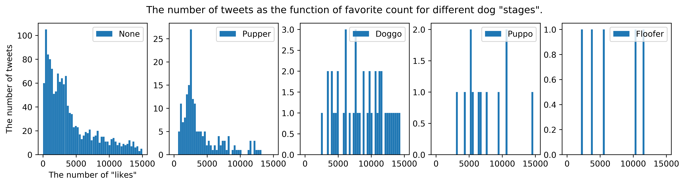

# [Data Wrangling](https://en.wikipedia.org/wiki/Data_wrangling) Project from [Udacity](https://www.udacity.com/)
## Description
The task of the project was to practice data gathering, cleaning, and analysis using the data produced by Twitter account [**WeRateDogs**](https://en.wikipedia.org/wiki/WeRateDogs). This account rates funny pictures with dogs and makes a humorous comment about it.

There are expected findings like the one that people retweet the pictures that they like and tend to "like" more often than retweet. The study shows that for the WeRateDogs 'more often' means 3-5 times more. The most amount of tweets has a little number of retweets and "likes", while some of them go viral and get 100 times more retweets and "likes".

The unclasified tweets distribution has two peaks, which indicates that there is a group of images, which are much more popular than the rest.

A funny finding is that WeRateDogs rarely uses it's own classification of dog "stages": `pupper`, `doggo`, `puppo` and `floofer`. The most number of pictures (1661) is not classified. The ratio of the number of `pupper`'s, `doggo`'s, `puppo`'s and `floofer`'s to each other is approximately 3. There are 3 times more `pupper`'s than `doggo`'s, and three times more `doggo`'s than `puppo`'s. The dog 'stage' `floofer` appeared only 7 times, which is only 0.4% from the total number of analyzed tweets. 

A neural network used by Udacity sometimes failes to recognize a dog, why an eye sees it, like [here](https://pbs.twimg.com/media/DBW35ZsVoAEWZUU.jpg).

The rating given by the account, the length of the description text, day of the week, etc., almost do not influence the popularity of a tweet. The `pupper` on average is as popular as an unclassified tweet, while `doggo`, `puppo` and `floofer` are more popular. It suggests that the popularity is driven by the figures themselves. If the figure is popular, then it get's the "stage" name, which does not matter, if it is `pupper`, and is significantly better, when it is either `doggo`, `puppo` or `floofer`.

**Prerequisites and used libraries:** [Python](https://www.udacity.com/) enviroment (e.g. [Anaconda](https://www.anaconda.com)), [Jupyter Notebook](https://jupyter.org/), [Pandas](https://pandas.pydata.org/), [NumPy](https://numpy.org/), [Requests](https://requests.kennethreitz.org/en/master/), [Tweepy](https://www.tweepy.org/), [Json](https://www.json.org/), [Matplotlib](https://matplotlib.org), [IPython](https://ipython.org/)

  A more detailed **report** can be found in the **`wrangle_report.md`** file. The file with the **project: `wrangle_act.md`**
