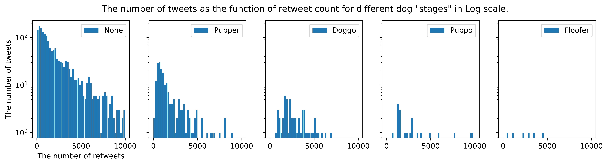

# Introduction (from Udacity)
The dataset that you will be wrangling (and analyzing and visualizing) is the tweet archive of Twitter user @dog_rates, also known as WeRateDogs. WeRateDogs is a Twitter account that rates people's dogs with a humorous comment about the dog. These ratings almost always have a denominator of 10. The numerators, though? Almost always greater than 10. 11/10, 12/10, 13/10, etc. Why? Because "they're good dogs Brent." WeRateDogs has over 4 million followers and has received international media coverage.

WeRateDogs downloaded their Twitter archive and sent it to Udacity via email exclusively for you to use in this project. This archive contains basic tweet data (tweet ID, timestamp, text, etc.) for all 5000+ of their tweets as they stood on August 1, 2017. More on this soon.

## Project Motivation
### Context
Your goal: wrangle WeRateDogs Twitter data to create interesting and trustworthy analyses and visualizations. The Twitter archive is great, but it only contains very basic tweet information. Additional gathering, then assessing and cleaning is required for "Wow!"-worthy analyses and visualizations.

## The Data
### Enhanced Twitter Archive

The WeRateDogs Twitter archive contains basic tweet data for all 5000+ of their tweets, but not everything. One column the archive does contain though: each tweet's text, which I used to extract rating, dog name, and dog "stage" (i.e. doggo, floofer, pupper, and puppo) to make this Twitter archive "enhanced." Of the 5000+ tweets, I have filtered for tweets with ratings only (there are 2356).

I extracted this data programmatically, but I didn't do a very good job. The ratings probably aren't all correct. Same goes for the dog names and probably dog stages (see below for more information on these) too. You'll need to assess and clean these columns if you want to use them for analysis and visualization.

### Additional Data via the Twitter API

Back to the basic-ness of Twitter archives: retweet count and favorite count are two of the notable column omissions. Fortunately, this additional data can be gathered by anyone from Twitter's API. Well, "anyone" who has access to data for the 3000 most recent tweets, at least. But you, because you have the WeRateDogs Twitter archive and specifically the tweet IDs within it, can gather this data for all 5000+. And guess what? You're going to query Twitter's API to gather this valuable data.

### Image Predictions File

One more cool thing: I ran every image in the WeRateDogs Twitter archive through a neural network that can classify breeds of dogs*. The results: a table full of image predictions (the top three only) alongside each tweet ID, image URL, and the image number that corresponded to the most confident prediction (numbered 1 to 4 since tweets can have up to four images).

So that's all fun and good. But all of this additional data will need to be gathered, assessed, and cleaned. This is where you come in.

## Key Points
Key points to keep in mind when data wrangling for this project:

- You only want original ratings (**no retweets**) that have **images**. Though there are 5000+ tweets in the dataset, **not all are dog** ratings and some are retweets.
- Assessing and cleaning the entire dataset completely would require a lot of time, and is not necessary to practice and demonstrate your skills in data wrangling. Therefore, the requirements of this project are only to assess and clean at least **8 quality issues** and at least **2 tidiness issues** in this dataset.
- Cleaning includes **merging individual pieces** of data according to the rules of tidy data.
- The fact that the rating numerators are greater than the denominators does not need to be cleaned. This unique rating system is a big part of the popularity of WeRateDogs.
- You do not need to gather the tweets beyond August 1st, 2017. You can, but note that you won't be able to gather the image predictions for these tweets since you don't have access to the algorithm used.

## Gather Data
Gather each of the three pieces of data as described below in a Jupyter Notebook titled `wrangle_act.ipynb`:

1. The WeRateDogs Twitter archive. I am giving this file to you, so imagine it as a file on hand. Download this file manually by clicking the following link: [`twitter_archive_enhanced.csv`](https://d17h27t6h515a5.cloudfront.net/topher/2017/August/59a4e958_twitter-archive-enhanced/twitter-archive-enhanced.csv)

2. The tweet image predictions, i.e., what breed of dog (or other object, animal, etc.) is present in each tweet according to a neural network. This file (`image_predictions.tsv`) is hosted on Udacity's servers and should be downloaded programmatically using the Requests library and the following URL: https://d17h27t6h515a5.cloudfront.net/topher/2017/August/599fd2ad_image-predictions/image-predictions.tsv

3. Gather each tweet's **retweet count** and **favorite ("like") count** at minimum, and any additional data you find interesting. Using the tweet IDs in the WeRateDogs Twitter archive, 
- query the Twitter API for each tweet's JSON data using Python's [Tweepy](http://www.tweepy.org/) library and 
- store each tweet's entire set of JSON data in a file called `tweet_json.txt` file. 
- Each tweet's JSON data should be written to its own line. 
- Then read this .txt file line by line into a pandas DataFrame with (at minimum) **tweet ID**, **retweet count**, and **favorite count**.

*Note: do not include your Twitter API keys, secrets, and tokens in your project submission.*


```python
# import the necessary libraries
import pandas as pd
import numpy as np
import requests
import tweepy
import json
import matplotlib.pyplot as plt
%matplotlib inline
```

### 2. Download `image_predictions.tsv` programmatically using the [Requests](https://2.python-requests.org//en/master/) library


```python
# Save the image_predictions_url
image_predictions_url = 'https://d17h27t6h515a5.cloudfront.net/topher/2017/August/599fd2ad_image-predictions/image-predictions.tsv'
```


```python
# Save the respons
response = requests.get(image_predictions_url)
#r = requests.get('https://d17h27t6h515a5.cloudfront.net/topher/2017/August/599fd2ad_image-predictions/image-predictions.tsv')
```


```python
# Check the response using `response.status_code`
if response.status_code == 200:
    with open("./image-predictions.tsv", "wb") as f:
        f.write(response.content)
```


```python
# Read `image-predictions.tsv`
img_predictions = pd.read_csv('image-predictions.tsv',sep='\t')#,error_bad_lines=False)
```

### 3.-6. Gather each tweet's retweet count and favorite ("like") count at minimum, and any additional data you find interesting. Using the tweet IDs in the WeRateDogs Twitter archive


```python
#import tweepy   # already done
#import json     # already done

from tweepy import OAuthHandler 
# Into this we pass our consumer key and secret which was given to us, 
# see http://docs.tweepy.org/en/latest/auth_tutorial.html?highlight=OAuthHandler#oauth-1a-authentication

from timeit import default_timer as timer
# Measure execution time of small code snippets, 
# see https://docs.python.org/3/library/timeit.html
```


```python
# Query Twitter API for each tweet in the Twitter archive and save JSON in a text file
# These are hidden to comply with Twitter's API terms and conditions
# !!! The actual keys and tokens must be replaced by 'HIDDEN'
consumer_key = 'HIDDEN' 
consumer_secret = 'HIDDEN' 
access_token = 'HIDDEN' 
access_secret = 'HIDDEN' 
```


```python
auth = OAuthHandler(consumer_key, consumer_secret)
auth.set_access_token(access_token, access_secret)

api = tweepy.API(auth, wait_on_rate_limit=True)
```


```python
# Read `twitter-archive-enhanced.csv` to a dataframe
df_1 = pd.read_csv('twitter-archive-enhanced.csv')
df_1.head()
```


<div>
<style scoped>
    .dataframe tbody tr th:only-of-type {
        vertical-align: middle;
    }

    .dataframe tbody tr th {
        vertical-align: top;
    }

    .dataframe thead th {
        text-align: right;
    }
</style>
<table border="1" class="dataframe">
  <thead>
    <tr style="text-align: right;">
      <th></th>
      <th>tweet_id</th>
      <th>in_reply_to_status_id</th>
      <th>in_reply_to_user_id</th>
      <th>timestamp</th>
      <th>source</th>
      <th>text</th>
      <th>retweeted_status_id</th>
      <th>retweeted_status_user_id</th>
      <th>retweeted_status_timestamp</th>
      <th>expanded_urls</th>
      <th>rating_numerator</th>
      <th>rating_denominator</th>
      <th>name</th>
      <th>doggo</th>
      <th>floofer</th>
      <th>pupper</th>
      <th>puppo</th>
    </tr>
  </thead>
  <tbody>
    <tr>
      <th>0</th>
      <td>892420643555336193</td>
      <td>NaN</td>
      <td>NaN</td>
      <td>2017-08-01 16:23:56 +0000</td>
      <td>&lt;a href="http://twitter.com/download/iphone" r...</td>
      <td>This is Phineas. He's a mystical boy. Only eve...</td>
      <td>NaN</td>
      <td>NaN</td>
      <td>NaN</td>
      <td>https://twitter.com/dog_rates/status/892420643...</td>
      <td>13</td>
      <td>10</td>
      <td>Phineas</td>
      <td>None</td>
      <td>None</td>
      <td>None</td>
      <td>None</td>
    </tr>
    <tr>
      <th>1</th>
      <td>892177421306343426</td>
      <td>NaN</td>
      <td>NaN</td>
      <td>2017-08-01 00:17:27 +0000</td>
      <td>&lt;a href="http://twitter.com/download/iphone" r...</td>
      <td>This is Tilly. She's just checking pup on you....</td>
      <td>NaN</td>
      <td>NaN</td>
      <td>NaN</td>
      <td>https://twitter.com/dog_rates/status/892177421...</td>
      <td>13</td>
      <td>10</td>
      <td>Tilly</td>
      <td>None</td>
      <td>None</td>
      <td>None</td>
      <td>None</td>
    </tr>
    <tr>
      <th>2</th>
      <td>891815181378084864</td>
      <td>NaN</td>
      <td>NaN</td>
      <td>2017-07-31 00:18:03 +0000</td>
      <td>&lt;a href="http://twitter.com/download/iphone" r...</td>
      <td>This is Archie. He is a rare Norwegian Pouncin...</td>
      <td>NaN</td>
      <td>NaN</td>
      <td>NaN</td>
      <td>https://twitter.com/dog_rates/status/891815181...</td>
      <td>12</td>
      <td>10</td>
      <td>Archie</td>
      <td>None</td>
      <td>None</td>
      <td>None</td>
      <td>None</td>
    </tr>
    <tr>
      <th>3</th>
      <td>891689557279858688</td>
      <td>NaN</td>
      <td>NaN</td>
      <td>2017-07-30 15:58:51 +0000</td>
      <td>&lt;a href="http://twitter.com/download/iphone" r...</td>
      <td>This is Darla. She commenced a snooze mid meal...</td>
      <td>NaN</td>
      <td>NaN</td>
      <td>NaN</td>
      <td>https://twitter.com/dog_rates/status/891689557...</td>
      <td>13</td>
      <td>10</td>
      <td>Darla</td>
      <td>None</td>
      <td>None</td>
      <td>None</td>
      <td>None</td>
    </tr>
    <tr>
      <th>4</th>
      <td>891327558926688256</td>
      <td>NaN</td>
      <td>NaN</td>
      <td>2017-07-29 16:00:24 +0000</td>
      <td>&lt;a href="http://twitter.com/download/iphone" r...</td>
      <td>This is Franklin. He would like you to stop ca...</td>
      <td>NaN</td>
      <td>NaN</td>
      <td>NaN</td>
      <td>https://twitter.com/dog_rates/status/891327558...</td>
      <td>12</td>
      <td>10</td>
      <td>Franklin</td>
      <td>None</td>
      <td>None</td>
      <td>None</td>
      <td>None</td>
    </tr>
  </tbody>
</table>
</div>


```python
# NOTE TO STUDENT WITH MOBILE VERIFICATION ISSUES:
# df_1 is a DataFrame with the twitter_archive_enhanced.csv file. You may have to
# change line 17 to match the name of your DataFrame with twitter_archive_enhanced.csv
# NOTE TO REVIEWER: this student had mobile verification issues so the following
# Twitter API code was sent to this student from a Udacity instructor
# Tweet IDs for which to gather additional data via Twitter's API

tweet_ids = df_1.tweet_id.values
len(tweet_ids)
```


    2356


```python
# Query Twitter's API for JSON data for each tweet ID in the Twitter archive
count = 0
fails_dict = {}
start = timer()
# Save each tweet's returned JSON as a new line in a .txt file
with open('tweet_json.txt', 'w') as outfile:
    # This loop will likely take 20-30 minutes to run because of Twitter's rate limit
    for tweet_id in tweet_ids:
        count += 1
        print(str(count) + ": " + str(tweet_id))
        try:
            tweet = api.get_status(tweet_id, tweet_mode='extended')
            print("Success")
            json.dump(tweet._json, outfile)
            outfile.write('\n')
        except tweepy.TweepError as e:
            print("Fail")
            fails_dict[tweet_id] = e
            pass
end = timer()
print('time taken by the loop:',end - start)
print('fails_dict:',fails_dict)
```


```python
#len(fails_dict)
```

### 7. Read the json .txt file line by line into a pandas DataFrame with (at minimum) **tweet ID**, **retweet count**, and **favorite count**


```python
# create an empty list 
json_data = []
with open('./tweet_json.txt', 'r') as json_file:
    text_line = json_file.readline()
    for text_line in json_file:
        #print(line)
        data_line = json.loads(text_line)
        tweet_id       = data_line['id']
        retweet_count  = data_line['retweet_count']
        favorite_count = data_line['favorite_count']
        #print('tweet_id:',tweet_id,'retweet_count:',retweet_count,'favorite_count:',favorite_count)
        # fill in the list
        json_data.append({'tweet_id':tweet_id,
                          'retweet_count':int(retweet_count),
                          'favorite_count':int(favorite_count)})
# fill in the Pandas Data Frame
tweets_df = pd.DataFrame(json_data, columns = ['tweet_id', 'retweet_count', 'favorite_count'])   
```


```python
tweets_df.head()
```


<div>
<style scoped>
    .dataframe tbody tr th:only-of-type {
        vertical-align: middle;
    }

    .dataframe tbody tr th {
        vertical-align: top;
    }

    .dataframe thead th {
        text-align: right;
    }
</style>
<table border="1" class="dataframe">
  <thead>
    <tr style="text-align: right;">
      <th></th>
      <th>tweet_id</th>
      <th>retweet_count</th>
      <th>favorite_count</th>
    </tr>
  </thead>
  <tbody>
    <tr>
      <th>0</th>
      <td>892177421306343426</td>
      <td>5900</td>
      <td>31940</td>
    </tr>
    <tr>
      <th>1</th>
      <td>891815181378084864</td>
      <td>3899</td>
      <td>24055</td>
    </tr>
    <tr>
      <th>2</th>
      <td>891689557279858688</td>
      <td>8096</td>
      <td>40455</td>
    </tr>
    <tr>
      <th>3</th>
      <td>891327558926688256</td>
      <td>8778</td>
      <td>38673</td>
    </tr>
    <tr>
      <th>4</th>
      <td>891087950875897856</td>
      <td>2918</td>
      <td>19441</td>
    </tr>
  </tbody>
</table>
</div>


## Assess Data
- Detect and document at least **eight (8) quality issues** and **two (2) tidiness issues**.
- To meet specifications, the issues that satisfy the Project Motivation (**see the Key Points** header) must be assessed.

### 1) the first file to assess: `twitter-archive-enhanced.csv`


```python
# Convert to Pandas Data Frame
twitter_archive_df = pd.read_csv('twitter-archive-enhanced.csv')
```


```python
twitter_archive_df.head()
```


<div>
<style scoped>
    .dataframe tbody tr th:only-of-type {
        vertical-align: middle;
    }

    .dataframe tbody tr th {
        vertical-align: top;
    }

    .dataframe thead th {
        text-align: right;
    }
</style>
<table border="1" class="dataframe">
  <thead>
    <tr style="text-align: right;">
      <th></th>
      <th>tweet_id</th>
      <th>in_reply_to_status_id</th>
      <th>in_reply_to_user_id</th>
      <th>timestamp</th>
      <th>source</th>
      <th>text</th>
      <th>retweeted_status_id</th>
      <th>retweeted_status_user_id</th>
      <th>retweeted_status_timestamp</th>
      <th>expanded_urls</th>
      <th>rating_numerator</th>
      <th>rating_denominator</th>
      <th>name</th>
      <th>doggo</th>
      <th>floofer</th>
      <th>pupper</th>
      <th>puppo</th>
    </tr>
  </thead>
  <tbody>
    <tr>
      <th>0</th>
      <td>892420643555336193</td>
      <td>NaN</td>
      <td>NaN</td>
      <td>2017-08-01 16:23:56 +0000</td>
      <td>&lt;a href="http://twitter.com/download/iphone" r...</td>
      <td>This is Phineas. He's a mystical boy. Only eve...</td>
      <td>NaN</td>
      <td>NaN</td>
      <td>NaN</td>
      <td>https://twitter.com/dog_rates/status/892420643...</td>
      <td>13</td>
      <td>10</td>
      <td>Phineas</td>
      <td>None</td>
      <td>None</td>
      <td>None</td>
      <td>None</td>
    </tr>
    <tr>
      <th>1</th>
      <td>892177421306343426</td>
      <td>NaN</td>
      <td>NaN</td>
      <td>2017-08-01 00:17:27 +0000</td>
      <td>&lt;a href="http://twitter.com/download/iphone" r...</td>
      <td>This is Tilly. She's just checking pup on you....</td>
      <td>NaN</td>
      <td>NaN</td>
      <td>NaN</td>
      <td>https://twitter.com/dog_rates/status/892177421...</td>
      <td>13</td>
      <td>10</td>
      <td>Tilly</td>
      <td>None</td>
      <td>None</td>
      <td>None</td>
      <td>None</td>
    </tr>
    <tr>
      <th>2</th>
      <td>891815181378084864</td>
      <td>NaN</td>
      <td>NaN</td>
      <td>2017-07-31 00:18:03 +0000</td>
      <td>&lt;a href="http://twitter.com/download/iphone" r...</td>
      <td>This is Archie. He is a rare Norwegian Pouncin...</td>
      <td>NaN</td>
      <td>NaN</td>
      <td>NaN</td>
      <td>https://twitter.com/dog_rates/status/891815181...</td>
      <td>12</td>
      <td>10</td>
      <td>Archie</td>
      <td>None</td>
      <td>None</td>
      <td>None</td>
      <td>None</td>
    </tr>
    <tr>
      <th>3</th>
      <td>891689557279858688</td>
      <td>NaN</td>
      <td>NaN</td>
      <td>2017-07-30 15:58:51 +0000</td>
      <td>&lt;a href="http://twitter.com/download/iphone" r...</td>
      <td>This is Darla. She commenced a snooze mid meal...</td>
      <td>NaN</td>
      <td>NaN</td>
      <td>NaN</td>
      <td>https://twitter.com/dog_rates/status/891689557...</td>
      <td>13</td>
      <td>10</td>
      <td>Darla</td>
      <td>None</td>
      <td>None</td>
      <td>None</td>
      <td>None</td>
    </tr>
    <tr>
      <th>4</th>
      <td>891327558926688256</td>
      <td>NaN</td>
      <td>NaN</td>
      <td>2017-07-29 16:00:24 +0000</td>
      <td>&lt;a href="http://twitter.com/download/iphone" r...</td>
      <td>This is Franklin. He would like you to stop ca...</td>
      <td>NaN</td>
      <td>NaN</td>
      <td>NaN</td>
      <td>https://twitter.com/dog_rates/status/891327558...</td>
      <td>12</td>
      <td>10</td>
      <td>Franklin</td>
      <td>None</td>
      <td>None</td>
      <td>None</td>
      <td>None</td>
    </tr>
  </tbody>
</table>
</div>


```python
twitter_archive_df.info()
```

    <class 'pandas.core.frame.DataFrame'>
    RangeIndex: 2356 entries, 0 to 2355
    Data columns (total 17 columns):
    tweet_id                      2356 non-null int64
    in_reply_to_status_id         78 non-null float64
    in_reply_to_user_id           78 non-null float64
    timestamp                     2356 non-null object
    source                        2356 non-null object
    text                          2356 non-null object
    retweeted_status_id           181 non-null float64
    retweeted_status_user_id      181 non-null float64
    retweeted_status_timestamp    181 non-null object
    expanded_urls                 2297 non-null object
    rating_numerator              2356 non-null int64
    rating_denominator            2356 non-null int64
    name                          2356 non-null object
    doggo                         2356 non-null object
    floofer                       2356 non-null object
    pupper                        2356 non-null object
    puppo                         2356 non-null object
    dtypes: float64(4), int64(3), object(10)
    memory usage: 313.0+ KB
    


```python
# Show the duplicates
twitter_archive_df[twitter_archive_df.tweet_id.duplicated()]
```


<div>
<style scoped>
    .dataframe tbody tr th:only-of-type {
        vertical-align: middle;
    }

    .dataframe tbody tr th {
        vertical-align: top;
    }

    .dataframe thead th {
        text-align: right;
    }
</style>
<table border="1" class="dataframe">
  <thead>
    <tr style="text-align: right;">
      <th></th>
      <th>tweet_id</th>
      <th>in_reply_to_status_id</th>
      <th>in_reply_to_user_id</th>
      <th>timestamp</th>
      <th>source</th>
      <th>text</th>
      <th>retweeted_status_id</th>
      <th>retweeted_status_user_id</th>
      <th>retweeted_status_timestamp</th>
      <th>expanded_urls</th>
      <th>rating_numerator</th>
      <th>rating_denominator</th>
      <th>name</th>
      <th>doggo</th>
      <th>floofer</th>
      <th>pupper</th>
      <th>puppo</th>
    </tr>
  </thead>
  <tbody>
  </tbody>
</table>
</div>


**The issue pointed out by a referee: some ratings are wrongly extracted.**


```python
r_id = 786709082849828864
print('The text:',list(twitter_archive_df.loc[twitter_archive_df.tweet_id == r_id].text))
print('The rating:',list(twitter_archive_df.loc[twitter_archive_df.tweet_id == r_id].rating_numerator))
```

    The text: ["This is Logan, the Chow who lived. He solemnly swears he's up to lots of good. H*ckin magical af 9.75/10 https://t.co/yBO5wuqaPS"]
    The rating: [75]
    

**The rating is 9.75, while extracted rating is 75.**


```python
# Count the sources
twitter_archive_df.source.value_counts()
```


    <a href="http://twitter.com/download/iphone" rel="nofollow">Twitter for iPhone</a>     2221
    <a href="http://vine.co" rel="nofollow">Vine - Make a Scene</a>                          91
    <a href="http://twitter.com" rel="nofollow">Twitter Web Client</a>                       33
    <a href="https://about.twitter.com/products/tweetdeck" rel="nofollow">TweetDeck</a>      11
    Name: source, dtype: int64


```python
# Check the lower case names
#twitter_archive_df[twitter_archive_df.name.str.islower()]
twitter_archive_df[twitter_archive_df.name.str.islower()].name.value_counts()
```


    a               55
    the              8
    an               7
    very             5
    one              4
    just             4
    quite            4
    actually         2
    mad              2
    getting          2
    not              2
    officially       1
    my               1
    infuriating      1
    unacceptable     1
    this             1
    incredibly       1
    such             1
    space            1
    his              1
    by               1
    all              1
    light            1
    old              1
    life             1
    Name: name, dtype: int64


### 2) the second file to assess `image_predictions.tsv`


```python
img_predictions.head()
```


<div>
<style scoped>
    .dataframe tbody tr th:only-of-type {
        vertical-align: middle;
    }

    .dataframe tbody tr th {
        vertical-align: top;
    }

    .dataframe thead th {
        text-align: right;
    }
</style>
<table border="1" class="dataframe">
  <thead>
    <tr style="text-align: right;">
      <th></th>
      <th>tweet_id</th>
      <th>jpg_url</th>
      <th>img_num</th>
      <th>p1</th>
      <th>p1_conf</th>
      <th>p1_dog</th>
      <th>p2</th>
      <th>p2_conf</th>
      <th>p2_dog</th>
      <th>p3</th>
      <th>p3_conf</th>
      <th>p3_dog</th>
    </tr>
  </thead>
  <tbody>
    <tr>
      <th>0</th>
      <td>666020888022790149</td>
      <td>https://pbs.twimg.com/media/CT4udn0WwAA0aMy.jpg</td>
      <td>1</td>
      <td>Welsh_springer_spaniel</td>
      <td>0.465074</td>
      <td>True</td>
      <td>collie</td>
      <td>0.156665</td>
      <td>True</td>
      <td>Shetland_sheepdog</td>
      <td>0.061428</td>
      <td>True</td>
    </tr>
    <tr>
      <th>1</th>
      <td>666029285002620928</td>
      <td>https://pbs.twimg.com/media/CT42GRgUYAA5iDo.jpg</td>
      <td>1</td>
      <td>redbone</td>
      <td>0.506826</td>
      <td>True</td>
      <td>miniature_pinscher</td>
      <td>0.074192</td>
      <td>True</td>
      <td>Rhodesian_ridgeback</td>
      <td>0.072010</td>
      <td>True</td>
    </tr>
    <tr>
      <th>2</th>
      <td>666033412701032449</td>
      <td>https://pbs.twimg.com/media/CT4521TWwAEvMyu.jpg</td>
      <td>1</td>
      <td>German_shepherd</td>
      <td>0.596461</td>
      <td>True</td>
      <td>malinois</td>
      <td>0.138584</td>
      <td>True</td>
      <td>bloodhound</td>
      <td>0.116197</td>
      <td>True</td>
    </tr>
    <tr>
      <th>3</th>
      <td>666044226329800704</td>
      <td>https://pbs.twimg.com/media/CT5Dr8HUEAA-lEu.jpg</td>
      <td>1</td>
      <td>Rhodesian_ridgeback</td>
      <td>0.408143</td>
      <td>True</td>
      <td>redbone</td>
      <td>0.360687</td>
      <td>True</td>
      <td>miniature_pinscher</td>
      <td>0.222752</td>
      <td>True</td>
    </tr>
    <tr>
      <th>4</th>
      <td>666049248165822465</td>
      <td>https://pbs.twimg.com/media/CT5IQmsXIAAKY4A.jpg</td>
      <td>1</td>
      <td>miniature_pinscher</td>
      <td>0.560311</td>
      <td>True</td>
      <td>Rottweiler</td>
      <td>0.243682</td>
      <td>True</td>
      <td>Doberman</td>
      <td>0.154629</td>
      <td>True</td>
    </tr>
  </tbody>
</table>
</div>


```python
img_predictions.info()
```

    <class 'pandas.core.frame.DataFrame'>
    RangeIndex: 2075 entries, 0 to 2074
    Data columns (total 12 columns):
    tweet_id    2075 non-null int64
    jpg_url     2075 non-null object
    img_num     2075 non-null int64
    p1          2075 non-null object
    p1_conf     2075 non-null float64
    p1_dog      2075 non-null bool
    p2          2075 non-null object
    p2_conf     2075 non-null float64
    p2_dog      2075 non-null bool
    p3          2075 non-null object
    p3_conf     2075 non-null float64
    p3_dog      2075 non-null bool
    dtypes: bool(3), float64(3), int64(2), object(4)
    memory usage: 152.1+ KB
    


```python
# Check the p1 values
img_predictions.p1.value_counts()
```


    golden_retriever             150
    Labrador_retriever           100
    Pembroke                      89
    Chihuahua                     83
    pug                           57
    chow                          44
    Samoyed                       43
    toy_poodle                    39
    Pomeranian                    38
    cocker_spaniel                30
    malamute                      30
    French_bulldog                26
    miniature_pinscher            23
    Chesapeake_Bay_retriever      23
    seat_belt                     22
    German_shepherd               20
    Staffordshire_bullterrier     20
    Siberian_husky                20
    Cardigan                      19
    web_site                      19
    Maltese_dog                   18
    Eskimo_dog                    18
    beagle                        18
    Shetland_sheepdog             18
    teddy                         18
    Rottweiler                    17
    Shih-Tzu                      17
    Lakeland_terrier              17
    Italian_greyhound             16
    kuvasz                        16
                                ... 
    revolver                       1
    flamingo                       1
    slug                           1
    envelope                       1
    tricycle                       1
    swab                           1
    beaver                         1
    carton                         1
    walking_stick                  1
    tick                           1
    maze                           1
    silky_terrier                  1
    radio_telescope                1
    wooden_spoon                   1
    shopping_basket                1
    grille                         1
    cheeseburger                   1
    fiddler_crab                   1
    cuirass                        1
    school_bus                     1
    guenon                         1
    minibus                        1
    black-footed_ferret            1
    ocarina                        1
    syringe                        1
    American_black_bear            1
    marmot                         1
    book_jacket                    1
    beach_wagon                    1
    Japanese_spaniel               1
    Name: p1, Length: 378, dtype: int64


```python
# Check the number of dogs
img_predictions.p1_dog.value_counts()
```


    True     1532
    False     543
    Name: p1_dog, dtype: int64


```python
# Chedk the number of images
img_predictions.img_num.value_counts()
```


    1    1780
    2     198
    3      66
    4      31
    Name: img_num, dtype: int64


```python
# Show the duplicates
img_predictions[img_predictions.tweet_id.duplicated()]
```


<div>
<style scoped>
    .dataframe tbody tr th:only-of-type {
        vertical-align: middle;
    }

    .dataframe tbody tr th {
        vertical-align: top;
    }

    .dataframe thead th {
        text-align: right;
    }
</style>
<table border="1" class="dataframe">
  <thead>
    <tr style="text-align: right;">
      <th></th>
      <th>tweet_id</th>
      <th>jpg_url</th>
      <th>img_num</th>
      <th>p1</th>
      <th>p1_conf</th>
      <th>p1_dog</th>
      <th>p2</th>
      <th>p2_conf</th>
      <th>p2_dog</th>
      <th>p3</th>
      <th>p3_conf</th>
      <th>p3_dog</th>
    </tr>
  </thead>
  <tbody>
  </tbody>
</table>
</div>


```python
# Check the tweets with dogs
img_predictions[img_predictions.p1_dog == True]
```


<div>
<style scoped>
    .dataframe tbody tr th:only-of-type {
        vertical-align: middle;
    }

    .dataframe tbody tr th {
        vertical-align: top;
    }

    .dataframe thead th {
        text-align: right;
    }
</style>
<table border="1" class="dataframe">
  <thead>
    <tr style="text-align: right;">
      <th></th>
      <th>tweet_id</th>
      <th>jpg_url</th>
      <th>img_num</th>
      <th>p1</th>
      <th>p1_conf</th>
      <th>p1_dog</th>
      <th>p2</th>
      <th>p2_conf</th>
      <th>p2_dog</th>
      <th>p3</th>
      <th>p3_conf</th>
      <th>p3_dog</th>
    </tr>
  </thead>
  <tbody>
    <tr>
      <th>0</th>
      <td>666020888022790149</td>
      <td>https://pbs.twimg.com/media/CT4udn0WwAA0aMy.jpg</td>
      <td>1</td>
      <td>Welsh_springer_spaniel</td>
      <td>0.465074</td>
      <td>True</td>
      <td>collie</td>
      <td>0.156665</td>
      <td>True</td>
      <td>Shetland_sheepdog</td>
      <td>0.061428</td>
      <td>True</td>
    </tr>
    <tr>
      <th>1</th>
      <td>666029285002620928</td>
      <td>https://pbs.twimg.com/media/CT42GRgUYAA5iDo.jpg</td>
      <td>1</td>
      <td>redbone</td>
      <td>0.506826</td>
      <td>True</td>
      <td>miniature_pinscher</td>
      <td>0.074192</td>
      <td>True</td>
      <td>Rhodesian_ridgeback</td>
      <td>0.072010</td>
      <td>True</td>
    </tr>
    <tr>
      <th>2</th>
      <td>666033412701032449</td>
      <td>https://pbs.twimg.com/media/CT4521TWwAEvMyu.jpg</td>
      <td>1</td>
      <td>German_shepherd</td>
      <td>0.596461</td>
      <td>True</td>
      <td>malinois</td>
      <td>0.138584</td>
      <td>True</td>
      <td>bloodhound</td>
      <td>0.116197</td>
      <td>True</td>
    </tr>
    <tr>
      <th>3</th>
      <td>666044226329800704</td>
      <td>https://pbs.twimg.com/media/CT5Dr8HUEAA-lEu.jpg</td>
      <td>1</td>
      <td>Rhodesian_ridgeback</td>
      <td>0.408143</td>
      <td>True</td>
      <td>redbone</td>
      <td>0.360687</td>
      <td>True</td>
      <td>miniature_pinscher</td>
      <td>0.222752</td>
      <td>True</td>
    </tr>
    <tr>
      <th>4</th>
      <td>666049248165822465</td>
      <td>https://pbs.twimg.com/media/CT5IQmsXIAAKY4A.jpg</td>
      <td>1</td>
      <td>miniature_pinscher</td>
      <td>0.560311</td>
      <td>True</td>
      <td>Rottweiler</td>
      <td>0.243682</td>
      <td>True</td>
      <td>Doberman</td>
      <td>0.154629</td>
      <td>True</td>
    </tr>
    <tr>
      <th>5</th>
      <td>666050758794694657</td>
      <td>https://pbs.twimg.com/media/CT5Jof1WUAEuVxN.jpg</td>
      <td>1</td>
      <td>Bernese_mountain_dog</td>
      <td>0.651137</td>
      <td>True</td>
      <td>English_springer</td>
      <td>0.263788</td>
      <td>True</td>
      <td>Greater_Swiss_Mountain_dog</td>
      <td>0.016199</td>
      <td>True</td>
    </tr>
    <tr>
      <th>7</th>
      <td>666055525042405380</td>
      <td>https://pbs.twimg.com/media/CT5N9tpXIAAifs1.jpg</td>
      <td>1</td>
      <td>chow</td>
      <td>0.692517</td>
      <td>True</td>
      <td>Tibetan_mastiff</td>
      <td>0.058279</td>
      <td>True</td>
      <td>fur_coat</td>
      <td>0.054449</td>
      <td>False</td>
    </tr>
    <tr>
      <th>9</th>
      <td>666058600524156928</td>
      <td>https://pbs.twimg.com/media/CT5Qw94XAAA_2dP.jpg</td>
      <td>1</td>
      <td>miniature_poodle</td>
      <td>0.201493</td>
      <td>True</td>
      <td>komondor</td>
      <td>0.192305</td>
      <td>True</td>
      <td>soft-coated_wheaten_terrier</td>
      <td>0.082086</td>
      <td>True</td>
    </tr>
    <tr>
      <th>10</th>
      <td>666063827256086533</td>
      <td>https://pbs.twimg.com/media/CT5Vg_wXIAAXfnj.jpg</td>
      <td>1</td>
      <td>golden_retriever</td>
      <td>0.775930</td>
      <td>True</td>
      <td>Tibetan_mastiff</td>
      <td>0.093718</td>
      <td>True</td>
      <td>Labrador_retriever</td>
      <td>0.072427</td>
      <td>True</td>
    </tr>
    <tr>
      <th>11</th>
      <td>666071193221509120</td>
      <td>https://pbs.twimg.com/media/CT5cN_3WEAAlOoZ.jpg</td>
      <td>1</td>
      <td>Gordon_setter</td>
      <td>0.503672</td>
      <td>True</td>
      <td>Yorkshire_terrier</td>
      <td>0.174201</td>
      <td>True</td>
      <td>Pekinese</td>
      <td>0.109454</td>
      <td>True</td>
    </tr>
    <tr>
      <th>12</th>
      <td>666073100786774016</td>
      <td>https://pbs.twimg.com/media/CT5d9DZXAAALcwe.jpg</td>
      <td>1</td>
      <td>Walker_hound</td>
      <td>0.260857</td>
      <td>True</td>
      <td>English_foxhound</td>
      <td>0.175382</td>
      <td>True</td>
      <td>Ibizan_hound</td>
      <td>0.097471</td>
      <td>True</td>
    </tr>
    <tr>
      <th>13</th>
      <td>666082916733198337</td>
      <td>https://pbs.twimg.com/media/CT5m4VGWEAAtKc8.jpg</td>
      <td>1</td>
      <td>pug</td>
      <td>0.489814</td>
      <td>True</td>
      <td>bull_mastiff</td>
      <td>0.404722</td>
      <td>True</td>
      <td>French_bulldog</td>
      <td>0.048960</td>
      <td>True</td>
    </tr>
    <tr>
      <th>14</th>
      <td>666094000022159362</td>
      <td>https://pbs.twimg.com/media/CT5w9gUW4AAsBNN.jpg</td>
      <td>1</td>
      <td>bloodhound</td>
      <td>0.195217</td>
      <td>True</td>
      <td>German_shepherd</td>
      <td>0.078260</td>
      <td>True</td>
      <td>malinois</td>
      <td>0.075628</td>
      <td>True</td>
    </tr>
    <tr>
      <th>15</th>
      <td>666099513787052032</td>
      <td>https://pbs.twimg.com/media/CT51-JJUEAA6hV8.jpg</td>
      <td>1</td>
      <td>Lhasa</td>
      <td>0.582330</td>
      <td>True</td>
      <td>Shih-Tzu</td>
      <td>0.166192</td>
      <td>True</td>
      <td>Dandie_Dinmont</td>
      <td>0.089688</td>
      <td>True</td>
    </tr>
    <tr>
      <th>16</th>
      <td>666102155909144576</td>
      <td>https://pbs.twimg.com/media/CT54YGiWUAEZnoK.jpg</td>
      <td>1</td>
      <td>English_setter</td>
      <td>0.298617</td>
      <td>True</td>
      <td>Newfoundland</td>
      <td>0.149842</td>
      <td>True</td>
      <td>borzoi</td>
      <td>0.133649</td>
      <td>True</td>
    </tr>
    <tr>
      <th>19</th>
      <td>666273097616637952</td>
      <td>https://pbs.twimg.com/media/CT8T1mtUwAA3aqm.jpg</td>
      <td>1</td>
      <td>Italian_greyhound</td>
      <td>0.176053</td>
      <td>True</td>
      <td>toy_terrier</td>
      <td>0.111884</td>
      <td>True</td>
      <td>basenji</td>
      <td>0.111152</td>
      <td>True</td>
    </tr>
    <tr>
      <th>20</th>
      <td>666287406224695296</td>
      <td>https://pbs.twimg.com/media/CT8g3BpUEAAuFjg.jpg</td>
      <td>1</td>
      <td>Maltese_dog</td>
      <td>0.857531</td>
      <td>True</td>
      <td>toy_poodle</td>
      <td>0.063064</td>
      <td>True</td>
      <td>miniature_poodle</td>
      <td>0.025581</td>
      <td>True</td>
    </tr>
    <tr>
      <th>23</th>
      <td>666345417576210432</td>
      <td>https://pbs.twimg.com/media/CT9Vn7PWoAA_ZCM.jpg</td>
      <td>1</td>
      <td>golden_retriever</td>
      <td>0.858744</td>
      <td>True</td>
      <td>Chesapeake_Bay_retriever</td>
      <td>0.054787</td>
      <td>True</td>
      <td>Labrador_retriever</td>
      <td>0.014241</td>
      <td>True</td>
    </tr>
    <tr>
      <th>24</th>
      <td>666353288456101888</td>
      <td>https://pbs.twimg.com/media/CT9cx0tUEAAhNN_.jpg</td>
      <td>1</td>
      <td>malamute</td>
      <td>0.336874</td>
      <td>True</td>
      <td>Siberian_husky</td>
      <td>0.147655</td>
      <td>True</td>
      <td>Eskimo_dog</td>
      <td>0.093412</td>
      <td>True</td>
    </tr>
    <tr>
      <th>26</th>
      <td>666373753744588802</td>
      <td>https://pbs.twimg.com/media/CT9vZEYWUAAlZ05.jpg</td>
      <td>1</td>
      <td>soft-coated_wheaten_terrier</td>
      <td>0.326467</td>
      <td>True</td>
      <td>Afghan_hound</td>
      <td>0.259551</td>
      <td>True</td>
      <td>briard</td>
      <td>0.206803</td>
      <td>True</td>
    </tr>
    <tr>
      <th>27</th>
      <td>666396247373291520</td>
      <td>https://pbs.twimg.com/media/CT-D2ZHWIAA3gK1.jpg</td>
      <td>1</td>
      <td>Chihuahua</td>
      <td>0.978108</td>
      <td>True</td>
      <td>toy_terrier</td>
      <td>0.009397</td>
      <td>True</td>
      <td>papillon</td>
      <td>0.004577</td>
      <td>True</td>
    </tr>
    <tr>
      <th>28</th>
      <td>666407126856765440</td>
      <td>https://pbs.twimg.com/media/CT-NvwmW4AAugGZ.jpg</td>
      <td>1</td>
      <td>black-and-tan_coonhound</td>
      <td>0.529139</td>
      <td>True</td>
      <td>bloodhound</td>
      <td>0.244220</td>
      <td>True</td>
      <td>flat-coated_retriever</td>
      <td>0.173810</td>
      <td>True</td>
    </tr>
    <tr>
      <th>30</th>
      <td>666418789513326592</td>
      <td>https://pbs.twimg.com/media/CT-YWb7U8AA7QnN.jpg</td>
      <td>1</td>
      <td>toy_terrier</td>
      <td>0.149680</td>
      <td>True</td>
      <td>papillon</td>
      <td>0.148258</td>
      <td>True</td>
      <td>Chihuahua</td>
      <td>0.142860</td>
      <td>True</td>
    </tr>
    <tr>
      <th>31</th>
      <td>666421158376562688</td>
      <td>https://pbs.twimg.com/media/CT-aggCXAAIMfT3.jpg</td>
      <td>1</td>
      <td>Blenheim_spaniel</td>
      <td>0.906777</td>
      <td>True</td>
      <td>cocker_spaniel</td>
      <td>0.090346</td>
      <td>True</td>
      <td>Shih-Tzu</td>
      <td>0.001117</td>
      <td>True</td>
    </tr>
    <tr>
      <th>32</th>
      <td>666428276349472768</td>
      <td>https://pbs.twimg.com/media/CT-g-0DUwAEQdSn.jpg</td>
      <td>1</td>
      <td>Pembroke</td>
      <td>0.371361</td>
      <td>True</td>
      <td>chow</td>
      <td>0.249394</td>
      <td>True</td>
      <td>Pomeranian</td>
      <td>0.241878</td>
      <td>True</td>
    </tr>
    <tr>
      <th>34</th>
      <td>666435652385423360</td>
      <td>https://pbs.twimg.com/media/CT-nsTQWEAEkyDn.jpg</td>
      <td>1</td>
      <td>Chesapeake_Bay_retriever</td>
      <td>0.184130</td>
      <td>True</td>
      <td>chain_saw</td>
      <td>0.056775</td>
      <td>False</td>
      <td>power_drill</td>
      <td>0.036763</td>
      <td>False</td>
    </tr>
    <tr>
      <th>35</th>
      <td>666437273139982337</td>
      <td>https://pbs.twimg.com/media/CT-pKmRWIAAxUWj.jpg</td>
      <td>1</td>
      <td>Chihuahua</td>
      <td>0.671853</td>
      <td>True</td>
      <td>beagle</td>
      <td>0.124680</td>
      <td>True</td>
      <td>Saluki</td>
      <td>0.044094</td>
      <td>True</td>
    </tr>
    <tr>
      <th>36</th>
      <td>666447344410484738</td>
      <td>https://pbs.twimg.com/media/CT-yU5QWwAEjLX5.jpg</td>
      <td>1</td>
      <td>curly-coated_retriever</td>
      <td>0.322084</td>
      <td>True</td>
      <td>giant_schnauzer</td>
      <td>0.287955</td>
      <td>True</td>
      <td>Labrador_retriever</td>
      <td>0.166331</td>
      <td>True</td>
    </tr>
    <tr>
      <th>37</th>
      <td>666454714377183233</td>
      <td>https://pbs.twimg.com/media/CT-5Bs-WUAA2JeC.jpg</td>
      <td>1</td>
      <td>dalmatian</td>
      <td>0.278954</td>
      <td>True</td>
      <td>Labrador_retriever</td>
      <td>0.237612</td>
      <td>True</td>
      <td>Great_Pyrenees</td>
      <td>0.171106</td>
      <td>True</td>
    </tr>
    <tr>
      <th>38</th>
      <td>666644823164719104</td>
      <td>https://pbs.twimg.com/media/CUBl6IwVAAA9_zT.jpg</td>
      <td>1</td>
      <td>Ibizan_hound</td>
      <td>0.044333</td>
      <td>True</td>
      <td>Pembroke</td>
      <td>0.043209</td>
      <td>True</td>
      <td>West_Highland_white_terrier</td>
      <td>0.038906</td>
      <td>True</td>
    </tr>
    <tr>
      <th>...</th>
      <td>...</td>
      <td>...</td>
      <td>...</td>
      <td>...</td>
      <td>...</td>
      <td>...</td>
      <td>...</td>
      <td>...</td>
      <td>...</td>
      <td>...</td>
      <td>...</td>
      <td>...</td>
    </tr>
    <tr>
      <th>2041</th>
      <td>885311592912609280</td>
      <td>https://pbs.twimg.com/media/C4bTH6nWMAAX_bJ.jpg</td>
      <td>1</td>
      <td>Labrador_retriever</td>
      <td>0.908703</td>
      <td>True</td>
      <td>seat_belt</td>
      <td>0.057091</td>
      <td>False</td>
      <td>pug</td>
      <td>0.011933</td>
      <td>True</td>
    </tr>
    <tr>
      <th>2042</th>
      <td>885528943205470208</td>
      <td>https://pbs.twimg.com/media/DEoH3yvXgAAzQtS.jpg</td>
      <td>1</td>
      <td>pug</td>
      <td>0.369275</td>
      <td>True</td>
      <td>Labrador_retriever</td>
      <td>0.265835</td>
      <td>True</td>
      <td>kuvasz</td>
      <td>0.134697</td>
      <td>True</td>
    </tr>
    <tr>
      <th>2043</th>
      <td>885984800019947520</td>
      <td>https://pbs.twimg.com/media/DEumeWWV0AA-Z61.jpg</td>
      <td>1</td>
      <td>Blenheim_spaniel</td>
      <td>0.972494</td>
      <td>True</td>
      <td>Shih-Tzu</td>
      <td>0.006630</td>
      <td>True</td>
      <td>Bernese_mountain_dog</td>
      <td>0.006239</td>
      <td>True</td>
    </tr>
    <tr>
      <th>2044</th>
      <td>886258384151887873</td>
      <td>https://pbs.twimg.com/media/DEyfTG4UMAE4aE9.jpg</td>
      <td>1</td>
      <td>pug</td>
      <td>0.943575</td>
      <td>True</td>
      <td>shower_cap</td>
      <td>0.025286</td>
      <td>False</td>
      <td>Siamese_cat</td>
      <td>0.002849</td>
      <td>False</td>
    </tr>
    <tr>
      <th>2045</th>
      <td>886366144734445568</td>
      <td>https://pbs.twimg.com/media/DE0BTnQUwAApKEH.jpg</td>
      <td>1</td>
      <td>French_bulldog</td>
      <td>0.999201</td>
      <td>True</td>
      <td>Chihuahua</td>
      <td>0.000361</td>
      <td>True</td>
      <td>Boston_bull</td>
      <td>0.000076</td>
      <td>True</td>
    </tr>
    <tr>
      <th>2047</th>
      <td>886736880519319552</td>
      <td>https://pbs.twimg.com/media/DE5Se8FXcAAJFx4.jpg</td>
      <td>1</td>
      <td>kuvasz</td>
      <td>0.309706</td>
      <td>True</td>
      <td>Great_Pyrenees</td>
      <td>0.186136</td>
      <td>True</td>
      <td>Dandie_Dinmont</td>
      <td>0.086346</td>
      <td>True</td>
    </tr>
    <tr>
      <th>2048</th>
      <td>886983233522544640</td>
      <td>https://pbs.twimg.com/media/DE8yicJW0AAAvBJ.jpg</td>
      <td>2</td>
      <td>Chihuahua</td>
      <td>0.793469</td>
      <td>True</td>
      <td>toy_terrier</td>
      <td>0.143528</td>
      <td>True</td>
      <td>can_opener</td>
      <td>0.032253</td>
      <td>False</td>
    </tr>
    <tr>
      <th>2049</th>
      <td>887101392804085760</td>
      <td>https://pbs.twimg.com/media/DE-eAq6UwAA-jaE.jpg</td>
      <td>1</td>
      <td>Samoyed</td>
      <td>0.733942</td>
      <td>True</td>
      <td>Eskimo_dog</td>
      <td>0.035029</td>
      <td>True</td>
      <td>Staffordshire_bullterrier</td>
      <td>0.029705</td>
      <td>True</td>
    </tr>
    <tr>
      <th>2050</th>
      <td>887343217045368832</td>
      <td>https://pbs.twimg.com/ext_tw_video_thumb/88734...</td>
      <td>1</td>
      <td>Mexican_hairless</td>
      <td>0.330741</td>
      <td>True</td>
      <td>sea_lion</td>
      <td>0.275645</td>
      <td>False</td>
      <td>Weimaraner</td>
      <td>0.134203</td>
      <td>True</td>
    </tr>
    <tr>
      <th>2051</th>
      <td>887473957103951883</td>
      <td>https://pbs.twimg.com/media/DFDw2tyUQAAAFke.jpg</td>
      <td>2</td>
      <td>Pembroke</td>
      <td>0.809197</td>
      <td>True</td>
      <td>Rhodesian_ridgeback</td>
      <td>0.054950</td>
      <td>True</td>
      <td>beagle</td>
      <td>0.038915</td>
      <td>True</td>
    </tr>
    <tr>
      <th>2053</th>
      <td>887705289381826560</td>
      <td>https://pbs.twimg.com/media/DFHDQBbXgAEqY7t.jpg</td>
      <td>1</td>
      <td>basset</td>
      <td>0.821664</td>
      <td>True</td>
      <td>redbone</td>
      <td>0.087582</td>
      <td>True</td>
      <td>Weimaraner</td>
      <td>0.026236</td>
      <td>True</td>
    </tr>
    <tr>
      <th>2054</th>
      <td>888078434458587136</td>
      <td>https://pbs.twimg.com/media/DFMWn56WsAAkA7B.jpg</td>
      <td>1</td>
      <td>French_bulldog</td>
      <td>0.995026</td>
      <td>True</td>
      <td>pug</td>
      <td>0.000932</td>
      <td>True</td>
      <td>bull_mastiff</td>
      <td>0.000903</td>
      <td>True</td>
    </tr>
    <tr>
      <th>2055</th>
      <td>888202515573088257</td>
      <td>https://pbs.twimg.com/media/DFDw2tyUQAAAFke.jpg</td>
      <td>2</td>
      <td>Pembroke</td>
      <td>0.809197</td>
      <td>True</td>
      <td>Rhodesian_ridgeback</td>
      <td>0.054950</td>
      <td>True</td>
      <td>beagle</td>
      <td>0.038915</td>
      <td>True</td>
    </tr>
    <tr>
      <th>2056</th>
      <td>888554962724278272</td>
      <td>https://pbs.twimg.com/media/DFTH_O-UQAACu20.jpg</td>
      <td>3</td>
      <td>Siberian_husky</td>
      <td>0.700377</td>
      <td>True</td>
      <td>Eskimo_dog</td>
      <td>0.166511</td>
      <td>True</td>
      <td>malamute</td>
      <td>0.111411</td>
      <td>True</td>
    </tr>
    <tr>
      <th>2057</th>
      <td>888804989199671297</td>
      <td>https://pbs.twimg.com/media/DFWra-3VYAA2piG.jpg</td>
      <td>1</td>
      <td>golden_retriever</td>
      <td>0.469760</td>
      <td>True</td>
      <td>Labrador_retriever</td>
      <td>0.184172</td>
      <td>True</td>
      <td>English_setter</td>
      <td>0.073482</td>
      <td>True</td>
    </tr>
    <tr>
      <th>2058</th>
      <td>888917238123831296</td>
      <td>https://pbs.twimg.com/media/DFYRgsOUQAARGhO.jpg</td>
      <td>1</td>
      <td>golden_retriever</td>
      <td>0.714719</td>
      <td>True</td>
      <td>Tibetan_mastiff</td>
      <td>0.120184</td>
      <td>True</td>
      <td>Labrador_retriever</td>
      <td>0.105506</td>
      <td>True</td>
    </tr>
    <tr>
      <th>2059</th>
      <td>889278841981685760</td>
      <td>https://pbs.twimg.com/ext_tw_video_thumb/88927...</td>
      <td>1</td>
      <td>whippet</td>
      <td>0.626152</td>
      <td>True</td>
      <td>borzoi</td>
      <td>0.194742</td>
      <td>True</td>
      <td>Saluki</td>
      <td>0.027351</td>
      <td>True</td>
    </tr>
    <tr>
      <th>2060</th>
      <td>889531135344209921</td>
      <td>https://pbs.twimg.com/media/DFg_2PVW0AEHN3p.jpg</td>
      <td>1</td>
      <td>golden_retriever</td>
      <td>0.953442</td>
      <td>True</td>
      <td>Labrador_retriever</td>
      <td>0.013834</td>
      <td>True</td>
      <td>redbone</td>
      <td>0.007958</td>
      <td>True</td>
    </tr>
    <tr>
      <th>2061</th>
      <td>889638837579907072</td>
      <td>https://pbs.twimg.com/media/DFihzFfXsAYGDPR.jpg</td>
      <td>1</td>
      <td>French_bulldog</td>
      <td>0.991650</td>
      <td>True</td>
      <td>boxer</td>
      <td>0.002129</td>
      <td>True</td>
      <td>Staffordshire_bullterrier</td>
      <td>0.001498</td>
      <td>True</td>
    </tr>
    <tr>
      <th>2062</th>
      <td>889665388333682689</td>
      <td>https://pbs.twimg.com/media/DFi579UWsAAatzw.jpg</td>
      <td>1</td>
      <td>Pembroke</td>
      <td>0.966327</td>
      <td>True</td>
      <td>Cardigan</td>
      <td>0.027356</td>
      <td>True</td>
      <td>basenji</td>
      <td>0.004633</td>
      <td>True</td>
    </tr>
    <tr>
      <th>2063</th>
      <td>889880896479866881</td>
      <td>https://pbs.twimg.com/media/DFl99B1WsAITKsg.jpg</td>
      <td>1</td>
      <td>French_bulldog</td>
      <td>0.377417</td>
      <td>True</td>
      <td>Labrador_retriever</td>
      <td>0.151317</td>
      <td>True</td>
      <td>muzzle</td>
      <td>0.082981</td>
      <td>False</td>
    </tr>
    <tr>
      <th>2064</th>
      <td>890006608113172480</td>
      <td>https://pbs.twimg.com/media/DFnwSY4WAAAMliS.jpg</td>
      <td>1</td>
      <td>Samoyed</td>
      <td>0.957979</td>
      <td>True</td>
      <td>Pomeranian</td>
      <td>0.013884</td>
      <td>True</td>
      <td>chow</td>
      <td>0.008167</td>
      <td>True</td>
    </tr>
    <tr>
      <th>2065</th>
      <td>890240255349198849</td>
      <td>https://pbs.twimg.com/media/DFrEyVuW0AAO3t9.jpg</td>
      <td>1</td>
      <td>Pembroke</td>
      <td>0.511319</td>
      <td>True</td>
      <td>Cardigan</td>
      <td>0.451038</td>
      <td>True</td>
      <td>Chihuahua</td>
      <td>0.029248</td>
      <td>True</td>
    </tr>
    <tr>
      <th>2066</th>
      <td>890609185150312448</td>
      <td>https://pbs.twimg.com/media/DFwUU__XcAEpyXI.jpg</td>
      <td>1</td>
      <td>Irish_terrier</td>
      <td>0.487574</td>
      <td>True</td>
      <td>Irish_setter</td>
      <td>0.193054</td>
      <td>True</td>
      <td>Chesapeake_Bay_retriever</td>
      <td>0.118184</td>
      <td>True</td>
    </tr>
    <tr>
      <th>2067</th>
      <td>890729181411237888</td>
      <td>https://pbs.twimg.com/media/DFyBahAVwAAhUTd.jpg</td>
      <td>2</td>
      <td>Pomeranian</td>
      <td>0.566142</td>
      <td>True</td>
      <td>Eskimo_dog</td>
      <td>0.178406</td>
      <td>True</td>
      <td>Pembroke</td>
      <td>0.076507</td>
      <td>True</td>
    </tr>
    <tr>
      <th>2068</th>
      <td>890971913173991426</td>
      <td>https://pbs.twimg.com/media/DF1eOmZXUAALUcq.jpg</td>
      <td>1</td>
      <td>Appenzeller</td>
      <td>0.341703</td>
      <td>True</td>
      <td>Border_collie</td>
      <td>0.199287</td>
      <td>True</td>
      <td>ice_lolly</td>
      <td>0.193548</td>
      <td>False</td>
    </tr>
    <tr>
      <th>2069</th>
      <td>891087950875897856</td>
      <td>https://pbs.twimg.com/media/DF3HwyEWsAABqE6.jpg</td>
      <td>1</td>
      <td>Chesapeake_Bay_retriever</td>
      <td>0.425595</td>
      <td>True</td>
      <td>Irish_terrier</td>
      <td>0.116317</td>
      <td>True</td>
      <td>Indian_elephant</td>
      <td>0.076902</td>
      <td>False</td>
    </tr>
    <tr>
      <th>2070</th>
      <td>891327558926688256</td>
      <td>https://pbs.twimg.com/media/DF6hr6BUMAAzZgT.jpg</td>
      <td>2</td>
      <td>basset</td>
      <td>0.555712</td>
      <td>True</td>
      <td>English_springer</td>
      <td>0.225770</td>
      <td>True</td>
      <td>German_short-haired_pointer</td>
      <td>0.175219</td>
      <td>True</td>
    </tr>
    <tr>
      <th>2072</th>
      <td>891815181378084864</td>
      <td>https://pbs.twimg.com/media/DGBdLU1WsAANxJ9.jpg</td>
      <td>1</td>
      <td>Chihuahua</td>
      <td>0.716012</td>
      <td>True</td>
      <td>malamute</td>
      <td>0.078253</td>
      <td>True</td>
      <td>kelpie</td>
      <td>0.031379</td>
      <td>True</td>
    </tr>
    <tr>
      <th>2073</th>
      <td>892177421306343426</td>
      <td>https://pbs.twimg.com/media/DGGmoV4XsAAUL6n.jpg</td>
      <td>1</td>
      <td>Chihuahua</td>
      <td>0.323581</td>
      <td>True</td>
      <td>Pekinese</td>
      <td>0.090647</td>
      <td>True</td>
      <td>papillon</td>
      <td>0.068957</td>
      <td>True</td>
    </tr>
  </tbody>
</table>
<p>1532 rows  12 columns</p>
</div>


```python
# Check the lower case dogs breeds 
img_predictions[(img_predictions.p1_dog == True) & (img_predictions.p1.str.islower())]
#img_predictions[(img_predictions.p1_dog == True) & (img_predictions.p1.str.upper())]
```


<div>
<style scoped>
    .dataframe tbody tr th:only-of-type {
        vertical-align: middle;
    }

    .dataframe tbody tr th {
        vertical-align: top;
    }

    .dataframe thead th {
        text-align: right;
    }
</style>
<table border="1" class="dataframe">
  <thead>
    <tr style="text-align: right;">
      <th></th>
      <th>tweet_id</th>
      <th>jpg_url</th>
      <th>img_num</th>
      <th>p1</th>
      <th>p1_conf</th>
      <th>p1_dog</th>
      <th>p2</th>
      <th>p2_conf</th>
      <th>p2_dog</th>
      <th>p3</th>
      <th>p3_conf</th>
      <th>p3_dog</th>
    </tr>
  </thead>
  <tbody>
    <tr>
      <th>1</th>
      <td>666029285002620928</td>
      <td>https://pbs.twimg.com/media/CT42GRgUYAA5iDo.jpg</td>
      <td>1</td>
      <td>redbone</td>
      <td>0.506826</td>
      <td>True</td>
      <td>miniature_pinscher</td>
      <td>0.074192</td>
      <td>True</td>
      <td>Rhodesian_ridgeback</td>
      <td>0.072010</td>
      <td>True</td>
    </tr>
    <tr>
      <th>4</th>
      <td>666049248165822465</td>
      <td>https://pbs.twimg.com/media/CT5IQmsXIAAKY4A.jpg</td>
      <td>1</td>
      <td>miniature_pinscher</td>
      <td>0.560311</td>
      <td>True</td>
      <td>Rottweiler</td>
      <td>0.243682</td>
      <td>True</td>
      <td>Doberman</td>
      <td>0.154629</td>
      <td>True</td>
    </tr>
    <tr>
      <th>7</th>
      <td>666055525042405380</td>
      <td>https://pbs.twimg.com/media/CT5N9tpXIAAifs1.jpg</td>
      <td>1</td>
      <td>chow</td>
      <td>0.692517</td>
      <td>True</td>
      <td>Tibetan_mastiff</td>
      <td>0.058279</td>
      <td>True</td>
      <td>fur_coat</td>
      <td>0.054449</td>
      <td>False</td>
    </tr>
    <tr>
      <th>9</th>
      <td>666058600524156928</td>
      <td>https://pbs.twimg.com/media/CT5Qw94XAAA_2dP.jpg</td>
      <td>1</td>
      <td>miniature_poodle</td>
      <td>0.201493</td>
      <td>True</td>
      <td>komondor</td>
      <td>0.192305</td>
      <td>True</td>
      <td>soft-coated_wheaten_terrier</td>
      <td>0.082086</td>
      <td>True</td>
    </tr>
    <tr>
      <th>10</th>
      <td>666063827256086533</td>
      <td>https://pbs.twimg.com/media/CT5Vg_wXIAAXfnj.jpg</td>
      <td>1</td>
      <td>golden_retriever</td>
      <td>0.775930</td>
      <td>True</td>
      <td>Tibetan_mastiff</td>
      <td>0.093718</td>
      <td>True</td>
      <td>Labrador_retriever</td>
      <td>0.072427</td>
      <td>True</td>
    </tr>
    <tr>
      <th>13</th>
      <td>666082916733198337</td>
      <td>https://pbs.twimg.com/media/CT5m4VGWEAAtKc8.jpg</td>
      <td>1</td>
      <td>pug</td>
      <td>0.489814</td>
      <td>True</td>
      <td>bull_mastiff</td>
      <td>0.404722</td>
      <td>True</td>
      <td>French_bulldog</td>
      <td>0.048960</td>
      <td>True</td>
    </tr>
    <tr>
      <th>14</th>
      <td>666094000022159362</td>
      <td>https://pbs.twimg.com/media/CT5w9gUW4AAsBNN.jpg</td>
      <td>1</td>
      <td>bloodhound</td>
      <td>0.195217</td>
      <td>True</td>
      <td>German_shepherd</td>
      <td>0.078260</td>
      <td>True</td>
      <td>malinois</td>
      <td>0.075628</td>
      <td>True</td>
    </tr>
    <tr>
      <th>23</th>
      <td>666345417576210432</td>
      <td>https://pbs.twimg.com/media/CT9Vn7PWoAA_ZCM.jpg</td>
      <td>1</td>
      <td>golden_retriever</td>
      <td>0.858744</td>
      <td>True</td>
      <td>Chesapeake_Bay_retriever</td>
      <td>0.054787</td>
      <td>True</td>
      <td>Labrador_retriever</td>
      <td>0.014241</td>
      <td>True</td>
    </tr>
    <tr>
      <th>24</th>
      <td>666353288456101888</td>
      <td>https://pbs.twimg.com/media/CT9cx0tUEAAhNN_.jpg</td>
      <td>1</td>
      <td>malamute</td>
      <td>0.336874</td>
      <td>True</td>
      <td>Siberian_husky</td>
      <td>0.147655</td>
      <td>True</td>
      <td>Eskimo_dog</td>
      <td>0.093412</td>
      <td>True</td>
    </tr>
    <tr>
      <th>26</th>
      <td>666373753744588802</td>
      <td>https://pbs.twimg.com/media/CT9vZEYWUAAlZ05.jpg</td>
      <td>1</td>
      <td>soft-coated_wheaten_terrier</td>
      <td>0.326467</td>
      <td>True</td>
      <td>Afghan_hound</td>
      <td>0.259551</td>
      <td>True</td>
      <td>briard</td>
      <td>0.206803</td>
      <td>True</td>
    </tr>
    <tr>
      <th>28</th>
      <td>666407126856765440</td>
      <td>https://pbs.twimg.com/media/CT-NvwmW4AAugGZ.jpg</td>
      <td>1</td>
      <td>black-and-tan_coonhound</td>
      <td>0.529139</td>
      <td>True</td>
      <td>bloodhound</td>
      <td>0.244220</td>
      <td>True</td>
      <td>flat-coated_retriever</td>
      <td>0.173810</td>
      <td>True</td>
    </tr>
    <tr>
      <th>30</th>
      <td>666418789513326592</td>
      <td>https://pbs.twimg.com/media/CT-YWb7U8AA7QnN.jpg</td>
      <td>1</td>
      <td>toy_terrier</td>
      <td>0.149680</td>
      <td>True</td>
      <td>papillon</td>
      <td>0.148258</td>
      <td>True</td>
      <td>Chihuahua</td>
      <td>0.142860</td>
      <td>True</td>
    </tr>
    <tr>
      <th>36</th>
      <td>666447344410484738</td>
      <td>https://pbs.twimg.com/media/CT-yU5QWwAEjLX5.jpg</td>
      <td>1</td>
      <td>curly-coated_retriever</td>
      <td>0.322084</td>
      <td>True</td>
      <td>giant_schnauzer</td>
      <td>0.287955</td>
      <td>True</td>
      <td>Labrador_retriever</td>
      <td>0.166331</td>
      <td>True</td>
    </tr>
    <tr>
      <th>37</th>
      <td>666454714377183233</td>
      <td>https://pbs.twimg.com/media/CT-5Bs-WUAA2JeC.jpg</td>
      <td>1</td>
      <td>dalmatian</td>
      <td>0.278954</td>
      <td>True</td>
      <td>Labrador_retriever</td>
      <td>0.237612</td>
      <td>True</td>
      <td>Great_Pyrenees</td>
      <td>0.171106</td>
      <td>True</td>
    </tr>
    <tr>
      <th>42</th>
      <td>666739327293083650</td>
      <td>https://pbs.twimg.com/media/CUC74aTWoAInZey.jpg</td>
      <td>1</td>
      <td>miniature_poodle</td>
      <td>0.546933</td>
      <td>True</td>
      <td>cocker_spaniel</td>
      <td>0.165255</td>
      <td>True</td>
      <td>toy_poodle</td>
      <td>0.095959</td>
      <td>True</td>
    </tr>
    <tr>
      <th>47</th>
      <td>666817836334096384</td>
      <td>https://pbs.twimg.com/media/CUEDSMEWEAAuXVZ.jpg</td>
      <td>1</td>
      <td>miniature_schnauzer</td>
      <td>0.496953</td>
      <td>True</td>
      <td>standard_schnauzer</td>
      <td>0.285276</td>
      <td>True</td>
      <td>giant_schnauzer</td>
      <td>0.073764</td>
      <td>True</td>
    </tr>
    <tr>
      <th>54</th>
      <td>667044094246576128</td>
      <td>https://pbs.twimg.com/media/CUHREBXXAAE6A9b.jpg</td>
      <td>1</td>
      <td>golden_retriever</td>
      <td>0.765266</td>
      <td>True</td>
      <td>Labrador_retriever</td>
      <td>0.206694</td>
      <td>True</td>
      <td>seat_belt</td>
      <td>0.010667</td>
      <td>False</td>
    </tr>
    <tr>
      <th>61</th>
      <td>667152164079423490</td>
      <td>https://pbs.twimg.com/media/CUIzWk_UwAAfUNq.jpg</td>
      <td>1</td>
      <td>toy_poodle</td>
      <td>0.535411</td>
      <td>True</td>
      <td>Pomeranian</td>
      <td>0.087544</td>
      <td>True</td>
      <td>miniature_poodle</td>
      <td>0.062050</td>
      <td>True</td>
    </tr>
    <tr>
      <th>62</th>
      <td>667160273090932737</td>
      <td>https://pbs.twimg.com/media/CUI6uuaW4AAvCIs.jpg</td>
      <td>1</td>
      <td>golden_retriever</td>
      <td>0.471351</td>
      <td>True</td>
      <td>miniature_poodle</td>
      <td>0.091992</td>
      <td>True</td>
      <td>standard_poodle</td>
      <td>0.087385</td>
      <td>True</td>
    </tr>
    <tr>
      <th>63</th>
      <td>667165590075940865</td>
      <td>https://pbs.twimg.com/media/CUI_kHBWsAAAef5.jpg</td>
      <td>1</td>
      <td>miniature_pinscher</td>
      <td>0.140173</td>
      <td>True</td>
      <td>Rottweiler</td>
      <td>0.134094</td>
      <td>True</td>
      <td>beagle</td>
      <td>0.081900</td>
      <td>True</td>
    </tr>
    <tr>
      <th>64</th>
      <td>667171260800061440</td>
      <td>https://pbs.twimg.com/media/CUJEuRIXIAAPDLt.jpg</td>
      <td>1</td>
      <td>giant_schnauzer</td>
      <td>0.841265</td>
      <td>True</td>
      <td>Lakeland_terrier</td>
      <td>0.052744</td>
      <td>True</td>
      <td>Irish_water_spaniel</td>
      <td>0.034402</td>
      <td>True</td>
    </tr>
    <tr>
      <th>65</th>
      <td>667174963120574464</td>
      <td>https://pbs.twimg.com/media/CUJIFoJWsAAL3Dc.jpg</td>
      <td>1</td>
      <td>toy_poodle</td>
      <td>0.266437</td>
      <td>True</td>
      <td>Chihuahua</td>
      <td>0.243223</td>
      <td>True</td>
      <td>bluetick</td>
      <td>0.072806</td>
      <td>True</td>
    </tr>
    <tr>
      <th>66</th>
      <td>667176164155375616</td>
      <td>https://pbs.twimg.com/media/CUJJLtWWsAE-go5.jpg</td>
      <td>1</td>
      <td>soft-coated_wheaten_terrier</td>
      <td>0.318981</td>
      <td>True</td>
      <td>Lakeland_terrier</td>
      <td>0.215218</td>
      <td>True</td>
      <td>toy_poodle</td>
      <td>0.106014</td>
      <td>True</td>
    </tr>
    <tr>
      <th>67</th>
      <td>667177989038297088</td>
      <td>https://pbs.twimg.com/media/CUJK18UWEAEg7AR.jpg</td>
      <td>1</td>
      <td>vizsla</td>
      <td>0.259249</td>
      <td>True</td>
      <td>Chesapeake_Bay_retriever</td>
      <td>0.176293</td>
      <td>True</td>
      <td>Weimaraner</td>
      <td>0.112369</td>
      <td>True</td>
    </tr>
    <tr>
      <th>68</th>
      <td>667182792070062081</td>
      <td>https://pbs.twimg.com/media/CUJPNjOWsAAZRqP.jpg</td>
      <td>1</td>
      <td>golden_retriever</td>
      <td>0.949892</td>
      <td>True</td>
      <td>Irish_setter</td>
      <td>0.010564</td>
      <td>True</td>
      <td>Chesapeake_Bay_retriever</td>
      <td>0.005821</td>
      <td>True</td>
    </tr>
    <tr>
      <th>72</th>
      <td>667211855547486208</td>
      <td>https://pbs.twimg.com/media/CUJppKJWoAA75NP.jpg</td>
      <td>1</td>
      <td>golden_retriever</td>
      <td>0.462556</td>
      <td>True</td>
      <td>Labrador_retriever</td>
      <td>0.454937</td>
      <td>True</td>
      <td>kuvasz</td>
      <td>0.024193</td>
      <td>True</td>
    </tr>
    <tr>
      <th>74</th>
      <td>667393430834667520</td>
      <td>https://pbs.twimg.com/media/CUMOyd3XIAAl13H.jpg</td>
      <td>1</td>
      <td>papillon</td>
      <td>0.557009</td>
      <td>True</td>
      <td>Border_collie</td>
      <td>0.271963</td>
      <td>True</td>
      <td>collie</td>
      <td>0.073473</td>
      <td>True</td>
    </tr>
    <tr>
      <th>81</th>
      <td>667470559035432960</td>
      <td>https://pbs.twimg.com/media/CUNU78YWEAECmpB.jpg</td>
      <td>1</td>
      <td>toy_poodle</td>
      <td>0.304175</td>
      <td>True</td>
      <td>pug</td>
      <td>0.223427</td>
      <td>True</td>
      <td>Lakeland_terrier</td>
      <td>0.073316</td>
      <td>True</td>
    </tr>
    <tr>
      <th>82</th>
      <td>667491009379606528</td>
      <td>https://pbs.twimg.com/media/CUNniSlUYAEj1Jl.jpg</td>
      <td>1</td>
      <td>borzoi</td>
      <td>0.852088</td>
      <td>True</td>
      <td>ice_bear</td>
      <td>0.132264</td>
      <td>False</td>
      <td>weasel</td>
      <td>0.005730</td>
      <td>False</td>
    </tr>
    <tr>
      <th>85</th>
      <td>667509364010450944</td>
      <td>https://pbs.twimg.com/media/CUN4Or5UAAAa5K4.jpg</td>
      <td>1</td>
      <td>beagle</td>
      <td>0.636169</td>
      <td>True</td>
      <td>Labrador_retriever</td>
      <td>0.119256</td>
      <td>True</td>
      <td>golden_retriever</td>
      <td>0.082549</td>
      <td>True</td>
    </tr>
    <tr>
      <th>...</th>
      <td>...</td>
      <td>...</td>
      <td>...</td>
      <td>...</td>
      <td>...</td>
      <td>...</td>
      <td>...</td>
      <td>...</td>
      <td>...</td>
      <td>...</td>
      <td>...</td>
      <td>...</td>
    </tr>
    <tr>
      <th>1981</th>
      <td>871515927908634625</td>
      <td>https://pbs.twimg.com/media/DBg_HT9WAAEeIMM.jpg</td>
      <td>2</td>
      <td>komondor</td>
      <td>0.974781</td>
      <td>True</td>
      <td>briard</td>
      <td>0.020041</td>
      <td>True</td>
      <td>swab</td>
      <td>0.003228</td>
      <td>False</td>
    </tr>
    <tr>
      <th>1987</th>
      <td>872620804844003328</td>
      <td>https://pbs.twimg.com/media/DBwr_hzXkAEnZBW.jpg</td>
      <td>1</td>
      <td>cocker_spaniel</td>
      <td>0.513191</td>
      <td>True</td>
      <td>Sussex_spaniel</td>
      <td>0.159088</td>
      <td>True</td>
      <td>standard_poodle</td>
      <td>0.149509</td>
      <td>True</td>
    </tr>
    <tr>
      <th>1988</th>
      <td>872820683541237760</td>
      <td>https://pbs.twimg.com/media/DBzhx0PWAAEhl0E.jpg</td>
      <td>3</td>
      <td>pug</td>
      <td>0.999120</td>
      <td>True</td>
      <td>French_bulldog</td>
      <td>0.000552</td>
      <td>True</td>
      <td>bull_mastiff</td>
      <td>0.000073</td>
      <td>True</td>
    </tr>
    <tr>
      <th>1990</th>
      <td>873213775632977920</td>
      <td>https://pbs.twimg.com/media/DB5HTBGXUAE0TiK.jpg</td>
      <td>1</td>
      <td>vizsla</td>
      <td>0.619782</td>
      <td>True</td>
      <td>bloodhound</td>
      <td>0.338069</td>
      <td>True</td>
      <td>Chesapeake_Bay_retriever</td>
      <td>0.012676</td>
      <td>True</td>
    </tr>
    <tr>
      <th>1994</th>
      <td>874057562936811520</td>
      <td>https://pbs.twimg.com/media/DCFGtdoXkAEsqIw.jpg</td>
      <td>1</td>
      <td>flat-coated_retriever</td>
      <td>0.832177</td>
      <td>True</td>
      <td>black-and-tan_coonhound</td>
      <td>0.040437</td>
      <td>True</td>
      <td>Newfoundland</td>
      <td>0.028228</td>
      <td>True</td>
    </tr>
    <tr>
      <th>1995</th>
      <td>874296783580663808</td>
      <td>https://pbs.twimg.com/media/DCIgSR0XgAANEOY.jpg</td>
      <td>1</td>
      <td>cocker_spaniel</td>
      <td>0.437216</td>
      <td>True</td>
      <td>miniature_poodle</td>
      <td>0.277191</td>
      <td>True</td>
      <td>toy_poodle</td>
      <td>0.157402</td>
      <td>True</td>
    </tr>
    <tr>
      <th>2001</th>
      <td>876484053909872640</td>
      <td>https://pbs.twimg.com/media/DCnll_dUQAAkBdG.jpg</td>
      <td>1</td>
      <td>golden_retriever</td>
      <td>0.874566</td>
      <td>True</td>
      <td>Irish_terrier</td>
      <td>0.037354</td>
      <td>True</td>
      <td>chow</td>
      <td>0.016724</td>
      <td>True</td>
    </tr>
    <tr>
      <th>2002</th>
      <td>876838120628539392</td>
      <td>https://pbs.twimg.com/media/DCsnnZsVwAEfkyi.jpg</td>
      <td>1</td>
      <td>bloodhound</td>
      <td>0.575751</td>
      <td>True</td>
      <td>redbone</td>
      <td>0.240970</td>
      <td>True</td>
      <td>Tibetan_mastiff</td>
      <td>0.088935</td>
      <td>True</td>
    </tr>
    <tr>
      <th>2005</th>
      <td>877556246731214848</td>
      <td>https://pbs.twimg.com/media/DC20wEcW0AAf59m.jpg</td>
      <td>1</td>
      <td>basset</td>
      <td>0.995368</td>
      <td>True</td>
      <td>Welsh_springer_spaniel</td>
      <td>0.001936</td>
      <td>True</td>
      <td>bathtub</td>
      <td>0.000468</td>
      <td>False</td>
    </tr>
    <tr>
      <th>2009</th>
      <td>878281511006478336</td>
      <td>https://pbs.twimg.com/media/DDBIX9QVYAAohGa.jpg</td>
      <td>1</td>
      <td>basset</td>
      <td>0.320420</td>
      <td>True</td>
      <td>collie</td>
      <td>0.215975</td>
      <td>True</td>
      <td>Appenzeller</td>
      <td>0.128507</td>
      <td>True</td>
    </tr>
    <tr>
      <th>2011</th>
      <td>879008229531029506</td>
      <td>https://pbs.twimg.com/media/DDLdUrqXYAMOVzY.jpg</td>
      <td>1</td>
      <td>vizsla</td>
      <td>0.960513</td>
      <td>True</td>
      <td>miniature_pinscher</td>
      <td>0.009431</td>
      <td>True</td>
      <td>American_Staffordshire_terrier</td>
      <td>0.008711</td>
      <td>True</td>
    </tr>
    <tr>
      <th>2016</th>
      <td>879862464715927552</td>
      <td>https://pbs.twimg.com/media/DDXmPrbWAAEKMvy.jpg</td>
      <td>3</td>
      <td>basset</td>
      <td>0.813507</td>
      <td>True</td>
      <td>beagle</td>
      <td>0.146654</td>
      <td>True</td>
      <td>cocker_spaniel</td>
      <td>0.009485</td>
      <td>True</td>
    </tr>
    <tr>
      <th>2017</th>
      <td>880095782870896641</td>
      <td>https://pbs.twimg.com/media/DDa6ckbXgAAM1vV.jpg</td>
      <td>1</td>
      <td>miniature_pinscher</td>
      <td>0.120298</td>
      <td>True</td>
      <td>Rhodesian_ridgeback</td>
      <td>0.106395</td>
      <td>True</td>
      <td>beagle</td>
      <td>0.106073</td>
      <td>True</td>
    </tr>
    <tr>
      <th>2019</th>
      <td>880465832366813184</td>
      <td>https://pbs.twimg.com/media/DDgK-J4XUAIEV9W.jpg</td>
      <td>1</td>
      <td>golden_retriever</td>
      <td>0.913255</td>
      <td>True</td>
      <td>Labrador_retriever</td>
      <td>0.026329</td>
      <td>True</td>
      <td>cocker_spaniel</td>
      <td>0.009371</td>
      <td>True</td>
    </tr>
    <tr>
      <th>2027</th>
      <td>882268110199369728</td>
      <td>https://pbs.twimg.com/media/DD5yKdPW0AArzX8.jpg</td>
      <td>1</td>
      <td>golden_retriever</td>
      <td>0.762211</td>
      <td>True</td>
      <td>Labrador_retriever</td>
      <td>0.098985</td>
      <td>True</td>
      <td>cocker_spaniel</td>
      <td>0.017199</td>
      <td>True</td>
    </tr>
    <tr>
      <th>2031</th>
      <td>883117836046086144</td>
      <td>https://pbs.twimg.com/media/DEF2-_hXoAAs62q.jpg</td>
      <td>2</td>
      <td>golden_retriever</td>
      <td>0.949562</td>
      <td>True</td>
      <td>Labrador_retriever</td>
      <td>0.045948</td>
      <td>True</td>
      <td>kuvasz</td>
      <td>0.002471</td>
      <td>True</td>
    </tr>
    <tr>
      <th>2032</th>
      <td>883360690899218434</td>
      <td>https://pbs.twimg.com/media/DEJT3FeXoAAtwUy.jpg</td>
      <td>1</td>
      <td>chow</td>
      <td>0.987997</td>
      <td>True</td>
      <td>Tibetan_mastiff</td>
      <td>0.007099</td>
      <td>True</td>
      <td>Newfoundland</td>
      <td>0.002140</td>
      <td>True</td>
    </tr>
    <tr>
      <th>2033</th>
      <td>883482846933004288</td>
      <td>https://pbs.twimg.com/media/DELC9dZXUAADqUk.jpg</td>
      <td>1</td>
      <td>golden_retriever</td>
      <td>0.943082</td>
      <td>True</td>
      <td>Labrador_retriever</td>
      <td>0.032409</td>
      <td>True</td>
      <td>kuvasz</td>
      <td>0.005501</td>
      <td>True</td>
    </tr>
    <tr>
      <th>2037</th>
      <td>884562892145688576</td>
      <td>https://pbs.twimg.com/media/DEaZQkfXUAEC7qB.jpg</td>
      <td>1</td>
      <td>pug</td>
      <td>0.546406</td>
      <td>True</td>
      <td>French_bulldog</td>
      <td>0.404291</td>
      <td>True</td>
      <td>Brabancon_griffon</td>
      <td>0.044002</td>
      <td>True</td>
    </tr>
    <tr>
      <th>2038</th>
      <td>884876753390489601</td>
      <td>https://pbs.twimg.com/media/DEe2tZXXkAAwyX3.jpg</td>
      <td>1</td>
      <td>chow</td>
      <td>0.822103</td>
      <td>True</td>
      <td>Norwich_terrier</td>
      <td>0.106075</td>
      <td>True</td>
      <td>Norfolk_terrier</td>
      <td>0.037348</td>
      <td>True</td>
    </tr>
    <tr>
      <th>2040</th>
      <td>885167619883638784</td>
      <td>https://pbs.twimg.com/media/DEi_N9qXYAAgEEw.jpg</td>
      <td>4</td>
      <td>malamute</td>
      <td>0.812482</td>
      <td>True</td>
      <td>Siberian_husky</td>
      <td>0.071712</td>
      <td>True</td>
      <td>Eskimo_dog</td>
      <td>0.055770</td>
      <td>True</td>
    </tr>
    <tr>
      <th>2042</th>
      <td>885528943205470208</td>
      <td>https://pbs.twimg.com/media/DEoH3yvXgAAzQtS.jpg</td>
      <td>1</td>
      <td>pug</td>
      <td>0.369275</td>
      <td>True</td>
      <td>Labrador_retriever</td>
      <td>0.265835</td>
      <td>True</td>
      <td>kuvasz</td>
      <td>0.134697</td>
      <td>True</td>
    </tr>
    <tr>
      <th>2044</th>
      <td>886258384151887873</td>
      <td>https://pbs.twimg.com/media/DEyfTG4UMAE4aE9.jpg</td>
      <td>1</td>
      <td>pug</td>
      <td>0.943575</td>
      <td>True</td>
      <td>shower_cap</td>
      <td>0.025286</td>
      <td>False</td>
      <td>Siamese_cat</td>
      <td>0.002849</td>
      <td>False</td>
    </tr>
    <tr>
      <th>2047</th>
      <td>886736880519319552</td>
      <td>https://pbs.twimg.com/media/DE5Se8FXcAAJFx4.jpg</td>
      <td>1</td>
      <td>kuvasz</td>
      <td>0.309706</td>
      <td>True</td>
      <td>Great_Pyrenees</td>
      <td>0.186136</td>
      <td>True</td>
      <td>Dandie_Dinmont</td>
      <td>0.086346</td>
      <td>True</td>
    </tr>
    <tr>
      <th>2053</th>
      <td>887705289381826560</td>
      <td>https://pbs.twimg.com/media/DFHDQBbXgAEqY7t.jpg</td>
      <td>1</td>
      <td>basset</td>
      <td>0.821664</td>
      <td>True</td>
      <td>redbone</td>
      <td>0.087582</td>
      <td>True</td>
      <td>Weimaraner</td>
      <td>0.026236</td>
      <td>True</td>
    </tr>
    <tr>
      <th>2057</th>
      <td>888804989199671297</td>
      <td>https://pbs.twimg.com/media/DFWra-3VYAA2piG.jpg</td>
      <td>1</td>
      <td>golden_retriever</td>
      <td>0.469760</td>
      <td>True</td>
      <td>Labrador_retriever</td>
      <td>0.184172</td>
      <td>True</td>
      <td>English_setter</td>
      <td>0.073482</td>
      <td>True</td>
    </tr>
    <tr>
      <th>2058</th>
      <td>888917238123831296</td>
      <td>https://pbs.twimg.com/media/DFYRgsOUQAARGhO.jpg</td>
      <td>1</td>
      <td>golden_retriever</td>
      <td>0.714719</td>
      <td>True</td>
      <td>Tibetan_mastiff</td>
      <td>0.120184</td>
      <td>True</td>
      <td>Labrador_retriever</td>
      <td>0.105506</td>
      <td>True</td>
    </tr>
    <tr>
      <th>2059</th>
      <td>889278841981685760</td>
      <td>https://pbs.twimg.com/ext_tw_video_thumb/88927...</td>
      <td>1</td>
      <td>whippet</td>
      <td>0.626152</td>
      <td>True</td>
      <td>borzoi</td>
      <td>0.194742</td>
      <td>True</td>
      <td>Saluki</td>
      <td>0.027351</td>
      <td>True</td>
    </tr>
    <tr>
      <th>2060</th>
      <td>889531135344209921</td>
      <td>https://pbs.twimg.com/media/DFg_2PVW0AEHN3p.jpg</td>
      <td>1</td>
      <td>golden_retriever</td>
      <td>0.953442</td>
      <td>True</td>
      <td>Labrador_retriever</td>
      <td>0.013834</td>
      <td>True</td>
      <td>redbone</td>
      <td>0.007958</td>
      <td>True</td>
    </tr>
    <tr>
      <th>2070</th>
      <td>891327558926688256</td>
      <td>https://pbs.twimg.com/media/DF6hr6BUMAAzZgT.jpg</td>
      <td>2</td>
      <td>basset</td>
      <td>0.555712</td>
      <td>True</td>
      <td>English_springer</td>
      <td>0.225770</td>
      <td>True</td>
      <td>German_short-haired_pointer</td>
      <td>0.175219</td>
      <td>True</td>
    </tr>
  </tbody>
</table>
<p>619 rows  12 columns</p>
</div>


### 3) the third file to assess `tweet_json.txt`


```python
tweets_df.head(5)
```


<div>
<style scoped>
    .dataframe tbody tr th:only-of-type {
        vertical-align: middle;
    }

    .dataframe tbody tr th {
        vertical-align: top;
    }

    .dataframe thead th {
        text-align: right;
    }
</style>
<table border="1" class="dataframe">
  <thead>
    <tr style="text-align: right;">
      <th></th>
      <th>tweet_id</th>
      <th>retweet_count</th>
      <th>favorite_count</th>
    </tr>
  </thead>
  <tbody>
    <tr>
      <th>0</th>
      <td>892177421306343426</td>
      <td>5900</td>
      <td>31940</td>
    </tr>
    <tr>
      <th>1</th>
      <td>891815181378084864</td>
      <td>3899</td>
      <td>24055</td>
    </tr>
    <tr>
      <th>2</th>
      <td>891689557279858688</td>
      <td>8096</td>
      <td>40455</td>
    </tr>
    <tr>
      <th>3</th>
      <td>891327558926688256</td>
      <td>8778</td>
      <td>38673</td>
    </tr>
    <tr>
      <th>4</th>
      <td>891087950875897856</td>
      <td>2918</td>
      <td>19441</td>
    </tr>
  </tbody>
</table>
</div>


```python
tweets_df.info()
```

    <class 'pandas.core.frame.DataFrame'>
    RangeIndex: 2332 entries, 0 to 2331
    Data columns (total 3 columns):
    tweet_id          2332 non-null int64
    retweet_count     2332 non-null int64
    favorite_count    2332 non-null int64
    dtypes: int64(3)
    memory usage: 54.7 KB
    


```python
# show the duplicates
tweets_df[tweets_df.tweet_id.duplicated()]
```


<div>
<style scoped>
    .dataframe tbody tr th:only-of-type {
        vertical-align: middle;
    }

    .dataframe tbody tr th {
        vertical-align: top;
    }

    .dataframe thead th {
        text-align: right;
    }
</style>
<table border="1" class="dataframe">
  <thead>
    <tr style="text-align: right;">
      <th></th>
      <th>tweet_id</th>
      <th>retweet_count</th>
      <th>favorite_count</th>
    </tr>
  </thead>
  <tbody>
  </tbody>
</table>
</div>


**The issue pointed out by a referee: multiple dog stages.**


```python
r_id = 759793422261743616
print('The text:',list(twitter_archive_df.loc[twitter_archive_df.tweet_id == r_id].text))
#print('The text:',list(twitter_archive_df.loc[twitter_archive_df.name == 'Maggie'].tweet_id))
twitter_archive_df.loc[twitter_archive_df.tweet_id == r_id]
```

    The text: ['Meet Maggie &amp; Lila. Maggie is the doggo, Lila is the pupper. They are sisters. Both 12/10 would pet at the same time https://t.co/MYwR4DQKll']
    


<div>
<style scoped>
    .dataframe tbody tr th:only-of-type {
        vertical-align: middle;
    }

    .dataframe tbody tr th {
        vertical-align: top;
    }

    .dataframe thead th {
        text-align: right;
    }
</style>
<table border="1" class="dataframe">
  <thead>
    <tr style="text-align: right;">
      <th></th>
      <th>tweet_id</th>
      <th>in_reply_to_status_id</th>
      <th>in_reply_to_user_id</th>
      <th>timestamp</th>
      <th>source</th>
      <th>text</th>
      <th>retweeted_status_id</th>
      <th>retweeted_status_user_id</th>
      <th>retweeted_status_timestamp</th>
      <th>expanded_urls</th>
      <th>rating_numerator</th>
      <th>rating_denominator</th>
      <th>name</th>
      <th>doggo</th>
      <th>floofer</th>
      <th>pupper</th>
      <th>puppo</th>
    </tr>
  </thead>
  <tbody>
    <tr>
      <th>889</th>
      <td>759793422261743616</td>
      <td>NaN</td>
      <td>NaN</td>
      <td>2016-07-31 16:50:42 +0000</td>
      <td>&lt;a href="http://twitter.com/download/iphone" r...</td>
      <td>Meet Maggie &amp;amp; Lila. Maggie is the doggo, L...</td>
      <td>NaN</td>
      <td>NaN</td>
      <td>NaN</td>
      <td>https://twitter.com/dog_rates/status/759793422...</td>
      <td>12</td>
      <td>10</td>
      <td>Maggie</td>
      <td>doggo</td>
      <td>None</td>
      <td>pupper</td>
      <td>None</td>
    </tr>
  </tbody>
</table>
</div>


## Quality issues
#### twitter-archive-enhanced.csv
We need only original ratings (no retweets) that have images, however we have

1. replies: 78 , 
2. retweets: 181 , 
3. entries without images = entries without urls = 2356 entries - 2297 expanded_urls = 59.  
4. The columns *in_reply_to_status_id, in_reply_to_user_id, retweeted_status_id	retweeted_status_user_id	retweeted_status_timestamp* are not needed.
5. The *timestamp* is object, while it should be date and time.
6. The issue pointed by a referee: some ratings are wrongly extracted.  
7. There are only four sources of images: *Twitter for iPhone*, *Vine - Make a Scene*, *Twitter Web Client*, and *TweetDeck*, which is not seen, because the full url is given.
8. Lower case names are not names

#### img_predictions
9. p1, p2, and p3 column names are unclear
10. The 543 images may be not dogs
- The underscore in the breed names is unnecessary
- The 619 breed names are lower case, but 1532-692 = 840 are upper case 

### Tidiness issues
1. All the tables can be merged into the new one on 'tweet_id' index 
2. The dog "stage" (i.e. doggo, floofer, pupper, and puppo) is a variable. The 'stage' should be one column.
3. The issue pointed by a referee: multiple dog stages.

## Clean


```python
# Copy the existing tables to the new ones
twitter_archive_clean = twitter_archive_df.copy()
img_predictions_clean = img_predictions.copy()
tweets_clean = tweets_df.copy()
```

### Define
- **Quality issues 1, 2, and 3**

**Delete all replies, retweets, and entries without images from `twitter_archive_df`** 

### Code


```python
# Fill in the dataframe
twitter_archive_clean = twitter_archive_df[(twitter_archive_df.in_reply_to_user_id.notnull()==False) &
                                           (twitter_archive_df.retweeted_status_user_id.notnull()==False) &
                                           (twitter_archive_df.expanded_urls.notnull()==True) ].copy()
```

### Test


```python
twitter_archive_clean.info()
```

    <class 'pandas.core.frame.DataFrame'>
    Int64Index: 2094 entries, 0 to 2355
    Data columns (total 17 columns):
    tweet_id                      2094 non-null int64
    in_reply_to_status_id         0 non-null float64
    in_reply_to_user_id           0 non-null float64
    timestamp                     2094 non-null object
    source                        2094 non-null object
    text                          2094 non-null object
    retweeted_status_id           0 non-null float64
    retweeted_status_user_id      0 non-null float64
    retweeted_status_timestamp    0 non-null object
    expanded_urls                 2094 non-null object
    rating_numerator              2094 non-null int64
    rating_denominator            2094 non-null int64
    name                          2094 non-null object
    doggo                         2094 non-null object
    floofer                       2094 non-null object
    pupper                        2094 non-null object
    puppo                         2094 non-null object
    dtypes: float64(4), int64(3), object(10)
    memory usage: 294.5+ KB
    

### Define
- **Quality issue 4**. The columns *in_reply_to_status_id, in_reply_to_user_id, retweeted_status_id	retweeted_status_user_id	retweeted_status_timestamp* are not needed.

**Remove the columns**

### Code


```python
twitter_archive_clean = twitter_archive_clean.drop(['in_reply_to_status_id', 
                                                    'in_reply_to_user_id', 
                                                    'retweeted_status_id',
                                                    'retweeted_status_user_id',
                                                    'retweeted_status_timestamp'
                                                   ], axis=1)
```

### Test


```python
twitter_archive_clean.info()
```

    <class 'pandas.core.frame.DataFrame'>
    Int64Index: 2094 entries, 0 to 2355
    Data columns (total 12 columns):
    tweet_id              2094 non-null int64
    timestamp             2094 non-null object
    source                2094 non-null object
    text                  2094 non-null object
    expanded_urls         2094 non-null object
    rating_numerator      2094 non-null int64
    rating_denominator    2094 non-null int64
    name                  2094 non-null object
    doggo                 2094 non-null object
    floofer               2094 non-null object
    pupper                2094 non-null object
    puppo                 2094 non-null object
    dtypes: int64(3), object(9)
    memory usage: 212.7+ KB
    

### Define
- **Quality issue 5**. The *timestamp* is object, while it should be date and time.

**Convert 'timestamp' to datetime.**

### Code


```python
# Convert 'timestamp' to datetime
twitter_archive_clean.timestamp = pd.to_datetime(twitter_archive_clean.timestamp)
```

### Test


```python
twitter_archive_clean.info()
```

    <class 'pandas.core.frame.DataFrame'>
    Int64Index: 2094 entries, 0 to 2355
    Data columns (total 12 columns):
    tweet_id              2094 non-null int64
    timestamp             2094 non-null datetime64[ns, UTC]
    source                2094 non-null object
    text                  2094 non-null object
    expanded_urls         2094 non-null object
    rating_numerator      2094 non-null int64
    rating_denominator    2094 non-null int64
    name                  2094 non-null object
    doggo                 2094 non-null object
    floofer               2094 non-null object
    pupper                2094 non-null object
    puppo                 2094 non-null object
    dtypes: datetime64[ns, UTC](1), int64(3), object(8)
    memory usage: 212.7+ KB
    

### Define
- **Quality issue 6**. The issue pointed by a referee: some ratings are wrongly extracted.

**- Get the correct ratings.** 

**- Replace the old column values with the newly extracted.**

### Code


```python
# Extract ratings
rating = twitter_archive_clean.text.str.extract('((?:\d+\.)?\d+)\/(\d+)', expand=True)
rating.columns = ['rating_numerator', 'rating_denominator']
```


```python
# Change the type to float
rating = rating.astype(float)
twitter_archive_clean.rating_numerator   = twitter_archive_clean.rating_numerator.astype(float)
twitter_archive_clean.rating_denominator = twitter_archive_clean.rating_denominator.astype(float)
```


```python
# Convert the columns in `rating` to int64
twitter_archive_clean.timestamp = pd.to_datetime(twitter_archive_clean.timestamp)
```


```python
# Make a `for` loop to check the differences in extracted and given ratings in numerator
for r in rating.index:
    #print(r)
    if (twitter_archive_clean.rating_numerator[r] != rating.rating_numerator[r]):
        print("Text: {}\ngiven numerator: {}, extracted numerator: {}\n".format(twitter_archive_clean.text[r], twitter_archive_clean.rating_numerator[r], rating.rating_numerator[r]))
```

    Text: This is Bella. She hopes her smile made you smile. If not, she is also offering you her favorite monkey. 13.5/10 https://t.co/qjrljjt948
    given numerator: 5.0, extracted numerator: 13.5
    
    Text: This is Logan, the Chow who lived. He solemnly swears he's up to lots of good. H*ckin magical af 9.75/10 https://t.co/yBO5wuqaPS
    given numerator: 75.0, extracted numerator: 9.75
    
    Text: This is Sophie. She's a Jubilant Bush Pupper. Super h*ckin rare. Appears at random just to smile at the locals. 11.27/10 would smile back https://t.co/QFaUiIHxHq
    given numerator: 27.0, extracted numerator: 11.27
    
    Text: Here we have uncovered an entire battalion of holiday puppers. Average of 11.26/10 https://t.co/eNm2S6p9BD
    given numerator: 26.0, extracted numerator: 11.26
    
    

**The new extracted numerators are correct.**


```python
# Make a `for` loop to check the differences in extracted and given ratings in denominator
for r in rating.index:
    #print(r)
    if (twitter_archive_clean.rating_denominator[r] != rating.rating_denominator[r]):
        #print('a')
        print("Text: {}\ngiven denominator: {}, extracted denominator: {}\n".format(twitter_archive_clean.text[r], twitter_archive_clean.rating_denominator[r], rating.rating_denominator[r]))

if r>0:
    print('\033[1m All given and extracted denominators are the same.')
```

     All given and extracted denominators are the same.
    


```python
# Replace the `rating_numerator` in `twitter_archive_clean` by the same column from `rating`
#twitter_archive_clean.replace(to_replace = 'twitter_archive_clean.rating_numerator', value='rating.rating_numerator', inplace=True)
# that above does not work
#
# Merge the result with rating
twitter_archive_clean = pd.merge(twitter_archive_clean, rating, left_index=True, right_index=True, how='inner')
# Drop the old columns
twitter_archive_clean = twitter_archive_clean.drop(['rating_numerator_x', 'rating_denominator_x'], axis=1)
# Rename the new columns
twitter_archive_clean = twitter_archive_clean.rename(columns={'rating_numerator_y':'rating_numerator',                                                              'p2':'p2_predict',
                                                              'rating_denominator_y':'rating_denominator'})
```

### Test


```python
twitter_archive_clean.head()
```


<div>
<style scoped>
    .dataframe tbody tr th:only-of-type {
        vertical-align: middle;
    }

    .dataframe tbody tr th {
        vertical-align: top;
    }

    .dataframe thead th {
        text-align: right;
    }
</style>
<table border="1" class="dataframe">
  <thead>
    <tr style="text-align: right;">
      <th></th>
      <th>tweet_id</th>
      <th>timestamp</th>
      <th>source</th>
      <th>text</th>
      <th>expanded_urls</th>
      <th>name</th>
      <th>doggo</th>
      <th>floofer</th>
      <th>pupper</th>
      <th>puppo</th>
      <th>rating_numerator</th>
      <th>rating_denominator</th>
    </tr>
  </thead>
  <tbody>
    <tr>
      <th>0</th>
      <td>892420643555336193</td>
      <td>2017-08-01 16:23:56+00:00</td>
      <td>&lt;a href="http://twitter.com/download/iphone" r...</td>
      <td>This is Phineas. He's a mystical boy. Only eve...</td>
      <td>https://twitter.com/dog_rates/status/892420643...</td>
      <td>Phineas</td>
      <td>None</td>
      <td>None</td>
      <td>None</td>
      <td>None</td>
      <td>13.0</td>
      <td>10.0</td>
    </tr>
    <tr>
      <th>1</th>
      <td>892177421306343426</td>
      <td>2017-08-01 00:17:27+00:00</td>
      <td>&lt;a href="http://twitter.com/download/iphone" r...</td>
      <td>This is Tilly. She's just checking pup on you....</td>
      <td>https://twitter.com/dog_rates/status/892177421...</td>
      <td>Tilly</td>
      <td>None</td>
      <td>None</td>
      <td>None</td>
      <td>None</td>
      <td>13.0</td>
      <td>10.0</td>
    </tr>
    <tr>
      <th>2</th>
      <td>891815181378084864</td>
      <td>2017-07-31 00:18:03+00:00</td>
      <td>&lt;a href="http://twitter.com/download/iphone" r...</td>
      <td>This is Archie. He is a rare Norwegian Pouncin...</td>
      <td>https://twitter.com/dog_rates/status/891815181...</td>
      <td>Archie</td>
      <td>None</td>
      <td>None</td>
      <td>None</td>
      <td>None</td>
      <td>12.0</td>
      <td>10.0</td>
    </tr>
    <tr>
      <th>3</th>
      <td>891689557279858688</td>
      <td>2017-07-30 15:58:51+00:00</td>
      <td>&lt;a href="http://twitter.com/download/iphone" r...</td>
      <td>This is Darla. She commenced a snooze mid meal...</td>
      <td>https://twitter.com/dog_rates/status/891689557...</td>
      <td>Darla</td>
      <td>None</td>
      <td>None</td>
      <td>None</td>
      <td>None</td>
      <td>13.0</td>
      <td>10.0</td>
    </tr>
    <tr>
      <th>4</th>
      <td>891327558926688256</td>
      <td>2017-07-29 16:00:24+00:00</td>
      <td>&lt;a href="http://twitter.com/download/iphone" r...</td>
      <td>This is Franklin. He would like you to stop ca...</td>
      <td>https://twitter.com/dog_rates/status/891327558...</td>
      <td>Franklin</td>
      <td>None</td>
      <td>None</td>
      <td>None</td>
      <td>None</td>
      <td>12.0</td>
      <td>10.0</td>
    </tr>
  </tbody>
</table>
</div>


```python
# Check the specific id
print('The text:',list(twitter_archive_clean.loc[twitter_archive_clean.tweet_id == 786709082849828864].text))
print('The rating:',list(twitter_archive_clean.loc[twitter_archive_clean.tweet_id == 786709082849828864].rating_numerator))
```

    The text: ["This is Logan, the Chow who lived. He solemnly swears he's up to lots of good. H*ckin magical af 9.75/10 https://t.co/yBO5wuqaPS"]
    The rating: [9.75]
    


```python
# Run a `for` loop to check the differences in extracted and given ratings in numerator
for r in rating.index:
    #print(r)
    if (twitter_archive_clean.rating_numerator[r] != rating.rating_numerator[r]):
        print("Text: {}\ngiven numerator: {}, extracted numerator: {}\n".format(twitter_archive_clean.text[r], twitter_archive_clean.rating_numerator[r], rating.rating_numerator[r]))
if r>0:
    print('\033[1m All given and extracted nominators are the same.')        
```

     All given and extracted nominators are the same.
    


```python
twitter_archive_clean.info()
```

    <class 'pandas.core.frame.DataFrame'>
    Int64Index: 2094 entries, 0 to 2355
    Data columns (total 12 columns):
    tweet_id              2094 non-null int64
    timestamp             2094 non-null datetime64[ns, UTC]
    source                2094 non-null object
    text                  2094 non-null object
    expanded_urls         2094 non-null object
    name                  2094 non-null object
    doggo                 2094 non-null object
    floofer               2094 non-null object
    pupper                2094 non-null object
    puppo                 2094 non-null object
    rating_numerator      2094 non-null float64
    rating_denominator    2094 non-null float64
    dtypes: datetime64[ns, UTC](1), float64(2), int64(1), object(8)
    memory usage: 292.7+ KB
    


```python
twitter_archive_df.info()
```

    <class 'pandas.core.frame.DataFrame'>
    RangeIndex: 2356 entries, 0 to 2355
    Data columns (total 17 columns):
    tweet_id                      2356 non-null int64
    in_reply_to_status_id         78 non-null float64
    in_reply_to_user_id           78 non-null float64
    timestamp                     2356 non-null object
    source                        2356 non-null object
    text                          2356 non-null object
    retweeted_status_id           181 non-null float64
    retweeted_status_user_id      181 non-null float64
    retweeted_status_timestamp    181 non-null object
    expanded_urls                 2297 non-null object
    rating_numerator              2356 non-null int64
    rating_denominator            2356 non-null int64
    name                          2356 non-null object
    doggo                         2356 non-null object
    floofer                       2356 non-null object
    pupper                        2356 non-null object
    puppo                         2356 non-null object
    dtypes: float64(4), int64(3), object(10)
    memory usage: 313.0+ KB
    

### Define
- **Quality issue 7**. There are only three sources of images: *Twitter for iPhone*, *Vine - Make a Scene*, *Twitter Web Client*, and *TweetDeck*, which is not seen, because the full url is given.

**Replace the source names**

### Code


```python
twitter_archive_clean.loc[twitter_archive_clean.source == '<a href="http://twitter.com/download/iphone" rel="nofollow">Twitter for iPhone</a>', 'source'] = 'Twitter for iPhone'
twitter_archive_clean.loc[twitter_archive_clean.source == '<a href="http://vine.co" rel="nofollow">Vine - Make a Scene</a>', 'source'] = 'Vine - Make a Scene'
twitter_archive_clean.loc[twitter_archive_clean.source == '<a href="http://twitter.com" rel="nofollow">Twitter Web Client</a>', 'source'] = 'Twitter Web Client'
twitter_archive_clean.loc[twitter_archive_clean.source == '<a href="https://about.twitter.com/products/tweetdeck" rel="nofollow">TweetDeck</a>', 'source'] = 'TweetDeck'
```

### Test


```python
twitter_archive_clean.source.value_counts()
```


    Twitter for iPhone     1962
    Vine - Make a Scene      91
    Twitter Web Client       30
    TweetDeck                11
    Name: source, dtype: int64


```python
twitter_archive_clean.head()
```


<div>
<style scoped>
    .dataframe tbody tr th:only-of-type {
        vertical-align: middle;
    }

    .dataframe tbody tr th {
        vertical-align: top;
    }

    .dataframe thead th {
        text-align: right;
    }
</style>
<table border="1" class="dataframe">
  <thead>
    <tr style="text-align: right;">
      <th></th>
      <th>tweet_id</th>
      <th>timestamp</th>
      <th>source</th>
      <th>text</th>
      <th>expanded_urls</th>
      <th>name</th>
      <th>doggo</th>
      <th>floofer</th>
      <th>pupper</th>
      <th>puppo</th>
      <th>rating_numerator</th>
      <th>rating_denominator</th>
    </tr>
  </thead>
  <tbody>
    <tr>
      <th>0</th>
      <td>892420643555336193</td>
      <td>2017-08-01 16:23:56+00:00</td>
      <td>Twitter for iPhone</td>
      <td>This is Phineas. He's a mystical boy. Only eve...</td>
      <td>https://twitter.com/dog_rates/status/892420643...</td>
      <td>Phineas</td>
      <td>None</td>
      <td>None</td>
      <td>None</td>
      <td>None</td>
      <td>13.0</td>
      <td>10.0</td>
    </tr>
    <tr>
      <th>1</th>
      <td>892177421306343426</td>
      <td>2017-08-01 00:17:27+00:00</td>
      <td>Twitter for iPhone</td>
      <td>This is Tilly. She's just checking pup on you....</td>
      <td>https://twitter.com/dog_rates/status/892177421...</td>
      <td>Tilly</td>
      <td>None</td>
      <td>None</td>
      <td>None</td>
      <td>None</td>
      <td>13.0</td>
      <td>10.0</td>
    </tr>
    <tr>
      <th>2</th>
      <td>891815181378084864</td>
      <td>2017-07-31 00:18:03+00:00</td>
      <td>Twitter for iPhone</td>
      <td>This is Archie. He is a rare Norwegian Pouncin...</td>
      <td>https://twitter.com/dog_rates/status/891815181...</td>
      <td>Archie</td>
      <td>None</td>
      <td>None</td>
      <td>None</td>
      <td>None</td>
      <td>12.0</td>
      <td>10.0</td>
    </tr>
    <tr>
      <th>3</th>
      <td>891689557279858688</td>
      <td>2017-07-30 15:58:51+00:00</td>
      <td>Twitter for iPhone</td>
      <td>This is Darla. She commenced a snooze mid meal...</td>
      <td>https://twitter.com/dog_rates/status/891689557...</td>
      <td>Darla</td>
      <td>None</td>
      <td>None</td>
      <td>None</td>
      <td>None</td>
      <td>13.0</td>
      <td>10.0</td>
    </tr>
    <tr>
      <th>4</th>
      <td>891327558926688256</td>
      <td>2017-07-29 16:00:24+00:00</td>
      <td>Twitter for iPhone</td>
      <td>This is Franklin. He would like you to stop ca...</td>
      <td>https://twitter.com/dog_rates/status/891327558...</td>
      <td>Franklin</td>
      <td>None</td>
      <td>None</td>
      <td>None</td>
      <td>None</td>
      <td>12.0</td>
      <td>10.0</td>
    </tr>
  </tbody>
</table>
</div>


### Define
- **Quality issue 8**. Lower case names are not names.

**Remove all lower case 'names'**

### Code


```python
# Get the nonames
noname = list(twitter_archive_clean[twitter_archive_clean.name.str.islower()].name.unique())
noname
```


    ['such',
     'a',
     'quite',
     'not',
     'one',
     'incredibly',
     'very',
     'my',
     'his',
     'an',
     'actually',
     'just',
     'getting',
     'mad',
     'this',
     'unacceptable',
     'all',
     'old',
     'infuriating',
     'the',
     'by',
     'officially',
     'life',
     'light',
     'space']


```python
for n in noname:
#    print(n)
    twitter_archive_clean.loc[twitter_archive_clean.name == n, 'name'] = ''
#        print('1')
        #print(twitter_archive_clean.tweet_id)
#df_tweets_clean.loc[df_tweets_clean.name == nonname, 'name'] = None
```

### Test


```python
twitter_archive_clean[twitter_archive_clean.name.str.islower()].name.unique()
```


    array([], dtype=object)


### Define
- **Quality issue 9**. p1, p2, and p3 column names are unclear.

**Rename the columns**

### Code


```python
img_predictions_clean = img_predictions_clean.rename(columns={'p1':'p1_predict',
                                                              'p2':'p2_predict',
                                                              'p3':'p3_predict'})
```

### Test


```python
img_predictions_clean.info()
```

    <class 'pandas.core.frame.DataFrame'>
    RangeIndex: 2075 entries, 0 to 2074
    Data columns (total 12 columns):
    tweet_id      2075 non-null int64
    jpg_url       2075 non-null object
    img_num       2075 non-null int64
    p1_predict    2075 non-null object
    p1_conf       2075 non-null float64
    p1_dog        2075 non-null bool
    p2_predict    2075 non-null object
    p2_conf       2075 non-null float64
    p2_dog        2075 non-null bool
    p3_predict    2075 non-null object
    p3_conf       2075 non-null float64
    p3_dog        2075 non-null bool
    dtypes: bool(3), float64(3), int64(2), object(4)
    memory usage: 152.1+ KB
    

### Define
- **Quality issue 10**. The 543 images may be not dogs.

**Check the entries, where p1_dog = p2_dog = p3_dog = False**

### Code


```python
# Find all images where all three predicions are not dogs
img_predictions_clean[(img_predictions_clean.p1_dog == False) & 
                      (img_predictions_clean.p2_dog == False) &
                      (img_predictions_clean.p3_dog == False)]
```


<div>
<style scoped>
    .dataframe tbody tr th:only-of-type {
        vertical-align: middle;
    }

    .dataframe tbody tr th {
        vertical-align: top;
    }

    .dataframe thead th {
        text-align: right;
    }
</style>
<table border="1" class="dataframe">
  <thead>
    <tr style="text-align: right;">
      <th></th>
      <th>tweet_id</th>
      <th>jpg_url</th>
      <th>img_num</th>
      <th>p1_predict</th>
      <th>p1_conf</th>
      <th>p1_dog</th>
      <th>p2_predict</th>
      <th>p2_conf</th>
      <th>p2_dog</th>
      <th>p3_predict</th>
      <th>p3_conf</th>
      <th>p3_dog</th>
    </tr>
  </thead>
  <tbody>
    <tr>
      <th>6</th>
      <td>666051853826850816</td>
      <td>https://pbs.twimg.com/media/CT5KoJ1WoAAJash.jpg</td>
      <td>1</td>
      <td>box_turtle</td>
      <td>0.933012</td>
      <td>False</td>
      <td>mud_turtle</td>
      <td>4.588540e-02</td>
      <td>False</td>
      <td>terrapin</td>
      <td>1.788530e-02</td>
      <td>False</td>
    </tr>
    <tr>
      <th>17</th>
      <td>666104133288665088</td>
      <td>https://pbs.twimg.com/media/CT56LSZWoAAlJj2.jpg</td>
      <td>1</td>
      <td>hen</td>
      <td>0.965932</td>
      <td>False</td>
      <td>cock</td>
      <td>3.391940e-02</td>
      <td>False</td>
      <td>partridge</td>
      <td>5.206580e-05</td>
      <td>False</td>
    </tr>
    <tr>
      <th>18</th>
      <td>666268910803644416</td>
      <td>https://pbs.twimg.com/media/CT8QCd1WEAADXws.jpg</td>
      <td>1</td>
      <td>desktop_computer</td>
      <td>0.086502</td>
      <td>False</td>
      <td>desk</td>
      <td>8.554740e-02</td>
      <td>False</td>
      <td>bookcase</td>
      <td>7.947970e-02</td>
      <td>False</td>
    </tr>
    <tr>
      <th>21</th>
      <td>666293911632134144</td>
      <td>https://pbs.twimg.com/media/CT8mx7KW4AEQu8N.jpg</td>
      <td>1</td>
      <td>three-toed_sloth</td>
      <td>0.914671</td>
      <td>False</td>
      <td>otter</td>
      <td>1.525000e-02</td>
      <td>False</td>
      <td>great_grey_owl</td>
      <td>1.320720e-02</td>
      <td>False</td>
    </tr>
    <tr>
      <th>25</th>
      <td>666362758909284353</td>
      <td>https://pbs.twimg.com/media/CT9lXGsUcAAyUFt.jpg</td>
      <td>1</td>
      <td>guinea_pig</td>
      <td>0.996496</td>
      <td>False</td>
      <td>skunk</td>
      <td>2.402450e-03</td>
      <td>False</td>
      <td>hamster</td>
      <td>4.608630e-04</td>
      <td>False</td>
    </tr>
    <tr>
      <th>29</th>
      <td>666411507551481857</td>
      <td>https://pbs.twimg.com/media/CT-RugiWIAELEaq.jpg</td>
      <td>1</td>
      <td>coho</td>
      <td>0.404640</td>
      <td>False</td>
      <td>barracouta</td>
      <td>2.714850e-01</td>
      <td>False</td>
      <td>gar</td>
      <td>1.899450e-01</td>
      <td>False</td>
    </tr>
    <tr>
      <th>45</th>
      <td>666786068205871104</td>
      <td>https://pbs.twimg.com/media/CUDmZIkWcAAIPPe.jpg</td>
      <td>1</td>
      <td>snail</td>
      <td>0.999888</td>
      <td>False</td>
      <td>slug</td>
      <td>5.514170e-05</td>
      <td>False</td>
      <td>acorn</td>
      <td>2.625800e-05</td>
      <td>False</td>
    </tr>
    <tr>
      <th>50</th>
      <td>666837028449972224</td>
      <td>https://pbs.twimg.com/media/CUEUva1WsAA2jPb.jpg</td>
      <td>1</td>
      <td>triceratops</td>
      <td>0.442113</td>
      <td>False</td>
      <td>armadillo</td>
      <td>1.140710e-01</td>
      <td>False</td>
      <td>common_iguana</td>
      <td>4.325530e-02</td>
      <td>False</td>
    </tr>
    <tr>
      <th>51</th>
      <td>666983947667116034</td>
      <td>https://pbs.twimg.com/media/CUGaXDhW4AY9JUH.jpg</td>
      <td>1</td>
      <td>swab</td>
      <td>0.589446</td>
      <td>False</td>
      <td>chain_saw</td>
      <td>1.901420e-01</td>
      <td>False</td>
      <td>wig</td>
      <td>3.450970e-02</td>
      <td>False</td>
    </tr>
    <tr>
      <th>53</th>
      <td>667012601033924608</td>
      <td>https://pbs.twimg.com/media/CUG0bC0U8AAw2su.jpg</td>
      <td>1</td>
      <td>hyena</td>
      <td>0.987230</td>
      <td>False</td>
      <td>African_hunting_dog</td>
      <td>1.260080e-02</td>
      <td>False</td>
      <td>coyote</td>
      <td>5.735010e-05</td>
      <td>False</td>
    </tr>
    <tr>
      <th>56</th>
      <td>667065535570550784</td>
      <td>https://pbs.twimg.com/media/CUHkkJpXIAA2w3n.jpg</td>
      <td>1</td>
      <td>jigsaw_puzzle</td>
      <td>0.560001</td>
      <td>False</td>
      <td>doormat</td>
      <td>1.032590e-01</td>
      <td>False</td>
      <td>space_heater</td>
      <td>4.256800e-02</td>
      <td>False</td>
    </tr>
    <tr>
      <th>69</th>
      <td>667188689915760640</td>
      <td>https://pbs.twimg.com/media/CUJUk2iWUAAVtOv.jpg</td>
      <td>1</td>
      <td>vacuum</td>
      <td>0.335830</td>
      <td>False</td>
      <td>swab</td>
      <td>2.652780e-01</td>
      <td>False</td>
      <td>toilet_tissue</td>
      <td>1.407030e-01</td>
      <td>False</td>
    </tr>
    <tr>
      <th>73</th>
      <td>667369227918143488</td>
      <td>https://pbs.twimg.com/media/CUL4xR9UkAEdlJ6.jpg</td>
      <td>1</td>
      <td>teddy</td>
      <td>0.709545</td>
      <td>False</td>
      <td>bath_towel</td>
      <td>1.272850e-01</td>
      <td>False</td>
      <td>Christmas_stocking</td>
      <td>2.856750e-02</td>
      <td>False</td>
    </tr>
    <tr>
      <th>77</th>
      <td>667437278097252352</td>
      <td>https://pbs.twimg.com/media/CUM2qWaWoAUZ06L.jpg</td>
      <td>1</td>
      <td>porcupine</td>
      <td>0.989154</td>
      <td>False</td>
      <td>bath_towel</td>
      <td>6.300490e-03</td>
      <td>False</td>
      <td>badger</td>
      <td>9.663400e-04</td>
      <td>False</td>
    </tr>
    <tr>
      <th>78</th>
      <td>667443425659232256</td>
      <td>https://pbs.twimg.com/media/CUM8QZwW4AAVsBl.jpg</td>
      <td>1</td>
      <td>goose</td>
      <td>0.980815</td>
      <td>False</td>
      <td>drake</td>
      <td>6.917770e-03</td>
      <td>False</td>
      <td>hen</td>
      <td>5.255170e-03</td>
      <td>False</td>
    </tr>
    <tr>
      <th>93</th>
      <td>667549055577362432</td>
      <td>https://pbs.twimg.com/media/CUOcVCwWsAERUKY.jpg</td>
      <td>1</td>
      <td>electric_fan</td>
      <td>0.984377</td>
      <td>False</td>
      <td>spotlight</td>
      <td>7.736710e-03</td>
      <td>False</td>
      <td>lampshade</td>
      <td>1.901230e-03</td>
      <td>False</td>
    </tr>
    <tr>
      <th>94</th>
      <td>667550882905632768</td>
      <td>https://pbs.twimg.com/media/CUObvUJVEAAnYPF.jpg</td>
      <td>1</td>
      <td>web_site</td>
      <td>0.998258</td>
      <td>False</td>
      <td>dishwasher</td>
      <td>2.010840e-04</td>
      <td>False</td>
      <td>oscilloscope</td>
      <td>1.417360e-04</td>
      <td>False</td>
    </tr>
    <tr>
      <th>96</th>
      <td>667724302356258817</td>
      <td>https://pbs.twimg.com/media/CUQ7tv3W4AA3KlI.jpg</td>
      <td>1</td>
      <td>ibex</td>
      <td>0.619098</td>
      <td>False</td>
      <td>bighorn</td>
      <td>1.251190e-01</td>
      <td>False</td>
      <td>ram</td>
      <td>7.467320e-02</td>
      <td>False</td>
    </tr>
    <tr>
      <th>98</th>
      <td>667766675769573376</td>
      <td>https://pbs.twimg.com/media/CURiQMnUAAAPT2M.jpg</td>
      <td>1</td>
      <td>fire_engine</td>
      <td>0.883493</td>
      <td>False</td>
      <td>tow_truck</td>
      <td>7.473390e-02</td>
      <td>False</td>
      <td>jeep</td>
      <td>1.277260e-02</td>
      <td>False</td>
    </tr>
    <tr>
      <th>100</th>
      <td>667782464991965184</td>
      <td>https://pbs.twimg.com/media/CURwm3cUkAARcO6.jpg</td>
      <td>1</td>
      <td>lorikeet</td>
      <td>0.466149</td>
      <td>False</td>
      <td>hummingbird</td>
      <td>8.301100e-02</td>
      <td>False</td>
      <td>African_grey</td>
      <td>5.424740e-02</td>
      <td>False</td>
    </tr>
    <tr>
      <th>106</th>
      <td>667866724293877760</td>
      <td>https://pbs.twimg.com/media/CUS9PlUWwAANeAD.jpg</td>
      <td>1</td>
      <td>jigsaw_puzzle</td>
      <td>1.000000</td>
      <td>False</td>
      <td>prayer_rug</td>
      <td>1.011300e-08</td>
      <td>False</td>
      <td>doormat</td>
      <td>1.740170e-10</td>
      <td>False</td>
    </tr>
    <tr>
      <th>107</th>
      <td>667873844930215936</td>
      <td>https://pbs.twimg.com/media/CUTDtyGXIAARxus.jpg</td>
      <td>1</td>
      <td>common_iguana</td>
      <td>0.999647</td>
      <td>False</td>
      <td>frilled_lizard</td>
      <td>1.811500e-04</td>
      <td>False</td>
      <td>African_chameleon</td>
      <td>1.283570e-04</td>
      <td>False</td>
    </tr>
    <tr>
      <th>112</th>
      <td>667911425562669056</td>
      <td>https://pbs.twimg.com/media/CUTl5m1WUAAabZG.jpg</td>
      <td>1</td>
      <td>frilled_lizard</td>
      <td>0.257695</td>
      <td>False</td>
      <td>ox</td>
      <td>2.351600e-01</td>
      <td>False</td>
      <td>triceratops</td>
      <td>8.531690e-02</td>
      <td>False</td>
    </tr>
    <tr>
      <th>115</th>
      <td>667937095915278337</td>
      <td>https://pbs.twimg.com/media/CUT9PuQWwAABQv7.jpg</td>
      <td>1</td>
      <td>hamster</td>
      <td>0.172078</td>
      <td>False</td>
      <td>guinea_pig</td>
      <td>9.492420e-02</td>
      <td>False</td>
      <td>Band_Aid</td>
      <td>5.999520e-02</td>
      <td>False</td>
    </tr>
    <tr>
      <th>117</th>
      <td>668142349051129856</td>
      <td>https://pbs.twimg.com/media/CUW37BzWsAAlJlN.jpg</td>
      <td>1</td>
      <td>Angora</td>
      <td>0.918834</td>
      <td>False</td>
      <td>hen</td>
      <td>3.779340e-02</td>
      <td>False</td>
      <td>wood_rabbit</td>
      <td>1.101490e-02</td>
      <td>False</td>
    </tr>
    <tr>
      <th>118</th>
      <td>668154635664932864</td>
      <td>https://pbs.twimg.com/media/CUXDGR2WcAAUQKz.jpg</td>
      <td>1</td>
      <td>Arctic_fox</td>
      <td>0.473584</td>
      <td>False</td>
      <td>wallaby</td>
      <td>2.614110e-01</td>
      <td>False</td>
      <td>white_wolf</td>
      <td>8.094780e-02</td>
      <td>False</td>
    </tr>
    <tr>
      <th>123</th>
      <td>668226093875376128</td>
      <td>https://pbs.twimg.com/media/CUYEFlQXAAUkPGm.jpg</td>
      <td>1</td>
      <td>trombone</td>
      <td>0.390339</td>
      <td>False</td>
      <td>cornet</td>
      <td>3.141490e-01</td>
      <td>False</td>
      <td>French_horn</td>
      <td>2.551820e-01</td>
      <td>False</td>
    </tr>
    <tr>
      <th>130</th>
      <td>668291999406125056</td>
      <td>https://pbs.twimg.com/media/CUZABzGW4AE5F0k.jpg</td>
      <td>1</td>
      <td>web_site</td>
      <td>0.995535</td>
      <td>False</td>
      <td>skunk</td>
      <td>1.363490e-03</td>
      <td>False</td>
      <td>badger</td>
      <td>6.856500e-04</td>
      <td>False</td>
    </tr>
    <tr>
      <th>132</th>
      <td>668466899341221888</td>
      <td>https://pbs.twimg.com/media/CUbfGbbWoAApZth.jpg</td>
      <td>1</td>
      <td>shopping_basket</td>
      <td>0.398361</td>
      <td>False</td>
      <td>hamper</td>
      <td>3.632220e-01</td>
      <td>False</td>
      <td>bassinet</td>
      <td>8.417350e-02</td>
      <td>False</td>
    </tr>
    <tr>
      <th>140</th>
      <td>668544745690562560</td>
      <td>https://pbs.twimg.com/media/CUcl5jeWsAA6ufS.jpg</td>
      <td>1</td>
      <td>bearskin</td>
      <td>0.427870</td>
      <td>False</td>
      <td>bow</td>
      <td>2.588580e-01</td>
      <td>False</td>
      <td>panpipe</td>
      <td>2.156260e-02</td>
      <td>False</td>
    </tr>
    <tr>
      <th>...</th>
      <td>...</td>
      <td>...</td>
      <td>...</td>
      <td>...</td>
      <td>...</td>
      <td>...</td>
      <td>...</td>
      <td>...</td>
      <td>...</td>
      <td>...</td>
      <td>...</td>
      <td>...</td>
    </tr>
    <tr>
      <th>1839</th>
      <td>837482249356513284</td>
      <td>https://pbs.twimg.com/media/C59VqMUXEAAzldG.jpg</td>
      <td>2</td>
      <td>birdhouse</td>
      <td>0.541196</td>
      <td>False</td>
      <td>can_opener</td>
      <td>1.210940e-01</td>
      <td>False</td>
      <td>carton</td>
      <td>5.613670e-02</td>
      <td>False</td>
    </tr>
    <tr>
      <th>1844</th>
      <td>838916489579200512</td>
      <td>https://pbs.twimg.com/media/C6RkiQZUsAAM4R4.jpg</td>
      <td>2</td>
      <td>web_site</td>
      <td>0.993651</td>
      <td>False</td>
      <td>monitor</td>
      <td>1.405900e-03</td>
      <td>False</td>
      <td>envelope</td>
      <td>1.093090e-03</td>
      <td>False</td>
    </tr>
    <tr>
      <th>1847</th>
      <td>839290600511926273</td>
      <td>https://pbs.twimg.com/media/C6XBt9XXEAEEW9U.jpg</td>
      <td>1</td>
      <td>web_site</td>
      <td>0.670892</td>
      <td>False</td>
      <td>monitor</td>
      <td>1.015650e-01</td>
      <td>False</td>
      <td>screen</td>
      <td>7.530610e-02</td>
      <td>False</td>
    </tr>
    <tr>
      <th>1851</th>
      <td>840370681858686976</td>
      <td>https://pbs.twimg.com/media/C6mYrK0UwAANhep.jpg</td>
      <td>1</td>
      <td>teapot</td>
      <td>0.981819</td>
      <td>False</td>
      <td>cup</td>
      <td>1.402580e-02</td>
      <td>False</td>
      <td>coffeepot</td>
      <td>2.420540e-03</td>
      <td>False</td>
    </tr>
    <tr>
      <th>1853</th>
      <td>840696689258311684</td>
      <td>https://pbs.twimg.com/media/C6rBLenU0AAr8MN.jpg</td>
      <td>1</td>
      <td>web_site</td>
      <td>0.841768</td>
      <td>False</td>
      <td>rule</td>
      <td>7.087310e-03</td>
      <td>False</td>
      <td>envelope</td>
      <td>6.820300e-03</td>
      <td>False</td>
    </tr>
    <tr>
      <th>1869</th>
      <td>844580511645339650</td>
      <td>https://pbs.twimg.com/media/C7iNfq1W0AAcbsR.jpg</td>
      <td>1</td>
      <td>washer</td>
      <td>0.903064</td>
      <td>False</td>
      <td>dishwasher</td>
      <td>3.248900e-02</td>
      <td>False</td>
      <td>printer</td>
      <td>1.645620e-02</td>
      <td>False</td>
    </tr>
    <tr>
      <th>1886</th>
      <td>847962785489326080</td>
      <td>https://pbs.twimg.com/media/C8SRpHNUIAARB3j.jpg</td>
      <td>1</td>
      <td>sea_lion</td>
      <td>0.882654</td>
      <td>False</td>
      <td>mink</td>
      <td>6.688020e-02</td>
      <td>False</td>
      <td>otter</td>
      <td>2.567870e-02</td>
      <td>False</td>
    </tr>
    <tr>
      <th>1887</th>
      <td>847971574464610304</td>
      <td>https://pbs.twimg.com/media/C8SZH1EWAAAIRRF.jpg</td>
      <td>1</td>
      <td>coffee_mug</td>
      <td>0.633652</td>
      <td>False</td>
      <td>cup</td>
      <td>2.733920e-01</td>
      <td>False</td>
      <td>toilet_tissue</td>
      <td>6.665580e-02</td>
      <td>False</td>
    </tr>
    <tr>
      <th>1891</th>
      <td>849051919805034497</td>
      <td>https://pbs.twimg.com/media/C8hwNxbXYAAwyVG.jpg</td>
      <td>1</td>
      <td>fountain</td>
      <td>0.997509</td>
      <td>False</td>
      <td>American_black_bear</td>
      <td>1.413120e-03</td>
      <td>False</td>
      <td>sundial</td>
      <td>6.811150e-04</td>
      <td>False</td>
    </tr>
    <tr>
      <th>1892</th>
      <td>849336543269576704</td>
      <td>https://pbs.twimg.com/media/C8lzFC4XcAAQxB4.jpg</td>
      <td>1</td>
      <td>patio</td>
      <td>0.521788</td>
      <td>False</td>
      <td>prison</td>
      <td>1.495440e-01</td>
      <td>False</td>
      <td>restaurant</td>
      <td>2.715260e-02</td>
      <td>False</td>
    </tr>
    <tr>
      <th>1900</th>
      <td>851464819735769094</td>
      <td>https://pbs.twimg.com/media/C9ECujZXsAAPCSM.jpg</td>
      <td>2</td>
      <td>web_site</td>
      <td>0.919649</td>
      <td>False</td>
      <td>menu</td>
      <td>2.630610e-02</td>
      <td>False</td>
      <td>crossword_puzzle</td>
      <td>3.481510e-03</td>
      <td>False</td>
    </tr>
    <tr>
      <th>1902</th>
      <td>851861385021730816</td>
      <td>https://pbs.twimg.com/media/C8W6sY_W0AEmttW.jpg</td>
      <td>1</td>
      <td>pencil_box</td>
      <td>0.662183</td>
      <td>False</td>
      <td>purse</td>
      <td>6.650550e-02</td>
      <td>False</td>
      <td>pillow</td>
      <td>4.472530e-02</td>
      <td>False</td>
    </tr>
    <tr>
      <th>1905</th>
      <td>852226086759018497</td>
      <td>https://pbs.twimg.com/ext_tw_video_thumb/85222...</td>
      <td>1</td>
      <td>prison</td>
      <td>0.352793</td>
      <td>False</td>
      <td>dishwasher</td>
      <td>1.107230e-01</td>
      <td>False</td>
      <td>file</td>
      <td>9.411200e-02</td>
      <td>False</td>
    </tr>
    <tr>
      <th>1906</th>
      <td>852311364735569921</td>
      <td>https://pbs.twimg.com/media/C9QEqZ7XYAIR7fS.jpg</td>
      <td>1</td>
      <td>barbell</td>
      <td>0.971581</td>
      <td>False</td>
      <td>dumbbell</td>
      <td>2.841790e-02</td>
      <td>False</td>
      <td>go-kart</td>
      <td>5.595040e-07</td>
      <td>False</td>
    </tr>
    <tr>
      <th>1910</th>
      <td>853299958564483072</td>
      <td>https://pbs.twimg.com/media/C9eHyF7XgAAOxPM.jpg</td>
      <td>1</td>
      <td>grille</td>
      <td>0.652280</td>
      <td>False</td>
      <td>beach_wagon</td>
      <td>1.128460e-01</td>
      <td>False</td>
      <td>convertible</td>
      <td>8.625230e-02</td>
      <td>False</td>
    </tr>
    <tr>
      <th>1931</th>
      <td>859074603037188101</td>
      <td>https://pbs.twimg.com/media/C-wLyufW0AA546I.jpg</td>
      <td>1</td>
      <td>revolver</td>
      <td>0.190292</td>
      <td>False</td>
      <td>projectile</td>
      <td>1.490640e-01</td>
      <td>False</td>
      <td>fountain</td>
      <td>6.604660e-02</td>
      <td>False</td>
    </tr>
    <tr>
      <th>1936</th>
      <td>860184849394610176</td>
      <td>https://pbs.twimg.com/media/C-_9jWWUwAAnwkd.jpg</td>
      <td>1</td>
      <td>chimpanzee</td>
      <td>0.267612</td>
      <td>False</td>
      <td>gorilla</td>
      <td>1.042930e-01</td>
      <td>False</td>
      <td>orangutan</td>
      <td>5.990750e-02</td>
      <td>False</td>
    </tr>
    <tr>
      <th>1937</th>
      <td>860276583193509888</td>
      <td>https://pbs.twimg.com/media/C_BQ_NlVwAAgYGD.jpg</td>
      <td>1</td>
      <td>lakeside</td>
      <td>0.312299</td>
      <td>False</td>
      <td>dock</td>
      <td>1.598420e-01</td>
      <td>False</td>
      <td>canoe</td>
      <td>7.079450e-02</td>
      <td>False</td>
    </tr>
    <tr>
      <th>1940</th>
      <td>860924035999428608</td>
      <td>https://pbs.twimg.com/media/C_KVJjDXsAEUCWn.jpg</td>
      <td>2</td>
      <td>envelope</td>
      <td>0.933016</td>
      <td>False</td>
      <td>oscilloscope</td>
      <td>1.259140e-02</td>
      <td>False</td>
      <td>paper_towel</td>
      <td>1.117850e-02</td>
      <td>False</td>
    </tr>
    <tr>
      <th>1946</th>
      <td>862457590147678208</td>
      <td>https://pbs.twimg.com/media/C_gQmaTUMAAPYSS.jpg</td>
      <td>1</td>
      <td>home_theater</td>
      <td>0.496348</td>
      <td>False</td>
      <td>studio_couch</td>
      <td>1.672560e-01</td>
      <td>False</td>
      <td>barber_chair</td>
      <td>5.262500e-02</td>
      <td>False</td>
    </tr>
    <tr>
      <th>1953</th>
      <td>863907417377173506</td>
      <td>https://pbs.twimg.com/media/C_03NPeUQAAgrMl.jpg</td>
      <td>1</td>
      <td>marmot</td>
      <td>0.358828</td>
      <td>False</td>
      <td>meerkat</td>
      <td>1.747030e-01</td>
      <td>False</td>
      <td>weasel</td>
      <td>1.234850e-01</td>
      <td>False</td>
    </tr>
    <tr>
      <th>1956</th>
      <td>864873206498414592</td>
      <td>https://pbs.twimg.com/media/DAClmHkXcAA1kSv.jpg</td>
      <td>2</td>
      <td>pole</td>
      <td>0.478616</td>
      <td>False</td>
      <td>lakeside</td>
      <td>1.141820e-01</td>
      <td>False</td>
      <td>wreck</td>
      <td>5.592650e-02</td>
      <td>False</td>
    </tr>
    <tr>
      <th>1975</th>
      <td>870063196459192321</td>
      <td>https://pbs.twimg.com/media/DBMV3NnXUAAm0Pp.jpg</td>
      <td>1</td>
      <td>comic_book</td>
      <td>0.534409</td>
      <td>False</td>
      <td>envelope</td>
      <td>2.807220e-01</td>
      <td>False</td>
      <td>book_jacket</td>
      <td>4.378550e-02</td>
      <td>False</td>
    </tr>
    <tr>
      <th>1979</th>
      <td>870804317367881728</td>
      <td>https://pbs.twimg.com/media/DBW35ZsVoAEWZUU.jpg</td>
      <td>1</td>
      <td>home_theater</td>
      <td>0.168290</td>
      <td>False</td>
      <td>sandbar</td>
      <td>9.804040e-02</td>
      <td>False</td>
      <td>television</td>
      <td>7.972940e-02</td>
      <td>False</td>
    </tr>
    <tr>
      <th>2012</th>
      <td>879050749262655488</td>
      <td>https://pbs.twimg.com/media/DDMD_phXoAQ1qf0.jpg</td>
      <td>1</td>
      <td>tabby</td>
      <td>0.311861</td>
      <td>False</td>
      <td>window_screen</td>
      <td>1.691230e-01</td>
      <td>False</td>
      <td>Egyptian_cat</td>
      <td>1.329320e-01</td>
      <td>False</td>
    </tr>
    <tr>
      <th>2021</th>
      <td>880935762899988482</td>
      <td>https://pbs.twimg.com/media/DDm2Z5aXUAEDS2u.jpg</td>
      <td>1</td>
      <td>street_sign</td>
      <td>0.251801</td>
      <td>False</td>
      <td>umbrella</td>
      <td>1.151230e-01</td>
      <td>False</td>
      <td>traffic_light</td>
      <td>6.953380e-02</td>
      <td>False</td>
    </tr>
    <tr>
      <th>2022</th>
      <td>881268444196462592</td>
      <td>https://pbs.twimg.com/media/DDrk-f9WAAI-WQv.jpg</td>
      <td>1</td>
      <td>tusker</td>
      <td>0.473303</td>
      <td>False</td>
      <td>Indian_elephant</td>
      <td>2.456460e-01</td>
      <td>False</td>
      <td>ibex</td>
      <td>5.566070e-02</td>
      <td>False</td>
    </tr>
    <tr>
      <th>2046</th>
      <td>886680336477933568</td>
      <td>https://pbs.twimg.com/media/DE4fEDzWAAAyHMM.jpg</td>
      <td>1</td>
      <td>convertible</td>
      <td>0.738995</td>
      <td>False</td>
      <td>sports_car</td>
      <td>1.399520e-01</td>
      <td>False</td>
      <td>car_wheel</td>
      <td>4.417270e-02</td>
      <td>False</td>
    </tr>
    <tr>
      <th>2052</th>
      <td>887517139158093824</td>
      <td>https://pbs.twimg.com/ext_tw_video_thumb/88751...</td>
      <td>1</td>
      <td>limousine</td>
      <td>0.130432</td>
      <td>False</td>
      <td>tow_truck</td>
      <td>2.917540e-02</td>
      <td>False</td>
      <td>shopping_cart</td>
      <td>2.632080e-02</td>
      <td>False</td>
    </tr>
    <tr>
      <th>2074</th>
      <td>892420643555336193</td>
      <td>https://pbs.twimg.com/media/DGKD1-bXoAAIAUK.jpg</td>
      <td>1</td>
      <td>orange</td>
      <td>0.097049</td>
      <td>False</td>
      <td>bagel</td>
      <td>8.585110e-02</td>
      <td>False</td>
      <td>banana</td>
      <td>7.611000e-02</td>
      <td>False</td>
    </tr>
  </tbody>
</table>
<p>324 rows  12 columns</p>
</div>


```python
from IPython.display import Image
```


```python
Image(img_predictions_clean.iloc[18].jpg_url)
```


```python
Image(img_predictions_clean.iloc[1979].jpg_url)
```


```python
Image(img_predictions_clean.iloc[1910].jpg_url)
```


**The manual check shows that even with all three predictions as not dogs, there might be dogs in the picture. Therefore, in order to clean this issue, one needs a manual check, or a better prediction algorithm, which is beyond the scope of this project.**

### Define
- **Quality issue 11** The underscore in the breed names is unnecessary.

**Remove underscore in the breed names**

### Code


```python
img_predictions_clean['p1_predict'] = img_predictions_clean['p1_predict'].str.replace('_', ' ')
img_predictions_clean['p2_predict'] = img_predictions_clean['p2_predict'].str.replace('_', ' ')
img_predictions_clean['p3_predict'] = img_predictions_clean['p3_predict'].str.replace('_', ' ')
```

### Test


```python
img_predictions_clean.head()
```


<div>
<style scoped>
    .dataframe tbody tr th:only-of-type {
        vertical-align: middle;
    }

    .dataframe tbody tr th {
        vertical-align: top;
    }

    .dataframe thead th {
        text-align: right;
    }
</style>
<table border="1" class="dataframe">
  <thead>
    <tr style="text-align: right;">
      <th></th>
      <th>tweet_id</th>
      <th>jpg_url</th>
      <th>img_num</th>
      <th>p1_predict</th>
      <th>p1_conf</th>
      <th>p1_dog</th>
      <th>p2_predict</th>
      <th>p2_conf</th>
      <th>p2_dog</th>
      <th>p3_predict</th>
      <th>p3_conf</th>
      <th>p3_dog</th>
    </tr>
  </thead>
  <tbody>
    <tr>
      <th>0</th>
      <td>666020888022790149</td>
      <td>https://pbs.twimg.com/media/CT4udn0WwAA0aMy.jpg</td>
      <td>1</td>
      <td>Welsh springer spaniel</td>
      <td>0.465074</td>
      <td>True</td>
      <td>collie</td>
      <td>0.156665</td>
      <td>True</td>
      <td>Shetland sheepdog</td>
      <td>0.061428</td>
      <td>True</td>
    </tr>
    <tr>
      <th>1</th>
      <td>666029285002620928</td>
      <td>https://pbs.twimg.com/media/CT42GRgUYAA5iDo.jpg</td>
      <td>1</td>
      <td>redbone</td>
      <td>0.506826</td>
      <td>True</td>
      <td>miniature pinscher</td>
      <td>0.074192</td>
      <td>True</td>
      <td>Rhodesian ridgeback</td>
      <td>0.072010</td>
      <td>True</td>
    </tr>
    <tr>
      <th>2</th>
      <td>666033412701032449</td>
      <td>https://pbs.twimg.com/media/CT4521TWwAEvMyu.jpg</td>
      <td>1</td>
      <td>German shepherd</td>
      <td>0.596461</td>
      <td>True</td>
      <td>malinois</td>
      <td>0.138584</td>
      <td>True</td>
      <td>bloodhound</td>
      <td>0.116197</td>
      <td>True</td>
    </tr>
    <tr>
      <th>3</th>
      <td>666044226329800704</td>
      <td>https://pbs.twimg.com/media/CT5Dr8HUEAA-lEu.jpg</td>
      <td>1</td>
      <td>Rhodesian ridgeback</td>
      <td>0.408143</td>
      <td>True</td>
      <td>redbone</td>
      <td>0.360687</td>
      <td>True</td>
      <td>miniature pinscher</td>
      <td>0.222752</td>
      <td>True</td>
    </tr>
    <tr>
      <th>4</th>
      <td>666049248165822465</td>
      <td>https://pbs.twimg.com/media/CT5IQmsXIAAKY4A.jpg</td>
      <td>1</td>
      <td>miniature pinscher</td>
      <td>0.560311</td>
      <td>True</td>
      <td>Rottweiler</td>
      <td>0.243682</td>
      <td>True</td>
      <td>Doberman</td>
      <td>0.154629</td>
      <td>True</td>
    </tr>
  </tbody>
</table>
</div>


### Define
- **Quality issue 12.** The 619 breed names are lower case, but 1532-692 = 840 are upper case.

**Capitalise all the names in p1_predoct, p2_predict, p3_predict**

### Code


```python
img_predictions_clean['p1_predict'] = img_predictions_clean['p1_predict'].str.title()
img_predictions_clean['p2_predict'] = img_predictions_clean['p2_predict'].str.title()
img_predictions_clean['p3_predict'] = img_predictions_clean['p3_predict'].str.title()
```

### Test


```python
img_predictions_clean.head()
```


<div>
<style scoped>
    .dataframe tbody tr th:only-of-type {
        vertical-align: middle;
    }

    .dataframe tbody tr th {
        vertical-align: top;
    }

    .dataframe thead th {
        text-align: right;
    }
</style>
<table border="1" class="dataframe">
  <thead>
    <tr style="text-align: right;">
      <th></th>
      <th>tweet_id</th>
      <th>jpg_url</th>
      <th>img_num</th>
      <th>p1_predict</th>
      <th>p1_conf</th>
      <th>p1_dog</th>
      <th>p2_predict</th>
      <th>p2_conf</th>
      <th>p2_dog</th>
      <th>p3_predict</th>
      <th>p3_conf</th>
      <th>p3_dog</th>
    </tr>
  </thead>
  <tbody>
    <tr>
      <th>0</th>
      <td>666020888022790149</td>
      <td>https://pbs.twimg.com/media/CT4udn0WwAA0aMy.jpg</td>
      <td>1</td>
      <td>Welsh Springer Spaniel</td>
      <td>0.465074</td>
      <td>True</td>
      <td>Collie</td>
      <td>0.156665</td>
      <td>True</td>
      <td>Shetland Sheepdog</td>
      <td>0.061428</td>
      <td>True</td>
    </tr>
    <tr>
      <th>1</th>
      <td>666029285002620928</td>
      <td>https://pbs.twimg.com/media/CT42GRgUYAA5iDo.jpg</td>
      <td>1</td>
      <td>Redbone</td>
      <td>0.506826</td>
      <td>True</td>
      <td>Miniature Pinscher</td>
      <td>0.074192</td>
      <td>True</td>
      <td>Rhodesian Ridgeback</td>
      <td>0.072010</td>
      <td>True</td>
    </tr>
    <tr>
      <th>2</th>
      <td>666033412701032449</td>
      <td>https://pbs.twimg.com/media/CT4521TWwAEvMyu.jpg</td>
      <td>1</td>
      <td>German Shepherd</td>
      <td>0.596461</td>
      <td>True</td>
      <td>Malinois</td>
      <td>0.138584</td>
      <td>True</td>
      <td>Bloodhound</td>
      <td>0.116197</td>
      <td>True</td>
    </tr>
    <tr>
      <th>3</th>
      <td>666044226329800704</td>
      <td>https://pbs.twimg.com/media/CT5Dr8HUEAA-lEu.jpg</td>
      <td>1</td>
      <td>Rhodesian Ridgeback</td>
      <td>0.408143</td>
      <td>True</td>
      <td>Redbone</td>
      <td>0.360687</td>
      <td>True</td>
      <td>Miniature Pinscher</td>
      <td>0.222752</td>
      <td>True</td>
    </tr>
    <tr>
      <th>4</th>
      <td>666049248165822465</td>
      <td>https://pbs.twimg.com/media/CT5IQmsXIAAKY4A.jpg</td>
      <td>1</td>
      <td>Miniature Pinscher</td>
      <td>0.560311</td>
      <td>True</td>
      <td>Rottweiler</td>
      <td>0.243682</td>
      <td>True</td>
      <td>Doberman</td>
      <td>0.154629</td>
      <td>True</td>
    </tr>
  </tbody>
</table>
</div>


### Define
**Tidiness issue 1** Merge all the tables into the new one on *tweet_id* index

**`merge` in two steps, since `merge` allows merging of two tables only** 

### Code


```python
# Delete the dataframe
#del we_rate_dogs_clean
```


```python
# Create the dataframe by merging twitter_archive_df with img_predictions
we_rate_dogs_clean = pd.merge(twitter_archive_clean, img_predictions_clean, on='tweet_id', how='inner')
# Merge the result with tweets_df
we_rate_dogs_clean = pd.merge(we_rate_dogs_clean, tweets_clean, on='tweet_id', how='inner')
```

### Test


```python
we_rate_dogs_clean.head()
```


<div>
<style scoped>
    .dataframe tbody tr th:only-of-type {
        vertical-align: middle;
    }

    .dataframe tbody tr th {
        vertical-align: top;
    }

    .dataframe thead th {
        text-align: right;
    }
</style>
<table border="1" class="dataframe">
  <thead>
    <tr style="text-align: right;">
      <th></th>
      <th>tweet_id</th>
      <th>timestamp</th>
      <th>source</th>
      <th>text</th>
      <th>expanded_urls</th>
      <th>name</th>
      <th>doggo</th>
      <th>floofer</th>
      <th>pupper</th>
      <th>puppo</th>
      <th>...</th>
      <th>p1_conf</th>
      <th>p1_dog</th>
      <th>p2_predict</th>
      <th>p2_conf</th>
      <th>p2_dog</th>
      <th>p3_predict</th>
      <th>p3_conf</th>
      <th>p3_dog</th>
      <th>retweet_count</th>
      <th>favorite_count</th>
    </tr>
  </thead>
  <tbody>
    <tr>
      <th>0</th>
      <td>892177421306343426</td>
      <td>2017-08-01 00:17:27+00:00</td>
      <td>Twitter for iPhone</td>
      <td>This is Tilly. She's just checking pup on you....</td>
      <td>https://twitter.com/dog_rates/status/892177421...</td>
      <td>Tilly</td>
      <td>None</td>
      <td>None</td>
      <td>None</td>
      <td>None</td>
      <td>...</td>
      <td>0.323581</td>
      <td>True</td>
      <td>Pekinese</td>
      <td>0.090647</td>
      <td>True</td>
      <td>Papillon</td>
      <td>0.068957</td>
      <td>True</td>
      <td>5900</td>
      <td>31940</td>
    </tr>
    <tr>
      <th>1</th>
      <td>891815181378084864</td>
      <td>2017-07-31 00:18:03+00:00</td>
      <td>Twitter for iPhone</td>
      <td>This is Archie. He is a rare Norwegian Pouncin...</td>
      <td>https://twitter.com/dog_rates/status/891815181...</td>
      <td>Archie</td>
      <td>None</td>
      <td>None</td>
      <td>None</td>
      <td>None</td>
      <td>...</td>
      <td>0.716012</td>
      <td>True</td>
      <td>Malamute</td>
      <td>0.078253</td>
      <td>True</td>
      <td>Kelpie</td>
      <td>0.031379</td>
      <td>True</td>
      <td>3899</td>
      <td>24055</td>
    </tr>
    <tr>
      <th>2</th>
      <td>891689557279858688</td>
      <td>2017-07-30 15:58:51+00:00</td>
      <td>Twitter for iPhone</td>
      <td>This is Darla. She commenced a snooze mid meal...</td>
      <td>https://twitter.com/dog_rates/status/891689557...</td>
      <td>Darla</td>
      <td>None</td>
      <td>None</td>
      <td>None</td>
      <td>None</td>
      <td>...</td>
      <td>0.170278</td>
      <td>False</td>
      <td>Labrador Retriever</td>
      <td>0.168086</td>
      <td>True</td>
      <td>Spatula</td>
      <td>0.040836</td>
      <td>False</td>
      <td>8096</td>
      <td>40455</td>
    </tr>
    <tr>
      <th>3</th>
      <td>891327558926688256</td>
      <td>2017-07-29 16:00:24+00:00</td>
      <td>Twitter for iPhone</td>
      <td>This is Franklin. He would like you to stop ca...</td>
      <td>https://twitter.com/dog_rates/status/891327558...</td>
      <td>Franklin</td>
      <td>None</td>
      <td>None</td>
      <td>None</td>
      <td>None</td>
      <td>...</td>
      <td>0.555712</td>
      <td>True</td>
      <td>English Springer</td>
      <td>0.225770</td>
      <td>True</td>
      <td>German Short-Haired Pointer</td>
      <td>0.175219</td>
      <td>True</td>
      <td>8778</td>
      <td>38673</td>
    </tr>
    <tr>
      <th>4</th>
      <td>891087950875897856</td>
      <td>2017-07-29 00:08:17+00:00</td>
      <td>Twitter for iPhone</td>
      <td>Here we have a majestic great white breaching ...</td>
      <td>https://twitter.com/dog_rates/status/891087950...</td>
      <td>None</td>
      <td>None</td>
      <td>None</td>
      <td>None</td>
      <td>None</td>
      <td>...</td>
      <td>0.425595</td>
      <td>True</td>
      <td>Irish Terrier</td>
      <td>0.116317</td>
      <td>True</td>
      <td>Indian Elephant</td>
      <td>0.076902</td>
      <td>False</td>
      <td>2918</td>
      <td>19441</td>
    </tr>
  </tbody>
</table>
<p>5 rows  25 columns</p>
</div>


```python
# Replace 'None' with nothing
#we_rate_dogs_clean = we_rate_dogs_clean.replace(to_replace='None', value='')
#we_rate_dogs_clean
```


```python
we_rate_dogs_clean.info()
```

    <class 'pandas.core.frame.DataFrame'>
    Int64Index: 1963 entries, 0 to 1962
    Data columns (total 25 columns):
    tweet_id              1963 non-null int64
    timestamp             1963 non-null datetime64[ns, UTC]
    source                1963 non-null object
    text                  1963 non-null object
    expanded_urls         1963 non-null object
    name                  1963 non-null object
    doggo                 1963 non-null object
    floofer               1963 non-null object
    pupper                1963 non-null object
    puppo                 1963 non-null object
    rating_numerator      1963 non-null float64
    rating_denominator    1963 non-null float64
    jpg_url               1963 non-null object
    img_num               1963 non-null int64
    p1_predict            1963 non-null object
    p1_conf               1963 non-null float64
    p1_dog                1963 non-null bool
    p2_predict            1963 non-null object
    p2_conf               1963 non-null float64
    p2_dog                1963 non-null bool
    p3_predict            1963 non-null object
    p3_conf               1963 non-null float64
    p3_dog                1963 non-null bool
    retweet_count         1963 non-null int64
    favorite_count        1963 non-null int64
    dtypes: bool(3), datetime64[ns, UTC](1), float64(5), int64(4), object(12)
    memory usage: 358.5+ KB
    


```python
# Check for duplicates tweet_id
we_rate_dogs_clean[we_rate_dogs_clean.tweet_id.duplicated()]
```


<div>
<style scoped>
    .dataframe tbody tr th:only-of-type {
        vertical-align: middle;
    }

    .dataframe tbody tr th {
        vertical-align: top;
    }

    .dataframe thead th {
        text-align: right;
    }
</style>
<table border="1" class="dataframe">
  <thead>
    <tr style="text-align: right;">
      <th></th>
      <th>tweet_id</th>
      <th>timestamp</th>
      <th>source</th>
      <th>text</th>
      <th>expanded_urls</th>
      <th>name</th>
      <th>doggo</th>
      <th>floofer</th>
      <th>pupper</th>
      <th>puppo</th>
      <th>...</th>
      <th>p1_conf</th>
      <th>p1_dog</th>
      <th>p2_predict</th>
      <th>p2_conf</th>
      <th>p2_dog</th>
      <th>p3_predict</th>
      <th>p3_conf</th>
      <th>p3_dog</th>
      <th>retweet_count</th>
      <th>favorite_count</th>
    </tr>
  </thead>
  <tbody>
  </tbody>
</table>
<p>0 rows  25 columns</p>
</div>


### Define
**Tidiness issue 2.** The dog "stage" (i.e. doggo, floofer, pupper, and puppo) is a variable. The 'stage' should be one column.

**- Make the new column `dog_stages`.** 

**- Fill it with the content of 'doggo', 'floofer', 'pupper', and 'puppo' columns.**

**- Remove the 'doggo', 'floofer', 'pupper', and 'puppo' columns.**

### Code


```python
# Merge `dog stages` into the new column 
we_rate_dogs_clean['dog_stages'] = we_rate_dogs_clean['doggo'] + we_rate_dogs_clean['floofer'] + we_rate_dogs_clean['pupper'] + we_rate_dogs_clean['puppo']
# Drop the 'doggo', 'floofer', 'pupper', and 'puppo' columns 
we_rate_dogs_clean = we_rate_dogs_clean.drop(['doggo', 'floofer', 'pupper', 'puppo'], axis=1)
we_rate_dogs_clean
```


<div>
<style scoped>
    .dataframe tbody tr th:only-of-type {
        vertical-align: middle;
    }

    .dataframe tbody tr th {
        vertical-align: top;
    }

    .dataframe thead th {
        text-align: right;
    }
</style>
<table border="1" class="dataframe">
  <thead>
    <tr style="text-align: right;">
      <th></th>
      <th>tweet_id</th>
      <th>timestamp</th>
      <th>source</th>
      <th>text</th>
      <th>expanded_urls</th>
      <th>name</th>
      <th>rating_numerator</th>
      <th>rating_denominator</th>
      <th>jpg_url</th>
      <th>img_num</th>
      <th>...</th>
      <th>p1_dog</th>
      <th>p2_predict</th>
      <th>p2_conf</th>
      <th>p2_dog</th>
      <th>p3_predict</th>
      <th>p3_conf</th>
      <th>p3_dog</th>
      <th>retweet_count</th>
      <th>favorite_count</th>
      <th>dog_stages</th>
    </tr>
  </thead>
  <tbody>
    <tr>
      <th>0</th>
      <td>892177421306343426</td>
      <td>2017-08-01 00:17:27+00:00</td>
      <td>Twitter for iPhone</td>
      <td>This is Tilly. She's just checking pup on you....</td>
      <td>https://twitter.com/dog_rates/status/892177421...</td>
      <td>Tilly</td>
      <td>13.0</td>
      <td>10.0</td>
      <td>https://pbs.twimg.com/media/DGGmoV4XsAAUL6n.jpg</td>
      <td>1</td>
      <td>...</td>
      <td>True</td>
      <td>Pekinese</td>
      <td>0.090647</td>
      <td>True</td>
      <td>Papillon</td>
      <td>0.068957</td>
      <td>True</td>
      <td>5900</td>
      <td>31940</td>
      <td>NoneNoneNoneNone</td>
    </tr>
    <tr>
      <th>1</th>
      <td>891815181378084864</td>
      <td>2017-07-31 00:18:03+00:00</td>
      <td>Twitter for iPhone</td>
      <td>This is Archie. He is a rare Norwegian Pouncin...</td>
      <td>https://twitter.com/dog_rates/status/891815181...</td>
      <td>Archie</td>
      <td>12.0</td>
      <td>10.0</td>
      <td>https://pbs.twimg.com/media/DGBdLU1WsAANxJ9.jpg</td>
      <td>1</td>
      <td>...</td>
      <td>True</td>
      <td>Malamute</td>
      <td>0.078253</td>
      <td>True</td>
      <td>Kelpie</td>
      <td>0.031379</td>
      <td>True</td>
      <td>3899</td>
      <td>24055</td>
      <td>NoneNoneNoneNone</td>
    </tr>
    <tr>
      <th>2</th>
      <td>891689557279858688</td>
      <td>2017-07-30 15:58:51+00:00</td>
      <td>Twitter for iPhone</td>
      <td>This is Darla. She commenced a snooze mid meal...</td>
      <td>https://twitter.com/dog_rates/status/891689557...</td>
      <td>Darla</td>
      <td>13.0</td>
      <td>10.0</td>
      <td>https://pbs.twimg.com/media/DF_q7IAWsAEuuN8.jpg</td>
      <td>1</td>
      <td>...</td>
      <td>False</td>
      <td>Labrador Retriever</td>
      <td>0.168086</td>
      <td>True</td>
      <td>Spatula</td>
      <td>0.040836</td>
      <td>False</td>
      <td>8096</td>
      <td>40455</td>
      <td>NoneNoneNoneNone</td>
    </tr>
    <tr>
      <th>3</th>
      <td>891327558926688256</td>
      <td>2017-07-29 16:00:24+00:00</td>
      <td>Twitter for iPhone</td>
      <td>This is Franklin. He would like you to stop ca...</td>
      <td>https://twitter.com/dog_rates/status/891327558...</td>
      <td>Franklin</td>
      <td>12.0</td>
      <td>10.0</td>
      <td>https://pbs.twimg.com/media/DF6hr6BUMAAzZgT.jpg</td>
      <td>2</td>
      <td>...</td>
      <td>True</td>
      <td>English Springer</td>
      <td>0.225770</td>
      <td>True</td>
      <td>German Short-Haired Pointer</td>
      <td>0.175219</td>
      <td>True</td>
      <td>8778</td>
      <td>38673</td>
      <td>NoneNoneNoneNone</td>
    </tr>
    <tr>
      <th>4</th>
      <td>891087950875897856</td>
      <td>2017-07-29 00:08:17+00:00</td>
      <td>Twitter for iPhone</td>
      <td>Here we have a majestic great white breaching ...</td>
      <td>https://twitter.com/dog_rates/status/891087950...</td>
      <td>None</td>
      <td>13.0</td>
      <td>10.0</td>
      <td>https://pbs.twimg.com/media/DF3HwyEWsAABqE6.jpg</td>
      <td>1</td>
      <td>...</td>
      <td>True</td>
      <td>Irish Terrier</td>
      <td>0.116317</td>
      <td>True</td>
      <td>Indian Elephant</td>
      <td>0.076902</td>
      <td>False</td>
      <td>2918</td>
      <td>19441</td>
      <td>NoneNoneNoneNone</td>
    </tr>
    <tr>
      <th>5</th>
      <td>890971913173991426</td>
      <td>2017-07-28 16:27:12+00:00</td>
      <td>Twitter for iPhone</td>
      <td>Meet Jax. He enjoys ice cream so much he gets ...</td>
      <td>https://gofundme.com/ydvmve-surgery-for-jax,ht...</td>
      <td>Jax</td>
      <td>13.0</td>
      <td>10.0</td>
      <td>https://pbs.twimg.com/media/DF1eOmZXUAALUcq.jpg</td>
      <td>1</td>
      <td>...</td>
      <td>True</td>
      <td>Border Collie</td>
      <td>0.199287</td>
      <td>True</td>
      <td>Ice Lolly</td>
      <td>0.193548</td>
      <td>False</td>
      <td>1937</td>
      <td>11340</td>
      <td>NoneNoneNoneNone</td>
    </tr>
    <tr>
      <th>6</th>
      <td>890729181411237888</td>
      <td>2017-07-28 00:22:40+00:00</td>
      <td>Twitter for iPhone</td>
      <td>When you watch your owner call another dog a g...</td>
      <td>https://twitter.com/dog_rates/status/890729181...</td>
      <td>None</td>
      <td>13.0</td>
      <td>10.0</td>
      <td>https://pbs.twimg.com/media/DFyBahAVwAAhUTd.jpg</td>
      <td>2</td>
      <td>...</td>
      <td>True</td>
      <td>Eskimo Dog</td>
      <td>0.178406</td>
      <td>True</td>
      <td>Pembroke</td>
      <td>0.076507</td>
      <td>True</td>
      <td>17700</td>
      <td>62633</td>
      <td>NoneNoneNoneNone</td>
    </tr>
    <tr>
      <th>7</th>
      <td>890609185150312448</td>
      <td>2017-07-27 16:25:51+00:00</td>
      <td>Twitter for iPhone</td>
      <td>This is Zoey. She doesn't want to be one of th...</td>
      <td>https://twitter.com/dog_rates/status/890609185...</td>
      <td>Zoey</td>
      <td>13.0</td>
      <td>10.0</td>
      <td>https://pbs.twimg.com/media/DFwUU__XcAEpyXI.jpg</td>
      <td>1</td>
      <td>...</td>
      <td>True</td>
      <td>Irish Setter</td>
      <td>0.193054</td>
      <td>True</td>
      <td>Chesapeake Bay Retriever</td>
      <td>0.118184</td>
      <td>True</td>
      <td>4020</td>
      <td>26744</td>
      <td>NoneNoneNoneNone</td>
    </tr>
    <tr>
      <th>8</th>
      <td>890240255349198849</td>
      <td>2017-07-26 15:59:51+00:00</td>
      <td>Twitter for iPhone</td>
      <td>This is Cassie. She is a college pup. Studying...</td>
      <td>https://twitter.com/dog_rates/status/890240255...</td>
      <td>Cassie</td>
      <td>14.0</td>
      <td>10.0</td>
      <td>https://pbs.twimg.com/media/DFrEyVuW0AAO3t9.jpg</td>
      <td>1</td>
      <td>...</td>
      <td>True</td>
      <td>Cardigan</td>
      <td>0.451038</td>
      <td>True</td>
      <td>Chihuahua</td>
      <td>0.029248</td>
      <td>True</td>
      <td>6903</td>
      <td>30631</td>
      <td>doggoNoneNoneNone</td>
    </tr>
    <tr>
      <th>9</th>
      <td>890006608113172480</td>
      <td>2017-07-26 00:31:25+00:00</td>
      <td>Twitter for iPhone</td>
      <td>This is Koda. He is a South Australian decksha...</td>
      <td>https://twitter.com/dog_rates/status/890006608...</td>
      <td>Koda</td>
      <td>13.0</td>
      <td>10.0</td>
      <td>https://pbs.twimg.com/media/DFnwSY4WAAAMliS.jpg</td>
      <td>1</td>
      <td>...</td>
      <td>True</td>
      <td>Pomeranian</td>
      <td>0.013884</td>
      <td>True</td>
      <td>Chow</td>
      <td>0.008167</td>
      <td>True</td>
      <td>6875</td>
      <td>29479</td>
      <td>NoneNoneNoneNone</td>
    </tr>
    <tr>
      <th>10</th>
      <td>889880896479866881</td>
      <td>2017-07-25 16:11:53+00:00</td>
      <td>Twitter for iPhone</td>
      <td>This is Bruno. He is a service shark. Only get...</td>
      <td>https://twitter.com/dog_rates/status/889880896...</td>
      <td>Bruno</td>
      <td>13.0</td>
      <td>10.0</td>
      <td>https://pbs.twimg.com/media/DFl99B1WsAITKsg.jpg</td>
      <td>1</td>
      <td>...</td>
      <td>True</td>
      <td>Labrador Retriever</td>
      <td>0.151317</td>
      <td>True</td>
      <td>Muzzle</td>
      <td>0.082981</td>
      <td>False</td>
      <td>4683</td>
      <td>26734</td>
      <td>NoneNoneNoneNone</td>
    </tr>
    <tr>
      <th>11</th>
      <td>889665388333682689</td>
      <td>2017-07-25 01:55:32+00:00</td>
      <td>Twitter for iPhone</td>
      <td>Here's a puppo that seems to be on the fence a...</td>
      <td>https://twitter.com/dog_rates/status/889665388...</td>
      <td>None</td>
      <td>13.0</td>
      <td>10.0</td>
      <td>https://pbs.twimg.com/media/DFi579UWsAAatzw.jpg</td>
      <td>1</td>
      <td>...</td>
      <td>True</td>
      <td>Cardigan</td>
      <td>0.027356</td>
      <td>True</td>
      <td>Basenji</td>
      <td>0.004633</td>
      <td>True</td>
      <td>9418</td>
      <td>46151</td>
      <td>NoneNoneNonepuppo</td>
    </tr>
    <tr>
      <th>12</th>
      <td>889638837579907072</td>
      <td>2017-07-25 00:10:02+00:00</td>
      <td>Twitter for iPhone</td>
      <td>This is Ted. He does his best. Sometimes that'...</td>
      <td>https://twitter.com/dog_rates/status/889638837...</td>
      <td>Ted</td>
      <td>12.0</td>
      <td>10.0</td>
      <td>https://pbs.twimg.com/media/DFihzFfXsAYGDPR.jpg</td>
      <td>1</td>
      <td>...</td>
      <td>True</td>
      <td>Boxer</td>
      <td>0.002129</td>
      <td>True</td>
      <td>Staffordshire Bullterrier</td>
      <td>0.001498</td>
      <td>True</td>
      <td>4225</td>
      <td>26017</td>
      <td>NoneNoneNoneNone</td>
    </tr>
    <tr>
      <th>13</th>
      <td>889531135344209921</td>
      <td>2017-07-24 17:02:04+00:00</td>
      <td>Twitter for iPhone</td>
      <td>This is Stuart. He's sporting his favorite fan...</td>
      <td>https://twitter.com/dog_rates/status/889531135...</td>
      <td>Stuart</td>
      <td>13.0</td>
      <td>10.0</td>
      <td>https://pbs.twimg.com/media/DFg_2PVW0AEHN3p.jpg</td>
      <td>1</td>
      <td>...</td>
      <td>True</td>
      <td>Labrador Retriever</td>
      <td>0.013834</td>
      <td>True</td>
      <td>Redbone</td>
      <td>0.007958</td>
      <td>True</td>
      <td>2117</td>
      <td>14524</td>
      <td>NoneNoneNonepuppo</td>
    </tr>
    <tr>
      <th>14</th>
      <td>889278841981685760</td>
      <td>2017-07-24 00:19:32+00:00</td>
      <td>Twitter for iPhone</td>
      <td>This is Oliver. You're witnessing one of his m...</td>
      <td>https://twitter.com/dog_rates/status/889278841...</td>
      <td>Oliver</td>
      <td>13.0</td>
      <td>10.0</td>
      <td>https://pbs.twimg.com/ext_tw_video_thumb/88927...</td>
      <td>1</td>
      <td>...</td>
      <td>True</td>
      <td>Borzoi</td>
      <td>0.194742</td>
      <td>True</td>
      <td>Saluki</td>
      <td>0.027351</td>
      <td>True</td>
      <td>5025</td>
      <td>24214</td>
      <td>NoneNoneNoneNone</td>
    </tr>
    <tr>
      <th>15</th>
      <td>888917238123831296</td>
      <td>2017-07-23 00:22:39+00:00</td>
      <td>Twitter for iPhone</td>
      <td>This is Jim. He found a fren. Taught him how t...</td>
      <td>https://twitter.com/dog_rates/status/888917238...</td>
      <td>Jim</td>
      <td>12.0</td>
      <td>10.0</td>
      <td>https://pbs.twimg.com/media/DFYRgsOUQAARGhO.jpg</td>
      <td>1</td>
      <td>...</td>
      <td>True</td>
      <td>Tibetan Mastiff</td>
      <td>0.120184</td>
      <td>True</td>
      <td>Labrador Retriever</td>
      <td>0.105506</td>
      <td>True</td>
      <td>4221</td>
      <td>27960</td>
      <td>NoneNoneNoneNone</td>
    </tr>
    <tr>
      <th>16</th>
      <td>888804989199671297</td>
      <td>2017-07-22 16:56:37+00:00</td>
      <td>Twitter for iPhone</td>
      <td>This is Zeke. He has a new stick. Very proud o...</td>
      <td>https://twitter.com/dog_rates/status/888804989...</td>
      <td>Zeke</td>
      <td>13.0</td>
      <td>10.0</td>
      <td>https://pbs.twimg.com/media/DFWra-3VYAA2piG.jpg</td>
      <td>1</td>
      <td>...</td>
      <td>True</td>
      <td>Labrador Retriever</td>
      <td>0.184172</td>
      <td>True</td>
      <td>English Setter</td>
      <td>0.073482</td>
      <td>True</td>
      <td>3997</td>
      <td>24552</td>
      <td>NoneNoneNoneNone</td>
    </tr>
    <tr>
      <th>17</th>
      <td>888554962724278272</td>
      <td>2017-07-22 00:23:06+00:00</td>
      <td>Twitter for iPhone</td>
      <td>This is Ralphus. He's powering up. Attempting ...</td>
      <td>https://twitter.com/dog_rates/status/888554962...</td>
      <td>Ralphus</td>
      <td>13.0</td>
      <td>10.0</td>
      <td>https://pbs.twimg.com/media/DFTH_O-UQAACu20.jpg</td>
      <td>3</td>
      <td>...</td>
      <td>True</td>
      <td>Eskimo Dog</td>
      <td>0.166511</td>
      <td>True</td>
      <td>Malamute</td>
      <td>0.111411</td>
      <td>True</td>
      <td>3298</td>
      <td>19005</td>
      <td>NoneNoneNoneNone</td>
    </tr>
    <tr>
      <th>18</th>
      <td>888078434458587136</td>
      <td>2017-07-20 16:49:33+00:00</td>
      <td>Twitter for iPhone</td>
      <td>This is Gerald. He was just told he didn't get...</td>
      <td>https://twitter.com/dog_rates/status/888078434...</td>
      <td>Gerald</td>
      <td>12.0</td>
      <td>10.0</td>
      <td>https://pbs.twimg.com/media/DFMWn56WsAAkA7B.jpg</td>
      <td>1</td>
      <td>...</td>
      <td>True</td>
      <td>Pug</td>
      <td>0.000932</td>
      <td>True</td>
      <td>Bull Mastiff</td>
      <td>0.000903</td>
      <td>True</td>
      <td>3265</td>
      <td>20889</td>
      <td>NoneNoneNoneNone</td>
    </tr>
    <tr>
      <th>19</th>
      <td>887705289381826560</td>
      <td>2017-07-19 16:06:48+00:00</td>
      <td>Twitter for iPhone</td>
      <td>This is Jeffrey. He has a monopoly on the pool...</td>
      <td>https://twitter.com/dog_rates/status/887705289...</td>
      <td>Jeffrey</td>
      <td>13.0</td>
      <td>10.0</td>
      <td>https://pbs.twimg.com/media/DFHDQBbXgAEqY7t.jpg</td>
      <td>1</td>
      <td>...</td>
      <td>True</td>
      <td>Redbone</td>
      <td>0.087582</td>
      <td>True</td>
      <td>Weimaraner</td>
      <td>0.026236</td>
      <td>True</td>
      <td>5050</td>
      <td>28993</td>
      <td>NoneNoneNoneNone</td>
    </tr>
    <tr>
      <th>20</th>
      <td>887517139158093824</td>
      <td>2017-07-19 03:39:09+00:00</td>
      <td>Twitter for iPhone</td>
      <td>I've yet to rate a Venezuelan Hover Wiener. Th...</td>
      <td>https://twitter.com/dog_rates/status/887517139...</td>
      <td></td>
      <td>14.0</td>
      <td>10.0</td>
      <td>https://pbs.twimg.com/ext_tw_video_thumb/88751...</td>
      <td>1</td>
      <td>...</td>
      <td>False</td>
      <td>Tow Truck</td>
      <td>0.029175</td>
      <td>False</td>
      <td>Shopping Cart</td>
      <td>0.026321</td>
      <td>False</td>
      <td>11011</td>
      <td>44490</td>
      <td>NoneNoneNoneNone</td>
    </tr>
    <tr>
      <th>21</th>
      <td>887473957103951883</td>
      <td>2017-07-19 00:47:34+00:00</td>
      <td>Twitter for iPhone</td>
      <td>This is Canela. She attempted some fancy porch...</td>
      <td>https://twitter.com/dog_rates/status/887473957...</td>
      <td>Canela</td>
      <td>13.0</td>
      <td>10.0</td>
      <td>https://pbs.twimg.com/media/DFDw2tyUQAAAFke.jpg</td>
      <td>2</td>
      <td>...</td>
      <td>True</td>
      <td>Rhodesian Ridgeback</td>
      <td>0.054950</td>
      <td>True</td>
      <td>Beagle</td>
      <td>0.038915</td>
      <td>True</td>
      <td>16923</td>
      <td>66125</td>
      <td>NoneNoneNoneNone</td>
    </tr>
    <tr>
      <th>22</th>
      <td>887343217045368832</td>
      <td>2017-07-18 16:08:03+00:00</td>
      <td>Twitter for iPhone</td>
      <td>You may not have known you needed to see this ...</td>
      <td>https://twitter.com/dog_rates/status/887343217...</td>
      <td>None</td>
      <td>13.0</td>
      <td>10.0</td>
      <td>https://pbs.twimg.com/ext_tw_video_thumb/88734...</td>
      <td>1</td>
      <td>...</td>
      <td>True</td>
      <td>Sea Lion</td>
      <td>0.275645</td>
      <td>False</td>
      <td>Weimaraner</td>
      <td>0.134203</td>
      <td>True</td>
      <td>9812</td>
      <td>32327</td>
      <td>NoneNoneNoneNone</td>
    </tr>
    <tr>
      <th>23</th>
      <td>887101392804085760</td>
      <td>2017-07-18 00:07:08+00:00</td>
      <td>Twitter for iPhone</td>
      <td>This... is a Jubilant Antarctic House Bear. We...</td>
      <td>https://twitter.com/dog_rates/status/887101392...</td>
      <td>None</td>
      <td>12.0</td>
      <td>10.0</td>
      <td>https://pbs.twimg.com/media/DE-eAq6UwAA-jaE.jpg</td>
      <td>1</td>
      <td>...</td>
      <td>True</td>
      <td>Eskimo Dog</td>
      <td>0.035029</td>
      <td>True</td>
      <td>Staffordshire Bullterrier</td>
      <td>0.029705</td>
      <td>True</td>
      <td>5592</td>
      <td>29354</td>
      <td>NoneNoneNoneNone</td>
    </tr>
    <tr>
      <th>24</th>
      <td>886983233522544640</td>
      <td>2017-07-17 16:17:36+00:00</td>
      <td>Twitter for iPhone</td>
      <td>This is Maya. She's very shy. Rarely leaves he...</td>
      <td>https://twitter.com/dog_rates/status/886983233...</td>
      <td>Maya</td>
      <td>13.0</td>
      <td>10.0</td>
      <td>https://pbs.twimg.com/media/DE8yicJW0AAAvBJ.jpg</td>
      <td>2</td>
      <td>...</td>
      <td>True</td>
      <td>Toy Terrier</td>
      <td>0.143528</td>
      <td>True</td>
      <td>Can Opener</td>
      <td>0.032253</td>
      <td>False</td>
      <td>7206</td>
      <td>33668</td>
      <td>NoneNoneNoneNone</td>
    </tr>
    <tr>
      <th>25</th>
      <td>886736880519319552</td>
      <td>2017-07-16 23:58:41+00:00</td>
      <td>Twitter for iPhone</td>
      <td>This is Mingus. He's a wonderful father to his...</td>
      <td>https://www.gofundme.com/mingusneedsus,https:/...</td>
      <td>Mingus</td>
      <td>13.0</td>
      <td>10.0</td>
      <td>https://pbs.twimg.com/media/DE5Se8FXcAAJFx4.jpg</td>
      <td>1</td>
      <td>...</td>
      <td>True</td>
      <td>Great Pyrenees</td>
      <td>0.186136</td>
      <td>True</td>
      <td>Dandie Dinmont</td>
      <td>0.086346</td>
      <td>True</td>
      <td>3039</td>
      <td>11545</td>
      <td>NoneNoneNoneNone</td>
    </tr>
    <tr>
      <th>26</th>
      <td>886680336477933568</td>
      <td>2017-07-16 20:14:00+00:00</td>
      <td>Twitter for iPhone</td>
      <td>This is Derek. He's late for a dog meeting. 13...</td>
      <td>https://twitter.com/dog_rates/status/886680336...</td>
      <td>Derek</td>
      <td>13.0</td>
      <td>10.0</td>
      <td>https://pbs.twimg.com/media/DE4fEDzWAAAyHMM.jpg</td>
      <td>1</td>
      <td>...</td>
      <td>False</td>
      <td>Sports Car</td>
      <td>0.139952</td>
      <td>False</td>
      <td>Car Wheel</td>
      <td>0.044173</td>
      <td>False</td>
      <td>4184</td>
      <td>21537</td>
      <td>NoneNoneNoneNone</td>
    </tr>
    <tr>
      <th>27</th>
      <td>886366144734445568</td>
      <td>2017-07-15 23:25:31+00:00</td>
      <td>Twitter for iPhone</td>
      <td>This is Roscoe. Another pupper fallen victim t...</td>
      <td>https://twitter.com/dog_rates/status/886366144...</td>
      <td>Roscoe</td>
      <td>12.0</td>
      <td>10.0</td>
      <td>https://pbs.twimg.com/media/DE0BTnQUwAApKEH.jpg</td>
      <td>1</td>
      <td>...</td>
      <td>True</td>
      <td>Chihuahua</td>
      <td>0.000361</td>
      <td>True</td>
      <td>Boston Bull</td>
      <td>0.000076</td>
      <td>True</td>
      <td>2995</td>
      <td>20312</td>
      <td>NoneNonepupperNone</td>
    </tr>
    <tr>
      <th>28</th>
      <td>886258384151887873</td>
      <td>2017-07-15 16:17:19+00:00</td>
      <td>Twitter for iPhone</td>
      <td>This is Waffles. His doggles are pupside down....</td>
      <td>https://twitter.com/dog_rates/status/886258384...</td>
      <td>Waffles</td>
      <td>13.0</td>
      <td>10.0</td>
      <td>https://pbs.twimg.com/media/DEyfTG4UMAE4aE9.jpg</td>
      <td>1</td>
      <td>...</td>
      <td>True</td>
      <td>Shower Cap</td>
      <td>0.025286</td>
      <td>False</td>
      <td>Siamese Cat</td>
      <td>0.002849</td>
      <td>False</td>
      <td>5924</td>
      <td>26869</td>
      <td>NoneNoneNoneNone</td>
    </tr>
    <tr>
      <th>29</th>
      <td>885984800019947520</td>
      <td>2017-07-14 22:10:11+00:00</td>
      <td>Twitter for iPhone</td>
      <td>Viewer discretion advised. This is Jimbo. He w...</td>
      <td>https://twitter.com/dog_rates/status/885984800...</td>
      <td>Jimbo</td>
      <td>12.0</td>
      <td>10.0</td>
      <td>https://pbs.twimg.com/media/DEumeWWV0AA-Z61.jpg</td>
      <td>1</td>
      <td>...</td>
      <td>True</td>
      <td>Shih-Tzu</td>
      <td>0.006630</td>
      <td>True</td>
      <td>Bernese Mountain Dog</td>
      <td>0.006239</td>
      <td>True</td>
      <td>6334</td>
      <td>31312</td>
      <td>NoneNoneNoneNone</td>
    </tr>
    <tr>
      <th>...</th>
      <td>...</td>
      <td>...</td>
      <td>...</td>
      <td>...</td>
      <td>...</td>
      <td>...</td>
      <td>...</td>
      <td>...</td>
      <td>...</td>
      <td>...</td>
      <td>...</td>
      <td>...</td>
      <td>...</td>
      <td>...</td>
      <td>...</td>
      <td>...</td>
      <td>...</td>
      <td>...</td>
      <td>...</td>
      <td>...</td>
      <td>...</td>
    </tr>
    <tr>
      <th>1933</th>
      <td>666411507551481857</td>
      <td>2015-11-17 00:24:19+00:00</td>
      <td>Twitter for iPhone</td>
      <td>This is quite the dog. Gets really excited whe...</td>
      <td>https://twitter.com/dog_rates/status/666411507...</td>
      <td></td>
      <td>2.0</td>
      <td>10.0</td>
      <td>https://pbs.twimg.com/media/CT-RugiWIAELEaq.jpg</td>
      <td>1</td>
      <td>...</td>
      <td>False</td>
      <td>Barracouta</td>
      <td>0.271485</td>
      <td>False</td>
      <td>Gar</td>
      <td>0.189945</td>
      <td>False</td>
      <td>314</td>
      <td>424</td>
      <td>NoneNoneNoneNone</td>
    </tr>
    <tr>
      <th>1934</th>
      <td>666407126856765440</td>
      <td>2015-11-17 00:06:54+00:00</td>
      <td>Twitter for iPhone</td>
      <td>This is a southern Vesuvius bumblegruff. Can d...</td>
      <td>https://twitter.com/dog_rates/status/666407126...</td>
      <td></td>
      <td>7.0</td>
      <td>10.0</td>
      <td>https://pbs.twimg.com/media/CT-NvwmW4AAugGZ.jpg</td>
      <td>1</td>
      <td>...</td>
      <td>True</td>
      <td>Bloodhound</td>
      <td>0.244220</td>
      <td>True</td>
      <td>Flat-Coated Retriever</td>
      <td>0.173810</td>
      <td>True</td>
      <td>36</td>
      <td>102</td>
      <td>NoneNoneNoneNone</td>
    </tr>
    <tr>
      <th>1935</th>
      <td>666396247373291520</td>
      <td>2015-11-16 23:23:41+00:00</td>
      <td>Twitter for iPhone</td>
      <td>Oh goodness. A super rare northeast Qdoba kang...</td>
      <td>https://twitter.com/dog_rates/status/666396247...</td>
      <td>None</td>
      <td>9.0</td>
      <td>10.0</td>
      <td>https://pbs.twimg.com/media/CT-D2ZHWIAA3gK1.jpg</td>
      <td>1</td>
      <td>...</td>
      <td>True</td>
      <td>Toy Terrier</td>
      <td>0.009397</td>
      <td>True</td>
      <td>Papillon</td>
      <td>0.004577</td>
      <td>True</td>
      <td>80</td>
      <td>161</td>
      <td>NoneNoneNoneNone</td>
    </tr>
    <tr>
      <th>1936</th>
      <td>666373753744588802</td>
      <td>2015-11-16 21:54:18+00:00</td>
      <td>Twitter for iPhone</td>
      <td>Those are sunglasses and a jean jacket. 11/10 ...</td>
      <td>https://twitter.com/dog_rates/status/666373753...</td>
      <td>None</td>
      <td>11.0</td>
      <td>10.0</td>
      <td>https://pbs.twimg.com/media/CT9vZEYWUAAlZ05.jpg</td>
      <td>1</td>
      <td>...</td>
      <td>True</td>
      <td>Afghan Hound</td>
      <td>0.259551</td>
      <td>True</td>
      <td>Briard</td>
      <td>0.206803</td>
      <td>True</td>
      <td>86</td>
      <td>178</td>
      <td>NoneNoneNoneNone</td>
    </tr>
    <tr>
      <th>1937</th>
      <td>666362758909284353</td>
      <td>2015-11-16 21:10:36+00:00</td>
      <td>Twitter for iPhone</td>
      <td>Unique dog here. Very small. Lives in containe...</td>
      <td>https://twitter.com/dog_rates/status/666362758...</td>
      <td>None</td>
      <td>6.0</td>
      <td>10.0</td>
      <td>https://pbs.twimg.com/media/CT9lXGsUcAAyUFt.jpg</td>
      <td>1</td>
      <td>...</td>
      <td>False</td>
      <td>Skunk</td>
      <td>0.002402</td>
      <td>False</td>
      <td>Hamster</td>
      <td>0.000461</td>
      <td>False</td>
      <td>537</td>
      <td>746</td>
      <td>NoneNoneNoneNone</td>
    </tr>
    <tr>
      <th>1938</th>
      <td>666353288456101888</td>
      <td>2015-11-16 20:32:58+00:00</td>
      <td>Twitter for iPhone</td>
      <td>Here we have a mixed Asiago from the Galpagos...</td>
      <td>https://twitter.com/dog_rates/status/666353288...</td>
      <td>None</td>
      <td>8.0</td>
      <td>10.0</td>
      <td>https://pbs.twimg.com/media/CT9cx0tUEAAhNN_.jpg</td>
      <td>1</td>
      <td>...</td>
      <td>True</td>
      <td>Siberian Husky</td>
      <td>0.147655</td>
      <td>True</td>
      <td>Eskimo Dog</td>
      <td>0.093412</td>
      <td>True</td>
      <td>71</td>
      <td>210</td>
      <td>NoneNoneNoneNone</td>
    </tr>
    <tr>
      <th>1939</th>
      <td>666345417576210432</td>
      <td>2015-11-16 20:01:42+00:00</td>
      <td>Twitter for iPhone</td>
      <td>Look at this jokester thinking seat belt laws ...</td>
      <td>https://twitter.com/dog_rates/status/666345417...</td>
      <td>None</td>
      <td>10.0</td>
      <td>10.0</td>
      <td>https://pbs.twimg.com/media/CT9Vn7PWoAA_ZCM.jpg</td>
      <td>1</td>
      <td>...</td>
      <td>True</td>
      <td>Chesapeake Bay Retriever</td>
      <td>0.054787</td>
      <td>True</td>
      <td>Labrador Retriever</td>
      <td>0.014241</td>
      <td>True</td>
      <td>130</td>
      <td>281</td>
      <td>NoneNoneNoneNone</td>
    </tr>
    <tr>
      <th>1940</th>
      <td>666337882303524864</td>
      <td>2015-11-16 19:31:45+00:00</td>
      <td>Twitter for iPhone</td>
      <td>This is an extremely rare horned Parthenon. No...</td>
      <td>https://twitter.com/dog_rates/status/666337882...</td>
      <td></td>
      <td>9.0</td>
      <td>10.0</td>
      <td>https://pbs.twimg.com/media/CT9OwFIWEAMuRje.jpg</td>
      <td>1</td>
      <td>...</td>
      <td>False</td>
      <td>Newfoundland</td>
      <td>0.278407</td>
      <td>True</td>
      <td>Groenendael</td>
      <td>0.102643</td>
      <td>True</td>
      <td>87</td>
      <td>187</td>
      <td>NoneNoneNoneNone</td>
    </tr>
    <tr>
      <th>1941</th>
      <td>666293911632134144</td>
      <td>2015-11-16 16:37:02+00:00</td>
      <td>Twitter for iPhone</td>
      <td>This is a funny dog. Weird toes. Won't come do...</td>
      <td>https://twitter.com/dog_rates/status/666293911...</td>
      <td></td>
      <td>3.0</td>
      <td>10.0</td>
      <td>https://pbs.twimg.com/media/CT8mx7KW4AEQu8N.jpg</td>
      <td>1</td>
      <td>...</td>
      <td>False</td>
      <td>Otter</td>
      <td>0.015250</td>
      <td>False</td>
      <td>Great Grey Owl</td>
      <td>0.013207</td>
      <td>False</td>
      <td>329</td>
      <td>478</td>
      <td>NoneNoneNoneNone</td>
    </tr>
    <tr>
      <th>1942</th>
      <td>666287406224695296</td>
      <td>2015-11-16 16:11:11+00:00</td>
      <td>Twitter for iPhone</td>
      <td>This is an Albanian 3 1/2 legged  Episcopalian...</td>
      <td>https://twitter.com/dog_rates/status/666287406...</td>
      <td></td>
      <td>1.0</td>
      <td>2.0</td>
      <td>https://pbs.twimg.com/media/CT8g3BpUEAAuFjg.jpg</td>
      <td>1</td>
      <td>...</td>
      <td>True</td>
      <td>Toy Poodle</td>
      <td>0.063064</td>
      <td>True</td>
      <td>Miniature Poodle</td>
      <td>0.025581</td>
      <td>True</td>
      <td>63</td>
      <td>141</td>
      <td>NoneNoneNoneNone</td>
    </tr>
    <tr>
      <th>1943</th>
      <td>666273097616637952</td>
      <td>2015-11-16 15:14:19+00:00</td>
      <td>Twitter for iPhone</td>
      <td>Can take selfies 11/10 https://t.co/ws2AMaNwPW</td>
      <td>https://twitter.com/dog_rates/status/666273097...</td>
      <td>None</td>
      <td>11.0</td>
      <td>10.0</td>
      <td>https://pbs.twimg.com/media/CT8T1mtUwAA3aqm.jpg</td>
      <td>1</td>
      <td>...</td>
      <td>True</td>
      <td>Toy Terrier</td>
      <td>0.111884</td>
      <td>True</td>
      <td>Basenji</td>
      <td>0.111152</td>
      <td>True</td>
      <td>74</td>
      <td>165</td>
      <td>NoneNoneNoneNone</td>
    </tr>
    <tr>
      <th>1944</th>
      <td>666268910803644416</td>
      <td>2015-11-16 14:57:41+00:00</td>
      <td>Twitter for iPhone</td>
      <td>Very concerned about fellow dog trapped in com...</td>
      <td>https://twitter.com/dog_rates/status/666268910...</td>
      <td>None</td>
      <td>10.0</td>
      <td>10.0</td>
      <td>https://pbs.twimg.com/media/CT8QCd1WEAADXws.jpg</td>
      <td>1</td>
      <td>...</td>
      <td>False</td>
      <td>Desk</td>
      <td>0.085547</td>
      <td>False</td>
      <td>Bookcase</td>
      <td>0.079480</td>
      <td>False</td>
      <td>32</td>
      <td>99</td>
      <td>NoneNoneNoneNone</td>
    </tr>
    <tr>
      <th>1945</th>
      <td>666104133288665088</td>
      <td>2015-11-16 04:02:55+00:00</td>
      <td>Twitter for iPhone</td>
      <td>Not familiar with this breed. No tail (weird)....</td>
      <td>https://twitter.com/dog_rates/status/666104133...</td>
      <td>None</td>
      <td>1.0</td>
      <td>10.0</td>
      <td>https://pbs.twimg.com/media/CT56LSZWoAAlJj2.jpg</td>
      <td>1</td>
      <td>...</td>
      <td>False</td>
      <td>Cock</td>
      <td>0.033919</td>
      <td>False</td>
      <td>Partridge</td>
      <td>0.000052</td>
      <td>False</td>
      <td>6162</td>
      <td>13779</td>
      <td>NoneNoneNoneNone</td>
    </tr>
    <tr>
      <th>1946</th>
      <td>666102155909144576</td>
      <td>2015-11-16 03:55:04+00:00</td>
      <td>Twitter for iPhone</td>
      <td>Oh my. Here you are seeing an Adobe Setter giv...</td>
      <td>https://twitter.com/dog_rates/status/666102155...</td>
      <td>None</td>
      <td>11.0</td>
      <td>10.0</td>
      <td>https://pbs.twimg.com/media/CT54YGiWUAEZnoK.jpg</td>
      <td>1</td>
      <td>...</td>
      <td>True</td>
      <td>Newfoundland</td>
      <td>0.149842</td>
      <td>True</td>
      <td>Borzoi</td>
      <td>0.133649</td>
      <td>True</td>
      <td>11</td>
      <td>75</td>
      <td>NoneNoneNoneNone</td>
    </tr>
    <tr>
      <th>1947</th>
      <td>666099513787052032</td>
      <td>2015-11-16 03:44:34+00:00</td>
      <td>Twitter for iPhone</td>
      <td>Can stand on stump for what seems like a while...</td>
      <td>https://twitter.com/dog_rates/status/666099513...</td>
      <td>None</td>
      <td>8.0</td>
      <td>10.0</td>
      <td>https://pbs.twimg.com/media/CT51-JJUEAA6hV8.jpg</td>
      <td>1</td>
      <td>...</td>
      <td>True</td>
      <td>Shih-Tzu</td>
      <td>0.166192</td>
      <td>True</td>
      <td>Dandie Dinmont</td>
      <td>0.089688</td>
      <td>True</td>
      <td>63</td>
      <td>146</td>
      <td>NoneNoneNoneNone</td>
    </tr>
    <tr>
      <th>1948</th>
      <td>666094000022159362</td>
      <td>2015-11-16 03:22:39+00:00</td>
      <td>Twitter for iPhone</td>
      <td>This appears to be a Mongolian Presbyterian mi...</td>
      <td>https://twitter.com/dog_rates/status/666094000...</td>
      <td>None</td>
      <td>9.0</td>
      <td>10.0</td>
      <td>https://pbs.twimg.com/media/CT5w9gUW4AAsBNN.jpg</td>
      <td>1</td>
      <td>...</td>
      <td>True</td>
      <td>German Shepherd</td>
      <td>0.078260</td>
      <td>True</td>
      <td>Malinois</td>
      <td>0.075628</td>
      <td>True</td>
      <td>68</td>
      <td>158</td>
      <td>NoneNoneNoneNone</td>
    </tr>
    <tr>
      <th>1949</th>
      <td>666082916733198337</td>
      <td>2015-11-16 02:38:37+00:00</td>
      <td>Twitter for iPhone</td>
      <td>Here we have a well-established sunblockerspan...</td>
      <td>https://twitter.com/dog_rates/status/666082916...</td>
      <td>None</td>
      <td>6.0</td>
      <td>10.0</td>
      <td>https://pbs.twimg.com/media/CT5m4VGWEAAtKc8.jpg</td>
      <td>1</td>
      <td>...</td>
      <td>True</td>
      <td>Bull Mastiff</td>
      <td>0.404722</td>
      <td>True</td>
      <td>French Bulldog</td>
      <td>0.048960</td>
      <td>True</td>
      <td>42</td>
      <td>108</td>
      <td>NoneNoneNoneNone</td>
    </tr>
    <tr>
      <th>1950</th>
      <td>666073100786774016</td>
      <td>2015-11-16 01:59:36+00:00</td>
      <td>Twitter for iPhone</td>
      <td>Let's hope this flight isn't Malaysian (lol). ...</td>
      <td>https://twitter.com/dog_rates/status/666073100...</td>
      <td>None</td>
      <td>10.0</td>
      <td>10.0</td>
      <td>https://pbs.twimg.com/media/CT5d9DZXAAALcwe.jpg</td>
      <td>1</td>
      <td>...</td>
      <td>True</td>
      <td>English Foxhound</td>
      <td>0.175382</td>
      <td>True</td>
      <td>Ibizan Hound</td>
      <td>0.097471</td>
      <td>True</td>
      <td>150</td>
      <td>309</td>
      <td>NoneNoneNoneNone</td>
    </tr>
    <tr>
      <th>1951</th>
      <td>666071193221509120</td>
      <td>2015-11-16 01:52:02+00:00</td>
      <td>Twitter for iPhone</td>
      <td>Here we have a northern speckled Rhododendron....</td>
      <td>https://twitter.com/dog_rates/status/666071193...</td>
      <td>None</td>
      <td>9.0</td>
      <td>10.0</td>
      <td>https://pbs.twimg.com/media/CT5cN_3WEAAlOoZ.jpg</td>
      <td>1</td>
      <td>...</td>
      <td>True</td>
      <td>Yorkshire Terrier</td>
      <td>0.174201</td>
      <td>True</td>
      <td>Pekinese</td>
      <td>0.109454</td>
      <td>True</td>
      <td>55</td>
      <td>139</td>
      <td>NoneNoneNoneNone</td>
    </tr>
    <tr>
      <th>1952</th>
      <td>666063827256086533</td>
      <td>2015-11-16 01:22:45+00:00</td>
      <td>Twitter for iPhone</td>
      <td>This is the happiest dog you will ever see. Ve...</td>
      <td>https://twitter.com/dog_rates/status/666063827...</td>
      <td></td>
      <td>10.0</td>
      <td>10.0</td>
      <td>https://pbs.twimg.com/media/CT5Vg_wXIAAXfnj.jpg</td>
      <td>1</td>
      <td>...</td>
      <td>True</td>
      <td>Tibetan Mastiff</td>
      <td>0.093718</td>
      <td>True</td>
      <td>Labrador Retriever</td>
      <td>0.072427</td>
      <td>True</td>
      <td>202</td>
      <td>456</td>
      <td>NoneNoneNoneNone</td>
    </tr>
    <tr>
      <th>1953</th>
      <td>666058600524156928</td>
      <td>2015-11-16 01:01:59+00:00</td>
      <td>Twitter for iPhone</td>
      <td>Here is the Rand Paul of retrievers folks! He'...</td>
      <td>https://twitter.com/dog_rates/status/666058600...</td>
      <td></td>
      <td>8.0</td>
      <td>10.0</td>
      <td>https://pbs.twimg.com/media/CT5Qw94XAAA_2dP.jpg</td>
      <td>1</td>
      <td>...</td>
      <td>True</td>
      <td>Komondor</td>
      <td>0.192305</td>
      <td>True</td>
      <td>Soft-Coated Wheaten Terrier</td>
      <td>0.082086</td>
      <td>True</td>
      <td>56</td>
      <td>108</td>
      <td>NoneNoneNoneNone</td>
    </tr>
    <tr>
      <th>1954</th>
      <td>666057090499244032</td>
      <td>2015-11-16 00:55:59+00:00</td>
      <td>Twitter for iPhone</td>
      <td>My oh my. This is a rare blond Canadian terrie...</td>
      <td>https://twitter.com/dog_rates/status/666057090...</td>
      <td></td>
      <td>9.0</td>
      <td>10.0</td>
      <td>https://pbs.twimg.com/media/CT5PY90WoAAQGLo.jpg</td>
      <td>1</td>
      <td>...</td>
      <td>False</td>
      <td>Shopping Basket</td>
      <td>0.014594</td>
      <td>False</td>
      <td>Golden Retriever</td>
      <td>0.007959</td>
      <td>True</td>
      <td>131</td>
      <td>277</td>
      <td>NoneNoneNoneNone</td>
    </tr>
    <tr>
      <th>1955</th>
      <td>666055525042405380</td>
      <td>2015-11-16 00:49:46+00:00</td>
      <td>Twitter for iPhone</td>
      <td>Here is a Siberian heavily armored polar bear ...</td>
      <td>https://twitter.com/dog_rates/status/666055525...</td>
      <td></td>
      <td>10.0</td>
      <td>10.0</td>
      <td>https://pbs.twimg.com/media/CT5N9tpXIAAifs1.jpg</td>
      <td>1</td>
      <td>...</td>
      <td>True</td>
      <td>Tibetan Mastiff</td>
      <td>0.058279</td>
      <td>True</td>
      <td>Fur Coat</td>
      <td>0.054449</td>
      <td>False</td>
      <td>226</td>
      <td>418</td>
      <td>NoneNoneNoneNone</td>
    </tr>
    <tr>
      <th>1956</th>
      <td>666051853826850816</td>
      <td>2015-11-16 00:35:11+00:00</td>
      <td>Twitter for iPhone</td>
      <td>This is an odd dog. Hard on the outside but lo...</td>
      <td>https://twitter.com/dog_rates/status/666051853...</td>
      <td></td>
      <td>2.0</td>
      <td>10.0</td>
      <td>https://pbs.twimg.com/media/CT5KoJ1WoAAJash.jpg</td>
      <td>1</td>
      <td>...</td>
      <td>False</td>
      <td>Mud Turtle</td>
      <td>0.045885</td>
      <td>False</td>
      <td>Terrapin</td>
      <td>0.017885</td>
      <td>False</td>
      <td>804</td>
      <td>1164</td>
      <td>NoneNoneNoneNone</td>
    </tr>
    <tr>
      <th>1957</th>
      <td>666050758794694657</td>
      <td>2015-11-16 00:30:50+00:00</td>
      <td>Twitter for iPhone</td>
      <td>This is a truly beautiful English Wilson Staff...</td>
      <td>https://twitter.com/dog_rates/status/666050758...</td>
      <td></td>
      <td>10.0</td>
      <td>10.0</td>
      <td>https://pbs.twimg.com/media/CT5Jof1WUAEuVxN.jpg</td>
      <td>1</td>
      <td>...</td>
      <td>True</td>
      <td>English Springer</td>
      <td>0.263788</td>
      <td>True</td>
      <td>Greater Swiss Mountain Dog</td>
      <td>0.016199</td>
      <td>True</td>
      <td>56</td>
      <td>128</td>
      <td>NoneNoneNoneNone</td>
    </tr>
    <tr>
      <th>1958</th>
      <td>666049248165822465</td>
      <td>2015-11-16 00:24:50+00:00</td>
      <td>Twitter for iPhone</td>
      <td>Here we have a 1949 1st generation vulpix. Enj...</td>
      <td>https://twitter.com/dog_rates/status/666049248...</td>
      <td>None</td>
      <td>5.0</td>
      <td>10.0</td>
      <td>https://pbs.twimg.com/media/CT5IQmsXIAAKY4A.jpg</td>
      <td>1</td>
      <td>...</td>
      <td>True</td>
      <td>Rottweiler</td>
      <td>0.243682</td>
      <td>True</td>
      <td>Doberman</td>
      <td>0.154629</td>
      <td>True</td>
      <td>41</td>
      <td>102</td>
      <td>NoneNoneNoneNone</td>
    </tr>
    <tr>
      <th>1959</th>
      <td>666044226329800704</td>
      <td>2015-11-16 00:04:52+00:00</td>
      <td>Twitter for iPhone</td>
      <td>This is a purebred Piers Morgan. Loves to Netf...</td>
      <td>https://twitter.com/dog_rates/status/666044226...</td>
      <td></td>
      <td>6.0</td>
      <td>10.0</td>
      <td>https://pbs.twimg.com/media/CT5Dr8HUEAA-lEu.jpg</td>
      <td>1</td>
      <td>...</td>
      <td>True</td>
      <td>Redbone</td>
      <td>0.360687</td>
      <td>True</td>
      <td>Miniature Pinscher</td>
      <td>0.222752</td>
      <td>True</td>
      <td>135</td>
      <td>281</td>
      <td>NoneNoneNoneNone</td>
    </tr>
    <tr>
      <th>1960</th>
      <td>666033412701032449</td>
      <td>2015-11-15 23:21:54+00:00</td>
      <td>Twitter for iPhone</td>
      <td>Here is a very happy pup. Big fan of well-main...</td>
      <td>https://twitter.com/dog_rates/status/666033412...</td>
      <td></td>
      <td>9.0</td>
      <td>10.0</td>
      <td>https://pbs.twimg.com/media/CT4521TWwAEvMyu.jpg</td>
      <td>1</td>
      <td>...</td>
      <td>True</td>
      <td>Malinois</td>
      <td>0.138584</td>
      <td>True</td>
      <td>Bloodhound</td>
      <td>0.116197</td>
      <td>True</td>
      <td>43</td>
      <td>120</td>
      <td>NoneNoneNoneNone</td>
    </tr>
    <tr>
      <th>1961</th>
      <td>666029285002620928</td>
      <td>2015-11-15 23:05:30+00:00</td>
      <td>Twitter for iPhone</td>
      <td>This is a western brown Mitsubishi terrier. Up...</td>
      <td>https://twitter.com/dog_rates/status/666029285...</td>
      <td></td>
      <td>7.0</td>
      <td>10.0</td>
      <td>https://pbs.twimg.com/media/CT42GRgUYAA5iDo.jpg</td>
      <td>1</td>
      <td>...</td>
      <td>True</td>
      <td>Miniature Pinscher</td>
      <td>0.074192</td>
      <td>True</td>
      <td>Rhodesian Ridgeback</td>
      <td>0.072010</td>
      <td>True</td>
      <td>45</td>
      <td>124</td>
      <td>NoneNoneNoneNone</td>
    </tr>
    <tr>
      <th>1962</th>
      <td>666020888022790149</td>
      <td>2015-11-15 22:32:08+00:00</td>
      <td>Twitter for iPhone</td>
      <td>Here we have a Japanese Irish Setter. Lost eye...</td>
      <td>https://twitter.com/dog_rates/status/666020888...</td>
      <td>None</td>
      <td>8.0</td>
      <td>10.0</td>
      <td>https://pbs.twimg.com/media/CT4udn0WwAA0aMy.jpg</td>
      <td>1</td>
      <td>...</td>
      <td>True</td>
      <td>Collie</td>
      <td>0.156665</td>
      <td>True</td>
      <td>Shetland Sheepdog</td>
      <td>0.061428</td>
      <td>True</td>
      <td>480</td>
      <td>2479</td>
      <td>NoneNoneNoneNone</td>
    </tr>
  </tbody>
</table>
<p>1963 rows  22 columns</p>
</div>


```python
we_rate_dogs_clean.dog_stages.value_counts()
```


    NoneNoneNoneNone        1661
    NoneNonepupperNone       201
    doggoNoneNoneNone         62
    NoneNoneNonepuppo         22
    doggoNonepupperNone        8
    NoneflooferNoneNone        7
    doggoNoneNonepuppo         1
    doggoflooferNoneNone       1
    Name: dog_stages, dtype: int64


```python
stages = we_rate_dogs_clean.dog_stages.value_counts().index.tolist()
stages
```


    ['NoneNoneNoneNone',
     'NoneNonepupperNone',
     'doggoNoneNoneNone',
     'NoneNoneNonepuppo',
     'doggoNonepupperNone',
     'NoneflooferNoneNone',
     'doggoNoneNonepuppo',
     'doggoflooferNoneNone']


```python
stages_clean = ['None', 'pupper', 'doggo', 'puppo', 'doggopupper', 'floofer', 'doggofloofer', 'doggopuppo']
stages_clean
```


    ['None',
     'pupper',
     'doggo',
     'puppo',
     'doggopupper',
     'floofer',
     'doggofloofer',
     'doggopuppo']


```python
# Replace 'None'
for i in range(len(we_rate_dogs_clean.dog_stages.value_counts())):
    we_rate_dogs_clean = we_rate_dogs_clean.replace(to_replace=stages[i], value=stages_clean[i])
    
we_rate_dogs_clean.dog_stages.value_counts()
```


    None            1661
    pupper           201
    doggo             62
    puppo             22
    doggopupper        8
    floofer            7
    doggofloofer       1
    doggopuppo         1
    Name: dog_stages, dtype: int64


```python
we_rate_dogs_clean.info()
```

    <class 'pandas.core.frame.DataFrame'>
    Int64Index: 1963 entries, 0 to 1962
    Data columns (total 22 columns):
    tweet_id              1963 non-null int64
    timestamp             1963 non-null datetime64[ns, UTC]
    source                1963 non-null object
    text                  1963 non-null object
    expanded_urls         1963 non-null object
    name                  1963 non-null object
    rating_numerator      1963 non-null float64
    rating_denominator    1963 non-null float64
    jpg_url               1963 non-null object
    img_num               1963 non-null int64
    p1_predict            1963 non-null object
    p1_conf               1963 non-null float64
    p1_dog                1963 non-null bool
    p2_predict            1963 non-null object
    p2_conf               1963 non-null float64
    p2_dog                1963 non-null bool
    p3_predict            1963 non-null object
    p3_conf               1963 non-null float64
    p3_dog                1963 non-null bool
    retweet_count         1963 non-null int64
    favorite_count        1963 non-null int64
    dog_stages            1963 non-null object
    dtypes: bool(3), datetime64[ns, UTC](1), float64(5), int64(4), object(9)
    memory usage: 312.5+ KB
    

### Test


```python
# Check duplicates
we_rate_dogs_clean[we_rate_dogs_clean.tweet_id.duplicated()]
```


<div>
<style scoped>
    .dataframe tbody tr th:only-of-type {
        vertical-align: middle;
    }

    .dataframe tbody tr th {
        vertical-align: top;
    }

    .dataframe thead th {
        text-align: right;
    }
</style>
<table border="1" class="dataframe">
  <thead>
    <tr style="text-align: right;">
      <th></th>
      <th>tweet_id</th>
      <th>timestamp</th>
      <th>source</th>
      <th>text</th>
      <th>expanded_urls</th>
      <th>name</th>
      <th>rating_numerator</th>
      <th>rating_denominator</th>
      <th>jpg_url</th>
      <th>img_num</th>
      <th>...</th>
      <th>p1_dog</th>
      <th>p2_predict</th>
      <th>p2_conf</th>
      <th>p2_dog</th>
      <th>p3_predict</th>
      <th>p3_conf</th>
      <th>p3_dog</th>
      <th>retweet_count</th>
      <th>favorite_count</th>
      <th>dog_stages</th>
    </tr>
  </thead>
  <tbody>
  </tbody>
</table>
<p>0 rows  22 columns</p>
</div>


```python
# Check the id pointed out by a referee
r_id = 759793422261743616
print('The text:',list(we_rate_dogs_clean.loc[we_rate_dogs_clean.tweet_id == r_id].text))
print('\nThe stage:',list(we_rate_dogs_clean.loc[we_rate_dogs_clean.tweet_id == r_id].dog_stages))
```

    The text: ['Meet Maggie &amp; Lila. Maggie is the doggo, Lila is the pupper. They are sisters. Both 12/10 would pet at the same time https://t.co/MYwR4DQKll']
    
    The stage: ['doggopupper']
    


```python
we_rate_dogs_clean.head()
```


<div>
<style scoped>
    .dataframe tbody tr th:only-of-type {
        vertical-align: middle;
    }

    .dataframe tbody tr th {
        vertical-align: top;
    }

    .dataframe thead th {
        text-align: right;
    }
</style>
<table border="1" class="dataframe">
  <thead>
    <tr style="text-align: right;">
      <th></th>
      <th>tweet_id</th>
      <th>timestamp</th>
      <th>source</th>
      <th>text</th>
      <th>expanded_urls</th>
      <th>name</th>
      <th>rating_numerator</th>
      <th>rating_denominator</th>
      <th>jpg_url</th>
      <th>img_num</th>
      <th>...</th>
      <th>p1_dog</th>
      <th>p2_predict</th>
      <th>p2_conf</th>
      <th>p2_dog</th>
      <th>p3_predict</th>
      <th>p3_conf</th>
      <th>p3_dog</th>
      <th>retweet_count</th>
      <th>favorite_count</th>
      <th>dog_stages</th>
    </tr>
  </thead>
  <tbody>
    <tr>
      <th>0</th>
      <td>892177421306343426</td>
      <td>2017-08-01 00:17:27+00:00</td>
      <td>Twitter for iPhone</td>
      <td>This is Tilly. She's just checking pup on you....</td>
      <td>https://twitter.com/dog_rates/status/892177421...</td>
      <td>Tilly</td>
      <td>13.0</td>
      <td>10.0</td>
      <td>https://pbs.twimg.com/media/DGGmoV4XsAAUL6n.jpg</td>
      <td>1</td>
      <td>...</td>
      <td>True</td>
      <td>Pekinese</td>
      <td>0.090647</td>
      <td>True</td>
      <td>Papillon</td>
      <td>0.068957</td>
      <td>True</td>
      <td>5900</td>
      <td>31940</td>
      <td>None</td>
    </tr>
    <tr>
      <th>1</th>
      <td>891815181378084864</td>
      <td>2017-07-31 00:18:03+00:00</td>
      <td>Twitter for iPhone</td>
      <td>This is Archie. He is a rare Norwegian Pouncin...</td>
      <td>https://twitter.com/dog_rates/status/891815181...</td>
      <td>Archie</td>
      <td>12.0</td>
      <td>10.0</td>
      <td>https://pbs.twimg.com/media/DGBdLU1WsAANxJ9.jpg</td>
      <td>1</td>
      <td>...</td>
      <td>True</td>
      <td>Malamute</td>
      <td>0.078253</td>
      <td>True</td>
      <td>Kelpie</td>
      <td>0.031379</td>
      <td>True</td>
      <td>3899</td>
      <td>24055</td>
      <td>None</td>
    </tr>
    <tr>
      <th>2</th>
      <td>891689557279858688</td>
      <td>2017-07-30 15:58:51+00:00</td>
      <td>Twitter for iPhone</td>
      <td>This is Darla. She commenced a snooze mid meal...</td>
      <td>https://twitter.com/dog_rates/status/891689557...</td>
      <td>Darla</td>
      <td>13.0</td>
      <td>10.0</td>
      <td>https://pbs.twimg.com/media/DF_q7IAWsAEuuN8.jpg</td>
      <td>1</td>
      <td>...</td>
      <td>False</td>
      <td>Labrador Retriever</td>
      <td>0.168086</td>
      <td>True</td>
      <td>Spatula</td>
      <td>0.040836</td>
      <td>False</td>
      <td>8096</td>
      <td>40455</td>
      <td>None</td>
    </tr>
    <tr>
      <th>3</th>
      <td>891327558926688256</td>
      <td>2017-07-29 16:00:24+00:00</td>
      <td>Twitter for iPhone</td>
      <td>This is Franklin. He would like you to stop ca...</td>
      <td>https://twitter.com/dog_rates/status/891327558...</td>
      <td>Franklin</td>
      <td>12.0</td>
      <td>10.0</td>
      <td>https://pbs.twimg.com/media/DF6hr6BUMAAzZgT.jpg</td>
      <td>2</td>
      <td>...</td>
      <td>True</td>
      <td>English Springer</td>
      <td>0.225770</td>
      <td>True</td>
      <td>German Short-Haired Pointer</td>
      <td>0.175219</td>
      <td>True</td>
      <td>8778</td>
      <td>38673</td>
      <td>None</td>
    </tr>
    <tr>
      <th>4</th>
      <td>891087950875897856</td>
      <td>2017-07-29 00:08:17+00:00</td>
      <td>Twitter for iPhone</td>
      <td>Here we have a majestic great white breaching ...</td>
      <td>https://twitter.com/dog_rates/status/891087950...</td>
      <td>None</td>
      <td>13.0</td>
      <td>10.0</td>
      <td>https://pbs.twimg.com/media/DF3HwyEWsAABqE6.jpg</td>
      <td>1</td>
      <td>...</td>
      <td>True</td>
      <td>Irish Terrier</td>
      <td>0.116317</td>
      <td>True</td>
      <td>Indian Elephant</td>
      <td>0.076902</td>
      <td>False</td>
      <td>2918</td>
      <td>19441</td>
      <td>None</td>
    </tr>
  </tbody>
</table>
<p>5 rows  22 columns</p>
</div>


```python
we_rate_dogs_clean.info()
```

    <class 'pandas.core.frame.DataFrame'>
    Int64Index: 1963 entries, 0 to 1962
    Data columns (total 22 columns):
    tweet_id              1963 non-null int64
    timestamp             1963 non-null datetime64[ns, UTC]
    source                1963 non-null object
    text                  1963 non-null object
    expanded_urls         1963 non-null object
    name                  1963 non-null object
    rating_numerator      1963 non-null float64
    rating_denominator    1963 non-null float64
    jpg_url               1963 non-null object
    img_num               1963 non-null int64
    p1_predict            1963 non-null object
    p1_conf               1963 non-null float64
    p1_dog                1963 non-null bool
    p2_predict            1963 non-null object
    p2_conf               1963 non-null float64
    p2_dog                1963 non-null bool
    p3_predict            1963 non-null object
    p3_conf               1963 non-null float64
    p3_dog                1963 non-null bool
    retweet_count         1963 non-null int64
    favorite_count        1963 non-null int64
    dog_stages            1963 non-null object
    dtypes: bool(3), datetime64[ns, UTC](1), float64(5), int64(4), object(9)
    memory usage: 312.5+ KB
    


```python
we_rate_dogs_clean.dog_stages.value_counts()
```


    None            1661
    pupper           201
    doggo             62
    puppo             22
    doggopupper        8
    floofer            7
    doggofloofer       1
    doggopuppo         1
    Name: dog_stages, dtype: int64


### Define
**Tidiness issue 3**, pointed by a referee: multiple dog stages.

There are eight `doggopupper`, one `doggofloofer` and one `doggopuppo`. These number are too small for a statistical analysis. 

We keep only `floofer`, because this `stage` was initially introduced by the WeRateDogs.  

## Storing, Analyzing, and Visualizing Data


```python
# Store the clean DataFrame in a CSV file
we_rate_dogs_clean.to_csv('twitter_archive_master.csv', index=False) 
```


```python
pd.read_csv('twitter_archive_master.csv').head()
```


<div>
<style scoped>
    .dataframe tbody tr th:only-of-type {
        vertical-align: middle;
    }

    .dataframe tbody tr th {
        vertical-align: top;
    }

    .dataframe thead th {
        text-align: right;
    }
</style>
<table border="1" class="dataframe">
  <thead>
    <tr style="text-align: right;">
      <th></th>
      <th>tweet_id</th>
      <th>timestamp</th>
      <th>source</th>
      <th>text</th>
      <th>expanded_urls</th>
      <th>name</th>
      <th>rating_numerator</th>
      <th>rating_denominator</th>
      <th>jpg_url</th>
      <th>img_num</th>
      <th>...</th>
      <th>p1_dog</th>
      <th>p2_predict</th>
      <th>p2_conf</th>
      <th>p2_dog</th>
      <th>p3_predict</th>
      <th>p3_conf</th>
      <th>p3_dog</th>
      <th>retweet_count</th>
      <th>favorite_count</th>
      <th>dog_stages</th>
    </tr>
  </thead>
  <tbody>
    <tr>
      <th>0</th>
      <td>892177421306343426</td>
      <td>2017-08-01 00:17:27+00:00</td>
      <td>Twitter for iPhone</td>
      <td>This is Tilly. She's just checking pup on you....</td>
      <td>https://twitter.com/dog_rates/status/892177421...</td>
      <td>Tilly</td>
      <td>13.0</td>
      <td>10.0</td>
      <td>https://pbs.twimg.com/media/DGGmoV4XsAAUL6n.jpg</td>
      <td>1</td>
      <td>...</td>
      <td>True</td>
      <td>Pekinese</td>
      <td>0.090647</td>
      <td>True</td>
      <td>Papillon</td>
      <td>0.068957</td>
      <td>True</td>
      <td>5900</td>
      <td>31940</td>
      <td>None</td>
    </tr>
    <tr>
      <th>1</th>
      <td>891815181378084864</td>
      <td>2017-07-31 00:18:03+00:00</td>
      <td>Twitter for iPhone</td>
      <td>This is Archie. He is a rare Norwegian Pouncin...</td>
      <td>https://twitter.com/dog_rates/status/891815181...</td>
      <td>Archie</td>
      <td>12.0</td>
      <td>10.0</td>
      <td>https://pbs.twimg.com/media/DGBdLU1WsAANxJ9.jpg</td>
      <td>1</td>
      <td>...</td>
      <td>True</td>
      <td>Malamute</td>
      <td>0.078253</td>
      <td>True</td>
      <td>Kelpie</td>
      <td>0.031379</td>
      <td>True</td>
      <td>3899</td>
      <td>24055</td>
      <td>None</td>
    </tr>
    <tr>
      <th>2</th>
      <td>891689557279858688</td>
      <td>2017-07-30 15:58:51+00:00</td>
      <td>Twitter for iPhone</td>
      <td>This is Darla. She commenced a snooze mid meal...</td>
      <td>https://twitter.com/dog_rates/status/891689557...</td>
      <td>Darla</td>
      <td>13.0</td>
      <td>10.0</td>
      <td>https://pbs.twimg.com/media/DF_q7IAWsAEuuN8.jpg</td>
      <td>1</td>
      <td>...</td>
      <td>False</td>
      <td>Labrador Retriever</td>
      <td>0.168086</td>
      <td>True</td>
      <td>Spatula</td>
      <td>0.040836</td>
      <td>False</td>
      <td>8096</td>
      <td>40455</td>
      <td>None</td>
    </tr>
    <tr>
      <th>3</th>
      <td>891327558926688256</td>
      <td>2017-07-29 16:00:24+00:00</td>
      <td>Twitter for iPhone</td>
      <td>This is Franklin. He would like you to stop ca...</td>
      <td>https://twitter.com/dog_rates/status/891327558...</td>
      <td>Franklin</td>
      <td>12.0</td>
      <td>10.0</td>
      <td>https://pbs.twimg.com/media/DF6hr6BUMAAzZgT.jpg</td>
      <td>2</td>
      <td>...</td>
      <td>True</td>
      <td>English Springer</td>
      <td>0.225770</td>
      <td>True</td>
      <td>German Short-Haired Pointer</td>
      <td>0.175219</td>
      <td>True</td>
      <td>8778</td>
      <td>38673</td>
      <td>None</td>
    </tr>
    <tr>
      <th>4</th>
      <td>891087950875897856</td>
      <td>2017-07-29 00:08:17+00:00</td>
      <td>Twitter for iPhone</td>
      <td>Here we have a majestic great white breaching ...</td>
      <td>https://twitter.com/dog_rates/status/891087950...</td>
      <td>None</td>
      <td>13.0</td>
      <td>10.0</td>
      <td>https://pbs.twimg.com/media/DF3HwyEWsAABqE6.jpg</td>
      <td>1</td>
      <td>...</td>
      <td>True</td>
      <td>Irish Terrier</td>
      <td>0.116317</td>
      <td>True</td>
      <td>Indian Elephant</td>
      <td>0.076902</td>
      <td>False</td>
      <td>2918</td>
      <td>19441</td>
      <td>None</td>
    </tr>
  </tbody>
</table>
<p>5 rows  22 columns</p>
</div>


```python
we_rate_dogs_clean.describe()
```


<div>
<style scoped>
    .dataframe tbody tr th:only-of-type {
        vertical-align: middle;
    }

    .dataframe tbody tr th {
        vertical-align: top;
    }

    .dataframe thead th {
        text-align: right;
    }
</style>
<table border="1" class="dataframe">
  <thead>
    <tr style="text-align: right;">
      <th></th>
      <th>tweet_id</th>
      <th>rating_numerator</th>
      <th>rating_denominator</th>
      <th>img_num</th>
      <th>p1_conf</th>
      <th>p2_conf</th>
      <th>p3_conf</th>
      <th>retweet_count</th>
      <th>favorite_count</th>
    </tr>
  </thead>
  <tbody>
    <tr>
      <th>count</th>
      <td>1.963000e+03</td>
      <td>1963.000000</td>
      <td>1963.000000</td>
      <td>1963.000000</td>
      <td>1963.000000</td>
      <td>1.963000e+03</td>
      <td>1.963000e+03</td>
      <td>1963.000000</td>
      <td>1963.000000</td>
    </tr>
    <tr>
      <th>mean</th>
      <td>7.357357e+17</td>
      <td>12.178186</td>
      <td>10.479368</td>
      <td>1.202241</td>
      <td>0.594182</td>
      <td>1.346642e-01</td>
      <td>6.028130e-02</td>
      <td>2543.966887</td>
      <td>8516.916964</td>
    </tr>
    <tr>
      <th>std</th>
      <td>6.736633e+16</td>
      <td>41.691919</td>
      <td>6.867165</td>
      <td>0.559739</td>
      <td>0.271972</td>
      <td>1.009627e-01</td>
      <td>5.097870e-02</td>
      <td>4550.994391</td>
      <td>12520.053504</td>
    </tr>
    <tr>
      <th>min</th>
      <td>6.660209e+17</td>
      <td>0.000000</td>
      <td>2.000000</td>
      <td>1.000000</td>
      <td>0.044333</td>
      <td>1.011300e-08</td>
      <td>1.740170e-10</td>
      <td>11.000000</td>
      <td>75.000000</td>
    </tr>
    <tr>
      <th>25%</th>
      <td>6.758342e+17</td>
      <td>10.000000</td>
      <td>10.000000</td>
      <td>1.000000</td>
      <td>0.362880</td>
      <td>5.352315e-02</td>
      <td>1.619495e-02</td>
      <td>568.500000</td>
      <td>1825.500000</td>
    </tr>
    <tr>
      <th>50%</th>
      <td>7.087111e+17</td>
      <td>11.000000</td>
      <td>10.000000</td>
      <td>1.000000</td>
      <td>0.587372</td>
      <td>1.174020e-01</td>
      <td>4.947150e-02</td>
      <td>1226.000000</td>
      <td>3854.000000</td>
    </tr>
    <tr>
      <th>75%</th>
      <td>7.875578e+17</td>
      <td>12.000000</td>
      <td>10.000000</td>
      <td>1.000000</td>
      <td>0.847139</td>
      <td>1.955655e-01</td>
      <td>9.164355e-02</td>
      <td>2902.500000</td>
      <td>10594.500000</td>
    </tr>
    <tr>
      <th>max</th>
      <td>8.921774e+17</td>
      <td>1776.000000</td>
      <td>170.000000</td>
      <td>4.000000</td>
      <td>1.000000</td>
      <td>4.880140e-01</td>
      <td>2.734190e-01</td>
      <td>80261.000000</td>
      <td>160450.000000</td>
    </tr>
  </tbody>
</table>
</div>


### Requirements to the project
- three (3) insights and 
- one (1) visualization**

### My questions to the data:
1. Are the `retweet_count` and `favorite_count` correlated with
    1. each other?  
    2. the rating numerator?
    3. the day of a week?
    - the length of the description `text`?
    - the case whether there is an easily recognizible dog on the image?
2. Which dog 'stage' has more retweets and favorite counts?
    1. How the corresponding distributions look like?
    - How the boxplots of the corresponding distributions look like?

**1.A. Are `retweet count` and `favorite count` correlated?**


```python
# Get the `retweet_count` and `favorite_count`
b = we_rate_dogs_clean.retweet_count
c = we_rate_dogs_clean.favorite_count
# Print correlation coefficients
print(np.corrcoef(b,c))
```

    [[1.         0.92960341]
     [0.92960341 1.        ]]
    

**1.A. - Yes, the correlation coefficient is 0.93.**

**1.B. Are the `retweet count` and `favorite count` correlated with the `rating numerator`?**


```python
a = we_rate_dogs_clean.rating_numerator
b = we_rate_dogs_clean.retweet_count
c = we_rate_dogs_clean.favorite_count
print(np.corrcoef(a,b))
print(np.corrcoef(a,c))
```

    [[1.         0.01850102]
     [0.01850102 1.        ]]
    [[1.         0.01649124]
     [0.01649124 1.        ]]
    

**1.B. - No, the correlation coefficient is less than 0.1.**

**1.C. Are the `retweet count` and `favorite count` correlated with a day of a week?**


```python
a = [we_rate_dogs_clean.timestamp[i].dayofweek for i in range(len(we_rate_dogs_clean))]
b = we_rate_dogs_clean.retweet_count
c = we_rate_dogs_clean.favorite_count
print(np.corrcoef(a,b))
print(np.corrcoef(a,c))
```

    [[1.         0.00858049]
     [0.00858049 1.        ]]
    [[1.         0.00269312]
     [0.00269312 1.        ]]
    

**1.C. - No, the correlation coefficient is less than 0.1.**

**1.D. Are the `retweet count` and `favorite count` correlated with the length of the description `text`?**


```python
a = we_rate_dogs_clean.text.str.len()
b = we_rate_dogs_clean.retweet_count
c = we_rate_dogs_clean.favorite_count
print(np.corrcoef(a,b))
print(np.corrcoef(a,c))
```

    [[1.         0.04115627]
     [0.04115627 1.        ]]
    [[1.         0.13166643]
     [0.13166643 1.        ]]
    

**1.D. - Yes, the length of the description `text` is slightly correlated with `favorite count` only. The correlation coefficient is 0.13.**

**1.E. Are the `retweet_count` and `favorite_count` correlated with the case whether there is an easily recognizible dog on the image?**


```python
a1 = we_rate_dogs_clean.p1_dog
a2 = we_rate_dogs_clean.p2_dog
a3 = we_rate_dogs_clean.p3_dog
b = we_rate_dogs_clean.retweet_count
c = we_rate_dogs_clean.favorite_count
print('p1_dog:')
print(np.corrcoef(a1,b))
print(np.corrcoef(a1,c))
print('p2_dog:')
print(np.corrcoef(a2,b))
print(np.corrcoef(a2,c))
print('p3_dog:')
print(np.corrcoef(a3,b))
print(np.corrcoef(a3,c))
a1 = we_rate_dogs_clean.p1_conf
a2 = we_rate_dogs_clean.p2_conf
a3 = we_rate_dogs_clean.p3_conf
b = we_rate_dogs_clean.retweet_count
c = we_rate_dogs_clean.favorite_count
print('p1_conf:')
print(np.corrcoef(a1,b))
print(np.corrcoef(a1,c))
print('p2_conf:')
print(np.corrcoef(a2,b))
print(np.corrcoef(a2,c))
print('p3_conf:')
print(np.corrcoef(a3,b))
print(np.corrcoef(a3,c))
```

    p1_dog:
    [[1.         0.00191915]
     [0.00191915 1.        ]]
    [[1.         0.04396251]
     [0.04396251 1.        ]]
    p2_dog:
    [[1.         0.01288268]
     [0.01288268 1.        ]]
    [[1.         0.05361309]
     [0.05361309 1.        ]]
    p3_dog:
    [[1.         0.00668707]
     [0.00668707 1.        ]]
    [[1.         0.03583652]
     [0.03583652 1.        ]]
    p1_conf:
    [[1.         0.04790236]
     [0.04790236 1.        ]]
    [[1.         0.07105229]
     [0.07105229 1.        ]]
    p2_conf:
    [[ 1.         -0.01394851]
     [-0.01394851  1.        ]]
    [[ 1.         -0.01551804]
     [-0.01551804  1.        ]]
    p3_conf:
    [[ 1.        -0.0382137]
     [-0.0382137  1.       ]]
    [[ 1.         -0.04607317]
     [-0.04607317  1.        ]]
    

**1.E. - Yes. There is a week correlation of `p2_dog` and `p1_conf` with `favorite_count` only. The correlation coefficient can be rounded to 0.1 from below.**

**2. Which dog 'stage' has more retweets and favorite counts?**


```python
# Get the number of each dog 'stage'
we_rate_dogs_clean.dog_stages.value_counts()
```


    None            1661
    pupper           201
    doggo             62
    puppo             22
    doggopupper        8
    floofer            7
    doggofloofer       1
    doggopuppo         1
    Name: dog_stages, dtype: int64


```python
# we_rate_dogs_clean.loc[we_rate_dogs_clean.dog_stage == 'None'].describe()
# The tables are hard to compare.
```

**2.B. How the corresponding distributions look like?**


```python
we_rate_dogs_clean
```


<div>
<style scoped>
    .dataframe tbody tr th:only-of-type {
        vertical-align: middle;
    }

    .dataframe tbody tr th {
        vertical-align: top;
    }

    .dataframe thead th {
        text-align: right;
    }
</style>
<table border="1" class="dataframe">
  <thead>
    <tr style="text-align: right;">
      <th></th>
      <th>tweet_id</th>
      <th>timestamp</th>
      <th>source</th>
      <th>text</th>
      <th>expanded_urls</th>
      <th>name</th>
      <th>rating_numerator</th>
      <th>rating_denominator</th>
      <th>jpg_url</th>
      <th>img_num</th>
      <th>...</th>
      <th>p1_dog</th>
      <th>p2_predict</th>
      <th>p2_conf</th>
      <th>p2_dog</th>
      <th>p3_predict</th>
      <th>p3_conf</th>
      <th>p3_dog</th>
      <th>retweet_count</th>
      <th>favorite_count</th>
      <th>dog_stages</th>
    </tr>
  </thead>
  <tbody>
    <tr>
      <th>0</th>
      <td>892177421306343426</td>
      <td>2017-08-01 00:17:27+00:00</td>
      <td>Twitter for iPhone</td>
      <td>This is Tilly. She's just checking pup on you....</td>
      <td>https://twitter.com/dog_rates/status/892177421...</td>
      <td>Tilly</td>
      <td>13.0</td>
      <td>10.0</td>
      <td>https://pbs.twimg.com/media/DGGmoV4XsAAUL6n.jpg</td>
      <td>1</td>
      <td>...</td>
      <td>True</td>
      <td>Pekinese</td>
      <td>0.090647</td>
      <td>True</td>
      <td>Papillon</td>
      <td>0.068957</td>
      <td>True</td>
      <td>5900</td>
      <td>31940</td>
      <td>None</td>
    </tr>
    <tr>
      <th>1</th>
      <td>891815181378084864</td>
      <td>2017-07-31 00:18:03+00:00</td>
      <td>Twitter for iPhone</td>
      <td>This is Archie. He is a rare Norwegian Pouncin...</td>
      <td>https://twitter.com/dog_rates/status/891815181...</td>
      <td>Archie</td>
      <td>12.0</td>
      <td>10.0</td>
      <td>https://pbs.twimg.com/media/DGBdLU1WsAANxJ9.jpg</td>
      <td>1</td>
      <td>...</td>
      <td>True</td>
      <td>Malamute</td>
      <td>0.078253</td>
      <td>True</td>
      <td>Kelpie</td>
      <td>0.031379</td>
      <td>True</td>
      <td>3899</td>
      <td>24055</td>
      <td>None</td>
    </tr>
    <tr>
      <th>2</th>
      <td>891689557279858688</td>
      <td>2017-07-30 15:58:51+00:00</td>
      <td>Twitter for iPhone</td>
      <td>This is Darla. She commenced a snooze mid meal...</td>
      <td>https://twitter.com/dog_rates/status/891689557...</td>
      <td>Darla</td>
      <td>13.0</td>
      <td>10.0</td>
      <td>https://pbs.twimg.com/media/DF_q7IAWsAEuuN8.jpg</td>
      <td>1</td>
      <td>...</td>
      <td>False</td>
      <td>Labrador Retriever</td>
      <td>0.168086</td>
      <td>True</td>
      <td>Spatula</td>
      <td>0.040836</td>
      <td>False</td>
      <td>8096</td>
      <td>40455</td>
      <td>None</td>
    </tr>
    <tr>
      <th>3</th>
      <td>891327558926688256</td>
      <td>2017-07-29 16:00:24+00:00</td>
      <td>Twitter for iPhone</td>
      <td>This is Franklin. He would like you to stop ca...</td>
      <td>https://twitter.com/dog_rates/status/891327558...</td>
      <td>Franklin</td>
      <td>12.0</td>
      <td>10.0</td>
      <td>https://pbs.twimg.com/media/DF6hr6BUMAAzZgT.jpg</td>
      <td>2</td>
      <td>...</td>
      <td>True</td>
      <td>English Springer</td>
      <td>0.225770</td>
      <td>True</td>
      <td>German Short-Haired Pointer</td>
      <td>0.175219</td>
      <td>True</td>
      <td>8778</td>
      <td>38673</td>
      <td>None</td>
    </tr>
    <tr>
      <th>4</th>
      <td>891087950875897856</td>
      <td>2017-07-29 00:08:17+00:00</td>
      <td>Twitter for iPhone</td>
      <td>Here we have a majestic great white breaching ...</td>
      <td>https://twitter.com/dog_rates/status/891087950...</td>
      <td>None</td>
      <td>13.0</td>
      <td>10.0</td>
      <td>https://pbs.twimg.com/media/DF3HwyEWsAABqE6.jpg</td>
      <td>1</td>
      <td>...</td>
      <td>True</td>
      <td>Irish Terrier</td>
      <td>0.116317</td>
      <td>True</td>
      <td>Indian Elephant</td>
      <td>0.076902</td>
      <td>False</td>
      <td>2918</td>
      <td>19441</td>
      <td>None</td>
    </tr>
    <tr>
      <th>5</th>
      <td>890971913173991426</td>
      <td>2017-07-28 16:27:12+00:00</td>
      <td>Twitter for iPhone</td>
      <td>Meet Jax. He enjoys ice cream so much he gets ...</td>
      <td>https://gofundme.com/ydvmve-surgery-for-jax,ht...</td>
      <td>Jax</td>
      <td>13.0</td>
      <td>10.0</td>
      <td>https://pbs.twimg.com/media/DF1eOmZXUAALUcq.jpg</td>
      <td>1</td>
      <td>...</td>
      <td>True</td>
      <td>Border Collie</td>
      <td>0.199287</td>
      <td>True</td>
      <td>Ice Lolly</td>
      <td>0.193548</td>
      <td>False</td>
      <td>1937</td>
      <td>11340</td>
      <td>None</td>
    </tr>
    <tr>
      <th>6</th>
      <td>890729181411237888</td>
      <td>2017-07-28 00:22:40+00:00</td>
      <td>Twitter for iPhone</td>
      <td>When you watch your owner call another dog a g...</td>
      <td>https://twitter.com/dog_rates/status/890729181...</td>
      <td>None</td>
      <td>13.0</td>
      <td>10.0</td>
      <td>https://pbs.twimg.com/media/DFyBahAVwAAhUTd.jpg</td>
      <td>2</td>
      <td>...</td>
      <td>True</td>
      <td>Eskimo Dog</td>
      <td>0.178406</td>
      <td>True</td>
      <td>Pembroke</td>
      <td>0.076507</td>
      <td>True</td>
      <td>17700</td>
      <td>62633</td>
      <td>None</td>
    </tr>
    <tr>
      <th>7</th>
      <td>890609185150312448</td>
      <td>2017-07-27 16:25:51+00:00</td>
      <td>Twitter for iPhone</td>
      <td>This is Zoey. She doesn't want to be one of th...</td>
      <td>https://twitter.com/dog_rates/status/890609185...</td>
      <td>Zoey</td>
      <td>13.0</td>
      <td>10.0</td>
      <td>https://pbs.twimg.com/media/DFwUU__XcAEpyXI.jpg</td>
      <td>1</td>
      <td>...</td>
      <td>True</td>
      <td>Irish Setter</td>
      <td>0.193054</td>
      <td>True</td>
      <td>Chesapeake Bay Retriever</td>
      <td>0.118184</td>
      <td>True</td>
      <td>4020</td>
      <td>26744</td>
      <td>None</td>
    </tr>
    <tr>
      <th>8</th>
      <td>890240255349198849</td>
      <td>2017-07-26 15:59:51+00:00</td>
      <td>Twitter for iPhone</td>
      <td>This is Cassie. She is a college pup. Studying...</td>
      <td>https://twitter.com/dog_rates/status/890240255...</td>
      <td>Cassie</td>
      <td>14.0</td>
      <td>10.0</td>
      <td>https://pbs.twimg.com/media/DFrEyVuW0AAO3t9.jpg</td>
      <td>1</td>
      <td>...</td>
      <td>True</td>
      <td>Cardigan</td>
      <td>0.451038</td>
      <td>True</td>
      <td>Chihuahua</td>
      <td>0.029248</td>
      <td>True</td>
      <td>6903</td>
      <td>30631</td>
      <td>doggo</td>
    </tr>
    <tr>
      <th>9</th>
      <td>890006608113172480</td>
      <td>2017-07-26 00:31:25+00:00</td>
      <td>Twitter for iPhone</td>
      <td>This is Koda. He is a South Australian decksha...</td>
      <td>https://twitter.com/dog_rates/status/890006608...</td>
      <td>Koda</td>
      <td>13.0</td>
      <td>10.0</td>
      <td>https://pbs.twimg.com/media/DFnwSY4WAAAMliS.jpg</td>
      <td>1</td>
      <td>...</td>
      <td>True</td>
      <td>Pomeranian</td>
      <td>0.013884</td>
      <td>True</td>
      <td>Chow</td>
      <td>0.008167</td>
      <td>True</td>
      <td>6875</td>
      <td>29479</td>
      <td>None</td>
    </tr>
    <tr>
      <th>10</th>
      <td>889880896479866881</td>
      <td>2017-07-25 16:11:53+00:00</td>
      <td>Twitter for iPhone</td>
      <td>This is Bruno. He is a service shark. Only get...</td>
      <td>https://twitter.com/dog_rates/status/889880896...</td>
      <td>Bruno</td>
      <td>13.0</td>
      <td>10.0</td>
      <td>https://pbs.twimg.com/media/DFl99B1WsAITKsg.jpg</td>
      <td>1</td>
      <td>...</td>
      <td>True</td>
      <td>Labrador Retriever</td>
      <td>0.151317</td>
      <td>True</td>
      <td>Muzzle</td>
      <td>0.082981</td>
      <td>False</td>
      <td>4683</td>
      <td>26734</td>
      <td>None</td>
    </tr>
    <tr>
      <th>11</th>
      <td>889665388333682689</td>
      <td>2017-07-25 01:55:32+00:00</td>
      <td>Twitter for iPhone</td>
      <td>Here's a puppo that seems to be on the fence a...</td>
      <td>https://twitter.com/dog_rates/status/889665388...</td>
      <td>None</td>
      <td>13.0</td>
      <td>10.0</td>
      <td>https://pbs.twimg.com/media/DFi579UWsAAatzw.jpg</td>
      <td>1</td>
      <td>...</td>
      <td>True</td>
      <td>Cardigan</td>
      <td>0.027356</td>
      <td>True</td>
      <td>Basenji</td>
      <td>0.004633</td>
      <td>True</td>
      <td>9418</td>
      <td>46151</td>
      <td>puppo</td>
    </tr>
    <tr>
      <th>12</th>
      <td>889638837579907072</td>
      <td>2017-07-25 00:10:02+00:00</td>
      <td>Twitter for iPhone</td>
      <td>This is Ted. He does his best. Sometimes that'...</td>
      <td>https://twitter.com/dog_rates/status/889638837...</td>
      <td>Ted</td>
      <td>12.0</td>
      <td>10.0</td>
      <td>https://pbs.twimg.com/media/DFihzFfXsAYGDPR.jpg</td>
      <td>1</td>
      <td>...</td>
      <td>True</td>
      <td>Boxer</td>
      <td>0.002129</td>
      <td>True</td>
      <td>Staffordshire Bullterrier</td>
      <td>0.001498</td>
      <td>True</td>
      <td>4225</td>
      <td>26017</td>
      <td>None</td>
    </tr>
    <tr>
      <th>13</th>
      <td>889531135344209921</td>
      <td>2017-07-24 17:02:04+00:00</td>
      <td>Twitter for iPhone</td>
      <td>This is Stuart. He's sporting his favorite fan...</td>
      <td>https://twitter.com/dog_rates/status/889531135...</td>
      <td>Stuart</td>
      <td>13.0</td>
      <td>10.0</td>
      <td>https://pbs.twimg.com/media/DFg_2PVW0AEHN3p.jpg</td>
      <td>1</td>
      <td>...</td>
      <td>True</td>
      <td>Labrador Retriever</td>
      <td>0.013834</td>
      <td>True</td>
      <td>Redbone</td>
      <td>0.007958</td>
      <td>True</td>
      <td>2117</td>
      <td>14524</td>
      <td>puppo</td>
    </tr>
    <tr>
      <th>14</th>
      <td>889278841981685760</td>
      <td>2017-07-24 00:19:32+00:00</td>
      <td>Twitter for iPhone</td>
      <td>This is Oliver. You're witnessing one of his m...</td>
      <td>https://twitter.com/dog_rates/status/889278841...</td>
      <td>Oliver</td>
      <td>13.0</td>
      <td>10.0</td>
      <td>https://pbs.twimg.com/ext_tw_video_thumb/88927...</td>
      <td>1</td>
      <td>...</td>
      <td>True</td>
      <td>Borzoi</td>
      <td>0.194742</td>
      <td>True</td>
      <td>Saluki</td>
      <td>0.027351</td>
      <td>True</td>
      <td>5025</td>
      <td>24214</td>
      <td>None</td>
    </tr>
    <tr>
      <th>15</th>
      <td>888917238123831296</td>
      <td>2017-07-23 00:22:39+00:00</td>
      <td>Twitter for iPhone</td>
      <td>This is Jim. He found a fren. Taught him how t...</td>
      <td>https://twitter.com/dog_rates/status/888917238...</td>
      <td>Jim</td>
      <td>12.0</td>
      <td>10.0</td>
      <td>https://pbs.twimg.com/media/DFYRgsOUQAARGhO.jpg</td>
      <td>1</td>
      <td>...</td>
      <td>True</td>
      <td>Tibetan Mastiff</td>
      <td>0.120184</td>
      <td>True</td>
      <td>Labrador Retriever</td>
      <td>0.105506</td>
      <td>True</td>
      <td>4221</td>
      <td>27960</td>
      <td>None</td>
    </tr>
    <tr>
      <th>16</th>
      <td>888804989199671297</td>
      <td>2017-07-22 16:56:37+00:00</td>
      <td>Twitter for iPhone</td>
      <td>This is Zeke. He has a new stick. Very proud o...</td>
      <td>https://twitter.com/dog_rates/status/888804989...</td>
      <td>Zeke</td>
      <td>13.0</td>
      <td>10.0</td>
      <td>https://pbs.twimg.com/media/DFWra-3VYAA2piG.jpg</td>
      <td>1</td>
      <td>...</td>
      <td>True</td>
      <td>Labrador Retriever</td>
      <td>0.184172</td>
      <td>True</td>
      <td>English Setter</td>
      <td>0.073482</td>
      <td>True</td>
      <td>3997</td>
      <td>24552</td>
      <td>None</td>
    </tr>
    <tr>
      <th>17</th>
      <td>888554962724278272</td>
      <td>2017-07-22 00:23:06+00:00</td>
      <td>Twitter for iPhone</td>
      <td>This is Ralphus. He's powering up. Attempting ...</td>
      <td>https://twitter.com/dog_rates/status/888554962...</td>
      <td>Ralphus</td>
      <td>13.0</td>
      <td>10.0</td>
      <td>https://pbs.twimg.com/media/DFTH_O-UQAACu20.jpg</td>
      <td>3</td>
      <td>...</td>
      <td>True</td>
      <td>Eskimo Dog</td>
      <td>0.166511</td>
      <td>True</td>
      <td>Malamute</td>
      <td>0.111411</td>
      <td>True</td>
      <td>3298</td>
      <td>19005</td>
      <td>None</td>
    </tr>
    <tr>
      <th>18</th>
      <td>888078434458587136</td>
      <td>2017-07-20 16:49:33+00:00</td>
      <td>Twitter for iPhone</td>
      <td>This is Gerald. He was just told he didn't get...</td>
      <td>https://twitter.com/dog_rates/status/888078434...</td>
      <td>Gerald</td>
      <td>12.0</td>
      <td>10.0</td>
      <td>https://pbs.twimg.com/media/DFMWn56WsAAkA7B.jpg</td>
      <td>1</td>
      <td>...</td>
      <td>True</td>
      <td>Pug</td>
      <td>0.000932</td>
      <td>True</td>
      <td>Bull Mastiff</td>
      <td>0.000903</td>
      <td>True</td>
      <td>3265</td>
      <td>20889</td>
      <td>None</td>
    </tr>
    <tr>
      <th>19</th>
      <td>887705289381826560</td>
      <td>2017-07-19 16:06:48+00:00</td>
      <td>Twitter for iPhone</td>
      <td>This is Jeffrey. He has a monopoly on the pool...</td>
      <td>https://twitter.com/dog_rates/status/887705289...</td>
      <td>Jeffrey</td>
      <td>13.0</td>
      <td>10.0</td>
      <td>https://pbs.twimg.com/media/DFHDQBbXgAEqY7t.jpg</td>
      <td>1</td>
      <td>...</td>
      <td>True</td>
      <td>Redbone</td>
      <td>0.087582</td>
      <td>True</td>
      <td>Weimaraner</td>
      <td>0.026236</td>
      <td>True</td>
      <td>5050</td>
      <td>28993</td>
      <td>None</td>
    </tr>
    <tr>
      <th>20</th>
      <td>887517139158093824</td>
      <td>2017-07-19 03:39:09+00:00</td>
      <td>Twitter for iPhone</td>
      <td>I've yet to rate a Venezuelan Hover Wiener. Th...</td>
      <td>https://twitter.com/dog_rates/status/887517139...</td>
      <td></td>
      <td>14.0</td>
      <td>10.0</td>
      <td>https://pbs.twimg.com/ext_tw_video_thumb/88751...</td>
      <td>1</td>
      <td>...</td>
      <td>False</td>
      <td>Tow Truck</td>
      <td>0.029175</td>
      <td>False</td>
      <td>Shopping Cart</td>
      <td>0.026321</td>
      <td>False</td>
      <td>11011</td>
      <td>44490</td>
      <td>None</td>
    </tr>
    <tr>
      <th>21</th>
      <td>887473957103951883</td>
      <td>2017-07-19 00:47:34+00:00</td>
      <td>Twitter for iPhone</td>
      <td>This is Canela. She attempted some fancy porch...</td>
      <td>https://twitter.com/dog_rates/status/887473957...</td>
      <td>Canela</td>
      <td>13.0</td>
      <td>10.0</td>
      <td>https://pbs.twimg.com/media/DFDw2tyUQAAAFke.jpg</td>
      <td>2</td>
      <td>...</td>
      <td>True</td>
      <td>Rhodesian Ridgeback</td>
      <td>0.054950</td>
      <td>True</td>
      <td>Beagle</td>
      <td>0.038915</td>
      <td>True</td>
      <td>16923</td>
      <td>66125</td>
      <td>None</td>
    </tr>
    <tr>
      <th>22</th>
      <td>887343217045368832</td>
      <td>2017-07-18 16:08:03+00:00</td>
      <td>Twitter for iPhone</td>
      <td>You may not have known you needed to see this ...</td>
      <td>https://twitter.com/dog_rates/status/887343217...</td>
      <td>None</td>
      <td>13.0</td>
      <td>10.0</td>
      <td>https://pbs.twimg.com/ext_tw_video_thumb/88734...</td>
      <td>1</td>
      <td>...</td>
      <td>True</td>
      <td>Sea Lion</td>
      <td>0.275645</td>
      <td>False</td>
      <td>Weimaraner</td>
      <td>0.134203</td>
      <td>True</td>
      <td>9812</td>
      <td>32327</td>
      <td>None</td>
    </tr>
    <tr>
      <th>23</th>
      <td>887101392804085760</td>
      <td>2017-07-18 00:07:08+00:00</td>
      <td>Twitter for iPhone</td>
      <td>This... is a Jubilant Antarctic House Bear. We...</td>
      <td>https://twitter.com/dog_rates/status/887101392...</td>
      <td>None</td>
      <td>12.0</td>
      <td>10.0</td>
      <td>https://pbs.twimg.com/media/DE-eAq6UwAA-jaE.jpg</td>
      <td>1</td>
      <td>...</td>
      <td>True</td>
      <td>Eskimo Dog</td>
      <td>0.035029</td>
      <td>True</td>
      <td>Staffordshire Bullterrier</td>
      <td>0.029705</td>
      <td>True</td>
      <td>5592</td>
      <td>29354</td>
      <td>None</td>
    </tr>
    <tr>
      <th>24</th>
      <td>886983233522544640</td>
      <td>2017-07-17 16:17:36+00:00</td>
      <td>Twitter for iPhone</td>
      <td>This is Maya. She's very shy. Rarely leaves he...</td>
      <td>https://twitter.com/dog_rates/status/886983233...</td>
      <td>Maya</td>
      <td>13.0</td>
      <td>10.0</td>
      <td>https://pbs.twimg.com/media/DE8yicJW0AAAvBJ.jpg</td>
      <td>2</td>
      <td>...</td>
      <td>True</td>
      <td>Toy Terrier</td>
      <td>0.143528</td>
      <td>True</td>
      <td>Can Opener</td>
      <td>0.032253</td>
      <td>False</td>
      <td>7206</td>
      <td>33668</td>
      <td>None</td>
    </tr>
    <tr>
      <th>25</th>
      <td>886736880519319552</td>
      <td>2017-07-16 23:58:41+00:00</td>
      <td>Twitter for iPhone</td>
      <td>This is Mingus. He's a wonderful father to his...</td>
      <td>https://www.gofundme.com/mingusneedsus,https:/...</td>
      <td>Mingus</td>
      <td>13.0</td>
      <td>10.0</td>
      <td>https://pbs.twimg.com/media/DE5Se8FXcAAJFx4.jpg</td>
      <td>1</td>
      <td>...</td>
      <td>True</td>
      <td>Great Pyrenees</td>
      <td>0.186136</td>
      <td>True</td>
      <td>Dandie Dinmont</td>
      <td>0.086346</td>
      <td>True</td>
      <td>3039</td>
      <td>11545</td>
      <td>None</td>
    </tr>
    <tr>
      <th>26</th>
      <td>886680336477933568</td>
      <td>2017-07-16 20:14:00+00:00</td>
      <td>Twitter for iPhone</td>
      <td>This is Derek. He's late for a dog meeting. 13...</td>
      <td>https://twitter.com/dog_rates/status/886680336...</td>
      <td>Derek</td>
      <td>13.0</td>
      <td>10.0</td>
      <td>https://pbs.twimg.com/media/DE4fEDzWAAAyHMM.jpg</td>
      <td>1</td>
      <td>...</td>
      <td>False</td>
      <td>Sports Car</td>
      <td>0.139952</td>
      <td>False</td>
      <td>Car Wheel</td>
      <td>0.044173</td>
      <td>False</td>
      <td>4184</td>
      <td>21537</td>
      <td>None</td>
    </tr>
    <tr>
      <th>27</th>
      <td>886366144734445568</td>
      <td>2017-07-15 23:25:31+00:00</td>
      <td>Twitter for iPhone</td>
      <td>This is Roscoe. Another pupper fallen victim t...</td>
      <td>https://twitter.com/dog_rates/status/886366144...</td>
      <td>Roscoe</td>
      <td>12.0</td>
      <td>10.0</td>
      <td>https://pbs.twimg.com/media/DE0BTnQUwAApKEH.jpg</td>
      <td>1</td>
      <td>...</td>
      <td>True</td>
      <td>Chihuahua</td>
      <td>0.000361</td>
      <td>True</td>
      <td>Boston Bull</td>
      <td>0.000076</td>
      <td>True</td>
      <td>2995</td>
      <td>20312</td>
      <td>pupper</td>
    </tr>
    <tr>
      <th>28</th>
      <td>886258384151887873</td>
      <td>2017-07-15 16:17:19+00:00</td>
      <td>Twitter for iPhone</td>
      <td>This is Waffles. His doggles are pupside down....</td>
      <td>https://twitter.com/dog_rates/status/886258384...</td>
      <td>Waffles</td>
      <td>13.0</td>
      <td>10.0</td>
      <td>https://pbs.twimg.com/media/DEyfTG4UMAE4aE9.jpg</td>
      <td>1</td>
      <td>...</td>
      <td>True</td>
      <td>Shower Cap</td>
      <td>0.025286</td>
      <td>False</td>
      <td>Siamese Cat</td>
      <td>0.002849</td>
      <td>False</td>
      <td>5924</td>
      <td>26869</td>
      <td>None</td>
    </tr>
    <tr>
      <th>29</th>
      <td>885984800019947520</td>
      <td>2017-07-14 22:10:11+00:00</td>
      <td>Twitter for iPhone</td>
      <td>Viewer discretion advised. This is Jimbo. He w...</td>
      <td>https://twitter.com/dog_rates/status/885984800...</td>
      <td>Jimbo</td>
      <td>12.0</td>
      <td>10.0</td>
      <td>https://pbs.twimg.com/media/DEumeWWV0AA-Z61.jpg</td>
      <td>1</td>
      <td>...</td>
      <td>True</td>
      <td>Shih-Tzu</td>
      <td>0.006630</td>
      <td>True</td>
      <td>Bernese Mountain Dog</td>
      <td>0.006239</td>
      <td>True</td>
      <td>6334</td>
      <td>31312</td>
      <td>None</td>
    </tr>
    <tr>
      <th>...</th>
      <td>...</td>
      <td>...</td>
      <td>...</td>
      <td>...</td>
      <td>...</td>
      <td>...</td>
      <td>...</td>
      <td>...</td>
      <td>...</td>
      <td>...</td>
      <td>...</td>
      <td>...</td>
      <td>...</td>
      <td>...</td>
      <td>...</td>
      <td>...</td>
      <td>...</td>
      <td>...</td>
      <td>...</td>
      <td>...</td>
      <td>...</td>
    </tr>
    <tr>
      <th>1933</th>
      <td>666411507551481857</td>
      <td>2015-11-17 00:24:19+00:00</td>
      <td>Twitter for iPhone</td>
      <td>This is quite the dog. Gets really excited whe...</td>
      <td>https://twitter.com/dog_rates/status/666411507...</td>
      <td></td>
      <td>2.0</td>
      <td>10.0</td>
      <td>https://pbs.twimg.com/media/CT-RugiWIAELEaq.jpg</td>
      <td>1</td>
      <td>...</td>
      <td>False</td>
      <td>Barracouta</td>
      <td>0.271485</td>
      <td>False</td>
      <td>Gar</td>
      <td>0.189945</td>
      <td>False</td>
      <td>314</td>
      <td>424</td>
      <td>None</td>
    </tr>
    <tr>
      <th>1934</th>
      <td>666407126856765440</td>
      <td>2015-11-17 00:06:54+00:00</td>
      <td>Twitter for iPhone</td>
      <td>This is a southern Vesuvius bumblegruff. Can d...</td>
      <td>https://twitter.com/dog_rates/status/666407126...</td>
      <td></td>
      <td>7.0</td>
      <td>10.0</td>
      <td>https://pbs.twimg.com/media/CT-NvwmW4AAugGZ.jpg</td>
      <td>1</td>
      <td>...</td>
      <td>True</td>
      <td>Bloodhound</td>
      <td>0.244220</td>
      <td>True</td>
      <td>Flat-Coated Retriever</td>
      <td>0.173810</td>
      <td>True</td>
      <td>36</td>
      <td>102</td>
      <td>None</td>
    </tr>
    <tr>
      <th>1935</th>
      <td>666396247373291520</td>
      <td>2015-11-16 23:23:41+00:00</td>
      <td>Twitter for iPhone</td>
      <td>Oh goodness. A super rare northeast Qdoba kang...</td>
      <td>https://twitter.com/dog_rates/status/666396247...</td>
      <td>None</td>
      <td>9.0</td>
      <td>10.0</td>
      <td>https://pbs.twimg.com/media/CT-D2ZHWIAA3gK1.jpg</td>
      <td>1</td>
      <td>...</td>
      <td>True</td>
      <td>Toy Terrier</td>
      <td>0.009397</td>
      <td>True</td>
      <td>Papillon</td>
      <td>0.004577</td>
      <td>True</td>
      <td>80</td>
      <td>161</td>
      <td>None</td>
    </tr>
    <tr>
      <th>1936</th>
      <td>666373753744588802</td>
      <td>2015-11-16 21:54:18+00:00</td>
      <td>Twitter for iPhone</td>
      <td>Those are sunglasses and a jean jacket. 11/10 ...</td>
      <td>https://twitter.com/dog_rates/status/666373753...</td>
      <td>None</td>
      <td>11.0</td>
      <td>10.0</td>
      <td>https://pbs.twimg.com/media/CT9vZEYWUAAlZ05.jpg</td>
      <td>1</td>
      <td>...</td>
      <td>True</td>
      <td>Afghan Hound</td>
      <td>0.259551</td>
      <td>True</td>
      <td>Briard</td>
      <td>0.206803</td>
      <td>True</td>
      <td>86</td>
      <td>178</td>
      <td>None</td>
    </tr>
    <tr>
      <th>1937</th>
      <td>666362758909284353</td>
      <td>2015-11-16 21:10:36+00:00</td>
      <td>Twitter for iPhone</td>
      <td>Unique dog here. Very small. Lives in containe...</td>
      <td>https://twitter.com/dog_rates/status/666362758...</td>
      <td>None</td>
      <td>6.0</td>
      <td>10.0</td>
      <td>https://pbs.twimg.com/media/CT9lXGsUcAAyUFt.jpg</td>
      <td>1</td>
      <td>...</td>
      <td>False</td>
      <td>Skunk</td>
      <td>0.002402</td>
      <td>False</td>
      <td>Hamster</td>
      <td>0.000461</td>
      <td>False</td>
      <td>537</td>
      <td>746</td>
      <td>None</td>
    </tr>
    <tr>
      <th>1938</th>
      <td>666353288456101888</td>
      <td>2015-11-16 20:32:58+00:00</td>
      <td>Twitter for iPhone</td>
      <td>Here we have a mixed Asiago from the Galpagos...</td>
      <td>https://twitter.com/dog_rates/status/666353288...</td>
      <td>None</td>
      <td>8.0</td>
      <td>10.0</td>
      <td>https://pbs.twimg.com/media/CT9cx0tUEAAhNN_.jpg</td>
      <td>1</td>
      <td>...</td>
      <td>True</td>
      <td>Siberian Husky</td>
      <td>0.147655</td>
      <td>True</td>
      <td>Eskimo Dog</td>
      <td>0.093412</td>
      <td>True</td>
      <td>71</td>
      <td>210</td>
      <td>None</td>
    </tr>
    <tr>
      <th>1939</th>
      <td>666345417576210432</td>
      <td>2015-11-16 20:01:42+00:00</td>
      <td>Twitter for iPhone</td>
      <td>Look at this jokester thinking seat belt laws ...</td>
      <td>https://twitter.com/dog_rates/status/666345417...</td>
      <td>None</td>
      <td>10.0</td>
      <td>10.0</td>
      <td>https://pbs.twimg.com/media/CT9Vn7PWoAA_ZCM.jpg</td>
      <td>1</td>
      <td>...</td>
      <td>True</td>
      <td>Chesapeake Bay Retriever</td>
      <td>0.054787</td>
      <td>True</td>
      <td>Labrador Retriever</td>
      <td>0.014241</td>
      <td>True</td>
      <td>130</td>
      <td>281</td>
      <td>None</td>
    </tr>
    <tr>
      <th>1940</th>
      <td>666337882303524864</td>
      <td>2015-11-16 19:31:45+00:00</td>
      <td>Twitter for iPhone</td>
      <td>This is an extremely rare horned Parthenon. No...</td>
      <td>https://twitter.com/dog_rates/status/666337882...</td>
      <td></td>
      <td>9.0</td>
      <td>10.0</td>
      <td>https://pbs.twimg.com/media/CT9OwFIWEAMuRje.jpg</td>
      <td>1</td>
      <td>...</td>
      <td>False</td>
      <td>Newfoundland</td>
      <td>0.278407</td>
      <td>True</td>
      <td>Groenendael</td>
      <td>0.102643</td>
      <td>True</td>
      <td>87</td>
      <td>187</td>
      <td>None</td>
    </tr>
    <tr>
      <th>1941</th>
      <td>666293911632134144</td>
      <td>2015-11-16 16:37:02+00:00</td>
      <td>Twitter for iPhone</td>
      <td>This is a funny dog. Weird toes. Won't come do...</td>
      <td>https://twitter.com/dog_rates/status/666293911...</td>
      <td></td>
      <td>3.0</td>
      <td>10.0</td>
      <td>https://pbs.twimg.com/media/CT8mx7KW4AEQu8N.jpg</td>
      <td>1</td>
      <td>...</td>
      <td>False</td>
      <td>Otter</td>
      <td>0.015250</td>
      <td>False</td>
      <td>Great Grey Owl</td>
      <td>0.013207</td>
      <td>False</td>
      <td>329</td>
      <td>478</td>
      <td>None</td>
    </tr>
    <tr>
      <th>1942</th>
      <td>666287406224695296</td>
      <td>2015-11-16 16:11:11+00:00</td>
      <td>Twitter for iPhone</td>
      <td>This is an Albanian 3 1/2 legged  Episcopalian...</td>
      <td>https://twitter.com/dog_rates/status/666287406...</td>
      <td></td>
      <td>1.0</td>
      <td>2.0</td>
      <td>https://pbs.twimg.com/media/CT8g3BpUEAAuFjg.jpg</td>
      <td>1</td>
      <td>...</td>
      <td>True</td>
      <td>Toy Poodle</td>
      <td>0.063064</td>
      <td>True</td>
      <td>Miniature Poodle</td>
      <td>0.025581</td>
      <td>True</td>
      <td>63</td>
      <td>141</td>
      <td>None</td>
    </tr>
    <tr>
      <th>1943</th>
      <td>666273097616637952</td>
      <td>2015-11-16 15:14:19+00:00</td>
      <td>Twitter for iPhone</td>
      <td>Can take selfies 11/10 https://t.co/ws2AMaNwPW</td>
      <td>https://twitter.com/dog_rates/status/666273097...</td>
      <td>None</td>
      <td>11.0</td>
      <td>10.0</td>
      <td>https://pbs.twimg.com/media/CT8T1mtUwAA3aqm.jpg</td>
      <td>1</td>
      <td>...</td>
      <td>True</td>
      <td>Toy Terrier</td>
      <td>0.111884</td>
      <td>True</td>
      <td>Basenji</td>
      <td>0.111152</td>
      <td>True</td>
      <td>74</td>
      <td>165</td>
      <td>None</td>
    </tr>
    <tr>
      <th>1944</th>
      <td>666268910803644416</td>
      <td>2015-11-16 14:57:41+00:00</td>
      <td>Twitter for iPhone</td>
      <td>Very concerned about fellow dog trapped in com...</td>
      <td>https://twitter.com/dog_rates/status/666268910...</td>
      <td>None</td>
      <td>10.0</td>
      <td>10.0</td>
      <td>https://pbs.twimg.com/media/CT8QCd1WEAADXws.jpg</td>
      <td>1</td>
      <td>...</td>
      <td>False</td>
      <td>Desk</td>
      <td>0.085547</td>
      <td>False</td>
      <td>Bookcase</td>
      <td>0.079480</td>
      <td>False</td>
      <td>32</td>
      <td>99</td>
      <td>None</td>
    </tr>
    <tr>
      <th>1945</th>
      <td>666104133288665088</td>
      <td>2015-11-16 04:02:55+00:00</td>
      <td>Twitter for iPhone</td>
      <td>Not familiar with this breed. No tail (weird)....</td>
      <td>https://twitter.com/dog_rates/status/666104133...</td>
      <td>None</td>
      <td>1.0</td>
      <td>10.0</td>
      <td>https://pbs.twimg.com/media/CT56LSZWoAAlJj2.jpg</td>
      <td>1</td>
      <td>...</td>
      <td>False</td>
      <td>Cock</td>
      <td>0.033919</td>
      <td>False</td>
      <td>Partridge</td>
      <td>0.000052</td>
      <td>False</td>
      <td>6162</td>
      <td>13779</td>
      <td>None</td>
    </tr>
    <tr>
      <th>1946</th>
      <td>666102155909144576</td>
      <td>2015-11-16 03:55:04+00:00</td>
      <td>Twitter for iPhone</td>
      <td>Oh my. Here you are seeing an Adobe Setter giv...</td>
      <td>https://twitter.com/dog_rates/status/666102155...</td>
      <td>None</td>
      <td>11.0</td>
      <td>10.0</td>
      <td>https://pbs.twimg.com/media/CT54YGiWUAEZnoK.jpg</td>
      <td>1</td>
      <td>...</td>
      <td>True</td>
      <td>Newfoundland</td>
      <td>0.149842</td>
      <td>True</td>
      <td>Borzoi</td>
      <td>0.133649</td>
      <td>True</td>
      <td>11</td>
      <td>75</td>
      <td>None</td>
    </tr>
    <tr>
      <th>1947</th>
      <td>666099513787052032</td>
      <td>2015-11-16 03:44:34+00:00</td>
      <td>Twitter for iPhone</td>
      <td>Can stand on stump for what seems like a while...</td>
      <td>https://twitter.com/dog_rates/status/666099513...</td>
      <td>None</td>
      <td>8.0</td>
      <td>10.0</td>
      <td>https://pbs.twimg.com/media/CT51-JJUEAA6hV8.jpg</td>
      <td>1</td>
      <td>...</td>
      <td>True</td>
      <td>Shih-Tzu</td>
      <td>0.166192</td>
      <td>True</td>
      <td>Dandie Dinmont</td>
      <td>0.089688</td>
      <td>True</td>
      <td>63</td>
      <td>146</td>
      <td>None</td>
    </tr>
    <tr>
      <th>1948</th>
      <td>666094000022159362</td>
      <td>2015-11-16 03:22:39+00:00</td>
      <td>Twitter for iPhone</td>
      <td>This appears to be a Mongolian Presbyterian mi...</td>
      <td>https://twitter.com/dog_rates/status/666094000...</td>
      <td>None</td>
      <td>9.0</td>
      <td>10.0</td>
      <td>https://pbs.twimg.com/media/CT5w9gUW4AAsBNN.jpg</td>
      <td>1</td>
      <td>...</td>
      <td>True</td>
      <td>German Shepherd</td>
      <td>0.078260</td>
      <td>True</td>
      <td>Malinois</td>
      <td>0.075628</td>
      <td>True</td>
      <td>68</td>
      <td>158</td>
      <td>None</td>
    </tr>
    <tr>
      <th>1949</th>
      <td>666082916733198337</td>
      <td>2015-11-16 02:38:37+00:00</td>
      <td>Twitter for iPhone</td>
      <td>Here we have a well-established sunblockerspan...</td>
      <td>https://twitter.com/dog_rates/status/666082916...</td>
      <td>None</td>
      <td>6.0</td>
      <td>10.0</td>
      <td>https://pbs.twimg.com/media/CT5m4VGWEAAtKc8.jpg</td>
      <td>1</td>
      <td>...</td>
      <td>True</td>
      <td>Bull Mastiff</td>
      <td>0.404722</td>
      <td>True</td>
      <td>French Bulldog</td>
      <td>0.048960</td>
      <td>True</td>
      <td>42</td>
      <td>108</td>
      <td>None</td>
    </tr>
    <tr>
      <th>1950</th>
      <td>666073100786774016</td>
      <td>2015-11-16 01:59:36+00:00</td>
      <td>Twitter for iPhone</td>
      <td>Let's hope this flight isn't Malaysian (lol). ...</td>
      <td>https://twitter.com/dog_rates/status/666073100...</td>
      <td>None</td>
      <td>10.0</td>
      <td>10.0</td>
      <td>https://pbs.twimg.com/media/CT5d9DZXAAALcwe.jpg</td>
      <td>1</td>
      <td>...</td>
      <td>True</td>
      <td>English Foxhound</td>
      <td>0.175382</td>
      <td>True</td>
      <td>Ibizan Hound</td>
      <td>0.097471</td>
      <td>True</td>
      <td>150</td>
      <td>309</td>
      <td>None</td>
    </tr>
    <tr>
      <th>1951</th>
      <td>666071193221509120</td>
      <td>2015-11-16 01:52:02+00:00</td>
      <td>Twitter for iPhone</td>
      <td>Here we have a northern speckled Rhododendron....</td>
      <td>https://twitter.com/dog_rates/status/666071193...</td>
      <td>None</td>
      <td>9.0</td>
      <td>10.0</td>
      <td>https://pbs.twimg.com/media/CT5cN_3WEAAlOoZ.jpg</td>
      <td>1</td>
      <td>...</td>
      <td>True</td>
      <td>Yorkshire Terrier</td>
      <td>0.174201</td>
      <td>True</td>
      <td>Pekinese</td>
      <td>0.109454</td>
      <td>True</td>
      <td>55</td>
      <td>139</td>
      <td>None</td>
    </tr>
    <tr>
      <th>1952</th>
      <td>666063827256086533</td>
      <td>2015-11-16 01:22:45+00:00</td>
      <td>Twitter for iPhone</td>
      <td>This is the happiest dog you will ever see. Ve...</td>
      <td>https://twitter.com/dog_rates/status/666063827...</td>
      <td></td>
      <td>10.0</td>
      <td>10.0</td>
      <td>https://pbs.twimg.com/media/CT5Vg_wXIAAXfnj.jpg</td>
      <td>1</td>
      <td>...</td>
      <td>True</td>
      <td>Tibetan Mastiff</td>
      <td>0.093718</td>
      <td>True</td>
      <td>Labrador Retriever</td>
      <td>0.072427</td>
      <td>True</td>
      <td>202</td>
      <td>456</td>
      <td>None</td>
    </tr>
    <tr>
      <th>1953</th>
      <td>666058600524156928</td>
      <td>2015-11-16 01:01:59+00:00</td>
      <td>Twitter for iPhone</td>
      <td>Here is the Rand Paul of retrievers folks! He'...</td>
      <td>https://twitter.com/dog_rates/status/666058600...</td>
      <td></td>
      <td>8.0</td>
      <td>10.0</td>
      <td>https://pbs.twimg.com/media/CT5Qw94XAAA_2dP.jpg</td>
      <td>1</td>
      <td>...</td>
      <td>True</td>
      <td>Komondor</td>
      <td>0.192305</td>
      <td>True</td>
      <td>Soft-Coated Wheaten Terrier</td>
      <td>0.082086</td>
      <td>True</td>
      <td>56</td>
      <td>108</td>
      <td>None</td>
    </tr>
    <tr>
      <th>1954</th>
      <td>666057090499244032</td>
      <td>2015-11-16 00:55:59+00:00</td>
      <td>Twitter for iPhone</td>
      <td>My oh my. This is a rare blond Canadian terrie...</td>
      <td>https://twitter.com/dog_rates/status/666057090...</td>
      <td></td>
      <td>9.0</td>
      <td>10.0</td>
      <td>https://pbs.twimg.com/media/CT5PY90WoAAQGLo.jpg</td>
      <td>1</td>
      <td>...</td>
      <td>False</td>
      <td>Shopping Basket</td>
      <td>0.014594</td>
      <td>False</td>
      <td>Golden Retriever</td>
      <td>0.007959</td>
      <td>True</td>
      <td>131</td>
      <td>277</td>
      <td>None</td>
    </tr>
    <tr>
      <th>1955</th>
      <td>666055525042405380</td>
      <td>2015-11-16 00:49:46+00:00</td>
      <td>Twitter for iPhone</td>
      <td>Here is a Siberian heavily armored polar bear ...</td>
      <td>https://twitter.com/dog_rates/status/666055525...</td>
      <td></td>
      <td>10.0</td>
      <td>10.0</td>
      <td>https://pbs.twimg.com/media/CT5N9tpXIAAifs1.jpg</td>
      <td>1</td>
      <td>...</td>
      <td>True</td>
      <td>Tibetan Mastiff</td>
      <td>0.058279</td>
      <td>True</td>
      <td>Fur Coat</td>
      <td>0.054449</td>
      <td>False</td>
      <td>226</td>
      <td>418</td>
      <td>None</td>
    </tr>
    <tr>
      <th>1956</th>
      <td>666051853826850816</td>
      <td>2015-11-16 00:35:11+00:00</td>
      <td>Twitter for iPhone</td>
      <td>This is an odd dog. Hard on the outside but lo...</td>
      <td>https://twitter.com/dog_rates/status/666051853...</td>
      <td></td>
      <td>2.0</td>
      <td>10.0</td>
      <td>https://pbs.twimg.com/media/CT5KoJ1WoAAJash.jpg</td>
      <td>1</td>
      <td>...</td>
      <td>False</td>
      <td>Mud Turtle</td>
      <td>0.045885</td>
      <td>False</td>
      <td>Terrapin</td>
      <td>0.017885</td>
      <td>False</td>
      <td>804</td>
      <td>1164</td>
      <td>None</td>
    </tr>
    <tr>
      <th>1957</th>
      <td>666050758794694657</td>
      <td>2015-11-16 00:30:50+00:00</td>
      <td>Twitter for iPhone</td>
      <td>This is a truly beautiful English Wilson Staff...</td>
      <td>https://twitter.com/dog_rates/status/666050758...</td>
      <td></td>
      <td>10.0</td>
      <td>10.0</td>
      <td>https://pbs.twimg.com/media/CT5Jof1WUAEuVxN.jpg</td>
      <td>1</td>
      <td>...</td>
      <td>True</td>
      <td>English Springer</td>
      <td>0.263788</td>
      <td>True</td>
      <td>Greater Swiss Mountain Dog</td>
      <td>0.016199</td>
      <td>True</td>
      <td>56</td>
      <td>128</td>
      <td>None</td>
    </tr>
    <tr>
      <th>1958</th>
      <td>666049248165822465</td>
      <td>2015-11-16 00:24:50+00:00</td>
      <td>Twitter for iPhone</td>
      <td>Here we have a 1949 1st generation vulpix. Enj...</td>
      <td>https://twitter.com/dog_rates/status/666049248...</td>
      <td>None</td>
      <td>5.0</td>
      <td>10.0</td>
      <td>https://pbs.twimg.com/media/CT5IQmsXIAAKY4A.jpg</td>
      <td>1</td>
      <td>...</td>
      <td>True</td>
      <td>Rottweiler</td>
      <td>0.243682</td>
      <td>True</td>
      <td>Doberman</td>
      <td>0.154629</td>
      <td>True</td>
      <td>41</td>
      <td>102</td>
      <td>None</td>
    </tr>
    <tr>
      <th>1959</th>
      <td>666044226329800704</td>
      <td>2015-11-16 00:04:52+00:00</td>
      <td>Twitter for iPhone</td>
      <td>This is a purebred Piers Morgan. Loves to Netf...</td>
      <td>https://twitter.com/dog_rates/status/666044226...</td>
      <td></td>
      <td>6.0</td>
      <td>10.0</td>
      <td>https://pbs.twimg.com/media/CT5Dr8HUEAA-lEu.jpg</td>
      <td>1</td>
      <td>...</td>
      <td>True</td>
      <td>Redbone</td>
      <td>0.360687</td>
      <td>True</td>
      <td>Miniature Pinscher</td>
      <td>0.222752</td>
      <td>True</td>
      <td>135</td>
      <td>281</td>
      <td>None</td>
    </tr>
    <tr>
      <th>1960</th>
      <td>666033412701032449</td>
      <td>2015-11-15 23:21:54+00:00</td>
      <td>Twitter for iPhone</td>
      <td>Here is a very happy pup. Big fan of well-main...</td>
      <td>https://twitter.com/dog_rates/status/666033412...</td>
      <td></td>
      <td>9.0</td>
      <td>10.0</td>
      <td>https://pbs.twimg.com/media/CT4521TWwAEvMyu.jpg</td>
      <td>1</td>
      <td>...</td>
      <td>True</td>
      <td>Malinois</td>
      <td>0.138584</td>
      <td>True</td>
      <td>Bloodhound</td>
      <td>0.116197</td>
      <td>True</td>
      <td>43</td>
      <td>120</td>
      <td>None</td>
    </tr>
    <tr>
      <th>1961</th>
      <td>666029285002620928</td>
      <td>2015-11-15 23:05:30+00:00</td>
      <td>Twitter for iPhone</td>
      <td>This is a western brown Mitsubishi terrier. Up...</td>
      <td>https://twitter.com/dog_rates/status/666029285...</td>
      <td></td>
      <td>7.0</td>
      <td>10.0</td>
      <td>https://pbs.twimg.com/media/CT42GRgUYAA5iDo.jpg</td>
      <td>1</td>
      <td>...</td>
      <td>True</td>
      <td>Miniature Pinscher</td>
      <td>0.074192</td>
      <td>True</td>
      <td>Rhodesian Ridgeback</td>
      <td>0.072010</td>
      <td>True</td>
      <td>45</td>
      <td>124</td>
      <td>None</td>
    </tr>
    <tr>
      <th>1962</th>
      <td>666020888022790149</td>
      <td>2015-11-15 22:32:08+00:00</td>
      <td>Twitter for iPhone</td>
      <td>Here we have a Japanese Irish Setter. Lost eye...</td>
      <td>https://twitter.com/dog_rates/status/666020888...</td>
      <td>None</td>
      <td>8.0</td>
      <td>10.0</td>
      <td>https://pbs.twimg.com/media/CT4udn0WwAA0aMy.jpg</td>
      <td>1</td>
      <td>...</td>
      <td>True</td>
      <td>Collie</td>
      <td>0.156665</td>
      <td>True</td>
      <td>Shetland Sheepdog</td>
      <td>0.061428</td>
      <td>True</td>
      <td>480</td>
      <td>2479</td>
      <td>None</td>
    </tr>
  </tbody>
</table>
<p>1963 rows  22 columns</p>
</div>


```python
# Get the retweet count for different dog 'stages'
none_rc    = we_rate_dogs_clean.loc[we_rate_dogs_clean.dog_stages == 'None'].retweet_count
pupper_rc  = we_rate_dogs_clean.loc[we_rate_dogs_clean.dog_stages == 'pupper'].retweet_count
doggo_rc   = we_rate_dogs_clean.loc[we_rate_dogs_clean.dog_stages == 'doggo'].retweet_count
puppo_rc   = we_rate_dogs_clean.loc[we_rate_dogs_clean.dog_stages == 'puppo'].retweet_count
floofer_rc = we_rate_dogs_clean.loc[we_rate_dogs_clean.dog_stages == 'floofer'].retweet_count
```


```python
#plt.hist(none_rc, bins = 15, rwidth = 0.95, log = True)
#plt.show()
# The individual figures are also hard to compare.
```


```python
# Plot the retweet count for different dog 'stages'
f, (ax1, ax2, ax3, ax4, ax5) = plt.subplots(1 , 5, sharey=False , figsize=(14, 3), dpi=600)
#ax1.set_title('The number of retweet counts for different dog "stages".')
f.suptitle('The number of tweets as the function of retweet count for different dog "stages".')

ax1.hist(none_rc,    bins = 50, rwidth = 0.95, range = (0,10000), label = 'None') 
ax1.set_xlabel('The number of retweets')#, fontsize=18)
ax1.set_ylabel('The number of tweets')#, fontsize=16)

ax2.hist(pupper_rc,  bins = 50, rwidth = 0.95, range = (0,7000), label = 'Pupper')
ax3.hist(doggo_rc,   bins = 50, rwidth = 0.95, range = (0,5000), label = 'Doggo')
ax4.hist(puppo_rc,   bins = 50, rwidth = 0.95, range = (0,5000), label = 'Puppo')
ax5.hist(floofer_rc, bins = 50, rwidth = 0.95, range = (0,5000), label = 'Floofer')

ax1.legend()
ax2.legend()
ax3.legend()
ax4.legend()
ax5.legend()

#plt.show()

plt.savefig('retweet_count_distributions.png', dpi=600, bbox_inches = 'tight', pad_inches = 0.1)
plt.savefig('retweet_count_distributions.pdf', dpi=600, bbox_inches = 'tight', pad_inches = 0.1)
```


```python
# Plot the retweet count for different dog 'stages'
f, (ax1, ax2, ax3, ax4, ax5) = plt.subplots(1 , 5, sharey=True , figsize=(14, 3), dpi=600)
#ax1.set_title('The number of retweet counts for different dog "stages".')
f.suptitle('The number of tweets as the function of retweet count for different dog "stages" in Log scale.')

ax1.hist(none_rc,    bins = 50, rwidth = 0.95, log = True, range = (0,10000), label = 'None') 
ax2.hist(pupper_rc,  bins = 50, rwidth = 0.95, log = True, range = (0,10000), label = 'Pupper')
ax3.hist(doggo_rc,   bins = 50, rwidth = 0.95, log = True, range = (0,10000), label = 'Doggo')
ax4.hist(puppo_rc,   bins = 50, rwidth = 0.95, log = True, range = (0,10000), label = 'Puppo')
ax5.hist(floofer_rc, bins = 50, rwidth = 0.95, log = True, range = (0,10000), label = 'Floofer')

ax1.set_xlabel('The number of retweets')
ax1.set_ylabel('The number of tweets')

ax1.legend()
ax2.legend()
ax3.legend()
ax4.legend()
ax5.legend()

plt.show()
```





```python
# Get the favorite count for different dog 'stages'
none_fc    = we_rate_dogs_clean.loc[we_rate_dogs_clean.dog_stages == 'None'].favorite_count
pupper_fc  = we_rate_dogs_clean.loc[we_rate_dogs_clean.dog_stages == 'pupper'].favorite_count
doggo_fc   = we_rate_dogs_clean.loc[we_rate_dogs_clean.dog_stages == 'doggo'].favorite_count
puppo_fc   = we_rate_dogs_clean.loc[we_rate_dogs_clean.dog_stages == 'puppo'].favorite_count
floofer_fc = we_rate_dogs_clean.loc[we_rate_dogs_clean.dog_stages == 'floofer'].favorite_count
```


```python
# Plot the favorite count for different dog 'stages'
f, (ax1, ax2, ax3, ax4, ax5) = plt.subplots(1 , 5, sharey=False , figsize=(14, 3), dpi=300)
#ax1.set_title('The number of retweet counts for different dog "stages".')
f.suptitle('The number of tweets as the function of favorite count for different dog "stages".')

ax1.hist(none_fc,    bins = 50, rwidth = 0.95, range = (0,15000), label = 'None') 
ax2.hist(pupper_fc,  bins = 50, rwidth = 0.95, range = (0,15000), label = 'Pupper')
ax3.hist(doggo_fc,   bins = 50, rwidth = 0.95, range = (0,15000), label = 'Doggo')
ax4.hist(puppo_fc,   bins = 50, rwidth = 0.95, range = (0,15000), label = 'Puppo')
ax5.hist(floofer_fc, bins = 50, rwidth = 0.95, range = (0,15000), label = 'Floofer')

ax1.set_xlabel('The number of "likes"')
ax1.set_ylabel('The number of tweets')

ax1.legend()
ax2.legend()
ax3.legend()
ax4.legend()
ax5.legend()

#plt.show()
plt.savefig('favorite_count_distributions.png', dpi=600, bbox_inches = 'tight', pad_inches = 0.1)
plt.savefig('favorite_count_distributions.pdf', dpi=600, bbox_inches = 'tight', pad_inches = 0.1)
```


```python
# Plot the favorite count for different dog 'stages'
f, (ax1, ax2, ax3, ax4, ax5) = plt.subplots(1 , 5, sharey=True , figsize=(14, 3), dpi=600)
f.suptitle('The number of tweets as the function of favorite count for different dog "stages" in Log scale.')

ax1.hist(none_fc,    bins = 50, rwidth = 0.95, log = True, range = (0,40000), label = 'None') 
ax2.hist(pupper_fc,  bins = 50, rwidth = 0.95, log = True, range = (0,15000), label = 'Pupper')
ax3.hist(doggo_fc,   bins = 50, rwidth = 0.95, log = True, range = (0,15000), label = 'Doggo')
ax4.hist(puppo_fc,   bins = 50, rwidth = 0.95, log = True, range = (0,15000), label = 'Puppo')
ax5.hist(floofer_fc, bins = 50, rwidth = 0.95, log = True, range = (0,15000), label = 'Floofer')

ax1.set_xlabel('The number of "likes"')
ax1.set_ylabel('The number of tweets')

ax1.legend()
ax2.legend()
ax3.legend()
ax4.legend()
ax5.legend()

plt.show()
```


**2.B. How the boxplots of the corresponding distributions look like?**

**To do:** 
- merge all `_rc` data into one table and then plot it with boxplot,
- do the same with `_fc`.


```python
# Convert to DataFrame, reset the index, and rename the columns
none_rc    = pd.DataFrame(none_rc).reset_index(drop=True).rename(columns={'retweet_count':'none_rc'})
pupper_rc  = pd.DataFrame(pupper_rc).reset_index(drop=True).rename(columns={'retweet_count':'pupper_rc'})
doggo_rc   = pd.DataFrame(doggo_rc).reset_index(drop=True).rename(columns={'retweet_count':'doggo_rc'})
puppo_rc   = pd.DataFrame(puppo_rc).reset_index(drop=True).rename(columns={'retweet_count':'puppo_rc'})
floofer_rc = pd.DataFrame(floofer_rc).reset_index(drop=True).rename(columns={'retweet_count':'floofer_rc'})
```


```python
# Convert to DataFrame, reset the index, and rename the columns
none_fc    = pd.DataFrame(none_fc).reset_index(drop=True).rename(columns={'favorite_count':'none_fc'})
pupper_fc  = pd.DataFrame(pupper_fc).reset_index(drop=True).rename(columns={'favorite_count':'pupper_fc'})
doggo_fc   = pd.DataFrame(doggo_fc).reset_index(drop=True).rename(columns={'favorite_count':'doggo_fc'})
puppo_fc   = pd.DataFrame(puppo_fc).reset_index(drop=True).rename(columns={'favorite_count':'puppo_fc'})
floofer_fc = pd.DataFrame(floofer_fc).reset_index(drop=True).rename(columns={'favorite_count':'floofer_fc'})
```


```python
# Initialize a joined DataFrame with none_rc
#del retweet_count_clean
retweet_count_clean = none_rc
# Join the rest on index
retweet_count_clean = retweet_count_clean.join([pupper_rc,doggo_rc,puppo_rc,floofer_rc], how = 'outer')
```


```python
retweet_count_clean
```


<div>
<style scoped>
    .dataframe tbody tr th:only-of-type {
        vertical-align: middle;
    }

    .dataframe tbody tr th {
        vertical-align: top;
    }

    .dataframe thead th {
        text-align: right;
    }
</style>
<table border="1" class="dataframe">
  <thead>
    <tr style="text-align: right;">
      <th></th>
      <th>none_rc</th>
      <th>pupper_rc</th>
      <th>doggo_rc</th>
      <th>puppo_rc</th>
      <th>floofer_rc</th>
    </tr>
  </thead>
  <tbody>
    <tr>
      <th>0</th>
      <td>5900</td>
      <td>2995.0</td>
      <td>6903.0</td>
      <td>9418.0</td>
      <td>3483.0</td>
    </tr>
    <tr>
      <th>1</th>
      <td>3899</td>
      <td>4602.0</td>
      <td>2802.0</td>
      <td>2117.0</td>
      <td>2962.0</td>
    </tr>
    <tr>
      <th>2</th>
      <td>8096</td>
      <td>14994.0</td>
      <td>5126.0</td>
      <td>3865.0</td>
      <td>16632.0</td>
    </tr>
    <tr>
      <th>3</th>
      <td>8778</td>
      <td>3151.0</td>
      <td>3292.0</td>
      <td>9756.0</td>
      <td>2297.0</td>
    </tr>
    <tr>
      <th>4</th>
      <td>2918</td>
      <td>3894.0</td>
      <td>2999.0</td>
      <td>2391.0</td>
      <td>4567.0</td>
    </tr>
    <tr>
      <th>5</th>
      <td>1937</td>
      <td>1510.0</td>
      <td>3427.0</td>
      <td>1532.0</td>
      <td>1035.0</td>
    </tr>
    <tr>
      <th>6</th>
      <td>17700</td>
      <td>3309.0</td>
      <td>11747.0</td>
      <td>17995.0</td>
      <td>455.0</td>
    </tr>
    <tr>
      <th>7</th>
      <td>4020</td>
      <td>33966.0</td>
      <td>1840.0</td>
      <td>1328.0</td>
      <td>NaN</td>
    </tr>
    <tr>
      <th>8</th>
      <td>6875</td>
      <td>7453.0</td>
      <td>4777.0</td>
      <td>45285.0</td>
      <td>NaN</td>
    </tr>
    <tr>
      <th>9</th>
      <td>4683</td>
      <td>4914.0</td>
      <td>2610.0</td>
      <td>1238.0</td>
      <td>NaN</td>
    </tr>
    <tr>
      <th>10</th>
      <td>4225</td>
      <td>5475.0</td>
      <td>2286.0</td>
      <td>2906.0</td>
      <td>NaN</td>
    </tr>
    <tr>
      <th>11</th>
      <td>5025</td>
      <td>8086.0</td>
      <td>2411.0</td>
      <td>2756.0</td>
      <td>NaN</td>
    </tr>
    <tr>
      <th>12</th>
      <td>4221</td>
      <td>2441.0</td>
      <td>4826.0</td>
      <td>5936.0</td>
      <td>NaN</td>
    </tr>
    <tr>
      <th>13</th>
      <td>3997</td>
      <td>3070.0</td>
      <td>6355.0</td>
      <td>4939.0</td>
      <td>NaN</td>
    </tr>
    <tr>
      <th>14</th>
      <td>3298</td>
      <td>4997.0</td>
      <td>1596.0</td>
      <td>2925.0</td>
      <td>NaN</td>
    </tr>
    <tr>
      <th>15</th>
      <td>3265</td>
      <td>1160.0</td>
      <td>2100.0</td>
      <td>7691.0</td>
      <td>NaN</td>
    </tr>
    <tr>
      <th>16</th>
      <td>5050</td>
      <td>5437.0</td>
      <td>2300.0</td>
      <td>1585.0</td>
      <td>NaN</td>
    </tr>
    <tr>
      <th>17</th>
      <td>11011</td>
      <td>10917.0</td>
      <td>5210.0</td>
      <td>3555.0</td>
      <td>NaN</td>
    </tr>
    <tr>
      <th>18</th>
      <td>16923</td>
      <td>15092.0</td>
      <td>10593.0</td>
      <td>1341.0</td>
      <td>NaN</td>
    </tr>
    <tr>
      <th>19</th>
      <td>9812</td>
      <td>8882.0</td>
      <td>4383.0</td>
      <td>637.0</td>
      <td>NaN</td>
    </tr>
    <tr>
      <th>20</th>
      <td>5592</td>
      <td>1348.0</td>
      <td>966.0</td>
      <td>1259.0</td>
      <td>NaN</td>
    </tr>
    <tr>
      <th>21</th>
      <td>7206</td>
      <td>6716.0</td>
      <td>1723.0</td>
      <td>1589.0</td>
      <td>NaN</td>
    </tr>
    <tr>
      <th>22</th>
      <td>3039</td>
      <td>2286.0</td>
      <td>4530.0</td>
      <td>NaN</td>
      <td>NaN</td>
    </tr>
    <tr>
      <th>23</th>
      <td>4184</td>
      <td>3845.0</td>
      <td>2229.0</td>
      <td>NaN</td>
      <td>NaN</td>
    </tr>
    <tr>
      <th>24</th>
      <td>5924</td>
      <td>4351.0</td>
      <td>5087.0</td>
      <td>NaN</td>
      <td>NaN</td>
    </tr>
    <tr>
      <th>25</th>
      <td>6334</td>
      <td>2277.0</td>
      <td>19808.0</td>
      <td>NaN</td>
      <td>NaN</td>
    </tr>
    <tr>
      <th>26</th>
      <td>6010</td>
      <td>3290.0</td>
      <td>38536.0</td>
      <td>NaN</td>
      <td>NaN</td>
    </tr>
    <tr>
      <th>27</th>
      <td>4107</td>
      <td>3504.0</td>
      <td>1964.0</td>
      <td>NaN</td>
      <td>NaN</td>
    </tr>
    <tr>
      <th>28</th>
      <td>17019</td>
      <td>3252.0</td>
      <td>1893.0</td>
      <td>NaN</td>
      <td>NaN</td>
    </tr>
    <tr>
      <th>29</th>
      <td>5263</td>
      <td>2755.0</td>
      <td>3286.0</td>
      <td>NaN</td>
      <td>NaN</td>
    </tr>
    <tr>
      <th>...</th>
      <td>...</td>
      <td>...</td>
      <td>...</td>
      <td>...</td>
      <td>...</td>
    </tr>
    <tr>
      <th>1631</th>
      <td>314</td>
      <td>NaN</td>
      <td>NaN</td>
      <td>NaN</td>
      <td>NaN</td>
    </tr>
    <tr>
      <th>1632</th>
      <td>36</td>
      <td>NaN</td>
      <td>NaN</td>
      <td>NaN</td>
      <td>NaN</td>
    </tr>
    <tr>
      <th>1633</th>
      <td>80</td>
      <td>NaN</td>
      <td>NaN</td>
      <td>NaN</td>
      <td>NaN</td>
    </tr>
    <tr>
      <th>1634</th>
      <td>86</td>
      <td>NaN</td>
      <td>NaN</td>
      <td>NaN</td>
      <td>NaN</td>
    </tr>
    <tr>
      <th>1635</th>
      <td>537</td>
      <td>NaN</td>
      <td>NaN</td>
      <td>NaN</td>
      <td>NaN</td>
    </tr>
    <tr>
      <th>1636</th>
      <td>71</td>
      <td>NaN</td>
      <td>NaN</td>
      <td>NaN</td>
      <td>NaN</td>
    </tr>
    <tr>
      <th>1637</th>
      <td>130</td>
      <td>NaN</td>
      <td>NaN</td>
      <td>NaN</td>
      <td>NaN</td>
    </tr>
    <tr>
      <th>1638</th>
      <td>87</td>
      <td>NaN</td>
      <td>NaN</td>
      <td>NaN</td>
      <td>NaN</td>
    </tr>
    <tr>
      <th>1639</th>
      <td>329</td>
      <td>NaN</td>
      <td>NaN</td>
      <td>NaN</td>
      <td>NaN</td>
    </tr>
    <tr>
      <th>1640</th>
      <td>63</td>
      <td>NaN</td>
      <td>NaN</td>
      <td>NaN</td>
      <td>NaN</td>
    </tr>
    <tr>
      <th>1641</th>
      <td>74</td>
      <td>NaN</td>
      <td>NaN</td>
      <td>NaN</td>
      <td>NaN</td>
    </tr>
    <tr>
      <th>1642</th>
      <td>32</td>
      <td>NaN</td>
      <td>NaN</td>
      <td>NaN</td>
      <td>NaN</td>
    </tr>
    <tr>
      <th>1643</th>
      <td>6162</td>
      <td>NaN</td>
      <td>NaN</td>
      <td>NaN</td>
      <td>NaN</td>
    </tr>
    <tr>
      <th>1644</th>
      <td>11</td>
      <td>NaN</td>
      <td>NaN</td>
      <td>NaN</td>
      <td>NaN</td>
    </tr>
    <tr>
      <th>1645</th>
      <td>63</td>
      <td>NaN</td>
      <td>NaN</td>
      <td>NaN</td>
      <td>NaN</td>
    </tr>
    <tr>
      <th>1646</th>
      <td>68</td>
      <td>NaN</td>
      <td>NaN</td>
      <td>NaN</td>
      <td>NaN</td>
    </tr>
    <tr>
      <th>1647</th>
      <td>42</td>
      <td>NaN</td>
      <td>NaN</td>
      <td>NaN</td>
      <td>NaN</td>
    </tr>
    <tr>
      <th>1648</th>
      <td>150</td>
      <td>NaN</td>
      <td>NaN</td>
      <td>NaN</td>
      <td>NaN</td>
    </tr>
    <tr>
      <th>1649</th>
      <td>55</td>
      <td>NaN</td>
      <td>NaN</td>
      <td>NaN</td>
      <td>NaN</td>
    </tr>
    <tr>
      <th>1650</th>
      <td>202</td>
      <td>NaN</td>
      <td>NaN</td>
      <td>NaN</td>
      <td>NaN</td>
    </tr>
    <tr>
      <th>1651</th>
      <td>56</td>
      <td>NaN</td>
      <td>NaN</td>
      <td>NaN</td>
      <td>NaN</td>
    </tr>
    <tr>
      <th>1652</th>
      <td>131</td>
      <td>NaN</td>
      <td>NaN</td>
      <td>NaN</td>
      <td>NaN</td>
    </tr>
    <tr>
      <th>1653</th>
      <td>226</td>
      <td>NaN</td>
      <td>NaN</td>
      <td>NaN</td>
      <td>NaN</td>
    </tr>
    <tr>
      <th>1654</th>
      <td>804</td>
      <td>NaN</td>
      <td>NaN</td>
      <td>NaN</td>
      <td>NaN</td>
    </tr>
    <tr>
      <th>1655</th>
      <td>56</td>
      <td>NaN</td>
      <td>NaN</td>
      <td>NaN</td>
      <td>NaN</td>
    </tr>
    <tr>
      <th>1656</th>
      <td>41</td>
      <td>NaN</td>
      <td>NaN</td>
      <td>NaN</td>
      <td>NaN</td>
    </tr>
    <tr>
      <th>1657</th>
      <td>135</td>
      <td>NaN</td>
      <td>NaN</td>
      <td>NaN</td>
      <td>NaN</td>
    </tr>
    <tr>
      <th>1658</th>
      <td>43</td>
      <td>NaN</td>
      <td>NaN</td>
      <td>NaN</td>
      <td>NaN</td>
    </tr>
    <tr>
      <th>1659</th>
      <td>45</td>
      <td>NaN</td>
      <td>NaN</td>
      <td>NaN</td>
      <td>NaN</td>
    </tr>
    <tr>
      <th>1660</th>
      <td>480</td>
      <td>NaN</td>
      <td>NaN</td>
      <td>NaN</td>
      <td>NaN</td>
    </tr>
  </tbody>
</table>
<p>1661 rows  5 columns</p>
</div>


```python
# Initialize a joined DataFrame with none_fc
#del favorite_count_clean
favorite_count_clean = none_fc
# Join the rest on index
#favorite_count_clean = favorite_count_clean.merge(pupper_fc, left_index=True, right_index=True, how = 'outer')
favorite_count_clean = favorite_count_clean.join([pupper_fc,doggo_fc,puppo_fc,floofer_fc], how = 'outer')
```


```python
favorite_count_clean
```


<div>
<style scoped>
    .dataframe tbody tr th:only-of-type {
        vertical-align: middle;
    }

    .dataframe tbody tr th {
        vertical-align: top;
    }

    .dataframe thead th {
        text-align: right;
    }
</style>
<table border="1" class="dataframe">
  <thead>
    <tr style="text-align: right;">
      <th></th>
      <th>none_fc</th>
      <th>pupper_fc</th>
      <th>doggo_fc</th>
      <th>puppo_fc</th>
      <th>floofer_fc</th>
    </tr>
  </thead>
  <tbody>
    <tr>
      <th>0</th>
      <td>31940</td>
      <td>20312.0</td>
      <td>30631.0</td>
      <td>46151.0</td>
      <td>21775.0</td>
    </tr>
    <tr>
      <th>1</th>
      <td>24055</td>
      <td>27158.0</td>
      <td>19563.0</td>
      <td>14524.0</td>
      <td>11679.0</td>
    </tr>
    <tr>
      <th>2</th>
      <td>40455</td>
      <td>47486.0</td>
      <td>26324.0</td>
      <td>18631.0</td>
      <td>31168.0</td>
    </tr>
    <tr>
      <th>3</th>
      <td>38673</td>
      <td>19926.0</td>
      <td>19498.0</td>
      <td>33237.0</td>
      <td>5639.0</td>
    </tr>
    <tr>
      <th>4</th>
      <td>19441</td>
      <td>25088.0</td>
      <td>15503.0</td>
      <td>15678.0</td>
      <td>10498.0</td>
    </tr>
    <tr>
      <th>5</th>
      <td>11340</td>
      <td>6943.0</td>
      <td>15344.0</td>
      <td>18310.0</td>
      <td>3745.0</td>
    </tr>
    <tr>
      <th>6</th>
      <td>62633</td>
      <td>19582.0</td>
      <td>45268.0</td>
      <td>53977.0</td>
      <td>2123.0</td>
    </tr>
    <tr>
      <th>7</th>
      <td>26744</td>
      <td>119270.0</td>
      <td>7752.0</td>
      <td>6555.0</td>
      <td>NaN</td>
    </tr>
    <tr>
      <th>8</th>
      <td>29479</td>
      <td>31921.0</td>
      <td>19774.0</td>
      <td>136808.0</td>
      <td>NaN</td>
    </tr>
    <tr>
      <th>9</th>
      <td>26734</td>
      <td>20594.0</td>
      <td>14041.0</td>
      <td>5530.0</td>
      <td>NaN</td>
    </tr>
    <tr>
      <th>10</th>
      <td>26017</td>
      <td>23718.0</td>
      <td>13671.0</td>
      <td>10512.0</td>
      <td>NaN</td>
    </tr>
    <tr>
      <th>11</th>
      <td>24214</td>
      <td>35003.0</td>
      <td>11644.0</td>
      <td>9478.0</td>
      <td>NaN</td>
    </tr>
    <tr>
      <th>12</th>
      <td>27960</td>
      <td>16441.0</td>
      <td>18368.0</td>
      <td>16010.0</td>
      <td>NaN</td>
    </tr>
    <tr>
      <th>13</th>
      <td>24552</td>
      <td>15126.0</td>
      <td>24700.0</td>
      <td>17426.0</td>
      <td>NaN</td>
    </tr>
    <tr>
      <th>14</th>
      <td>19005</td>
      <td>20748.0</td>
      <td>9516.0</td>
      <td>10692.0</td>
      <td>NaN</td>
    </tr>
    <tr>
      <th>15</th>
      <td>20889</td>
      <td>6727.0</td>
      <td>10795.0</td>
      <td>22530.0</td>
      <td>NaN</td>
    </tr>
    <tr>
      <th>16</th>
      <td>28993</td>
      <td>20766.0</td>
      <td>13037.0</td>
      <td>6627.0</td>
      <td>NaN</td>
    </tr>
    <tr>
      <th>17</th>
      <td>44490</td>
      <td>12230.0</td>
      <td>22281.0</td>
      <td>7592.0</td>
      <td>NaN</td>
    </tr>
    <tr>
      <th>18</th>
      <td>66125</td>
      <td>29311.0</td>
      <td>37621.0</td>
      <td>5209.0</td>
      <td>NaN</td>
    </tr>
    <tr>
      <th>19</th>
      <td>32327</td>
      <td>23330.0</td>
      <td>19039.0</td>
      <td>3036.0</td>
      <td>NaN</td>
    </tr>
    <tr>
      <th>20</th>
      <td>29354</td>
      <td>7975.0</td>
      <td>5038.0</td>
      <td>4330.0</td>
      <td>NaN</td>
    </tr>
    <tr>
      <th>21</th>
      <td>33668</td>
      <td>21827.0</td>
      <td>8726.0</td>
      <td>5211.0</td>
      <td>NaN</td>
    </tr>
    <tr>
      <th>22</th>
      <td>11545</td>
      <td>8272.0</td>
      <td>12224.0</td>
      <td>NaN</td>
      <td>NaN</td>
    </tr>
    <tr>
      <th>23</th>
      <td>21537</td>
      <td>15228.0</td>
      <td>9948.0</td>
      <td>NaN</td>
      <td>NaN</td>
    </tr>
    <tr>
      <th>24</th>
      <td>26869</td>
      <td>11465.0</td>
      <td>13380.0</td>
      <td>NaN</td>
      <td>NaN</td>
    </tr>
    <tr>
      <th>25</th>
      <td>31312</td>
      <td>9932.0</td>
      <td>46991.0</td>
      <td>NaN</td>
      <td>NaN</td>
    </tr>
    <tr>
      <th>26</th>
      <td>34542</td>
      <td>12166.0</td>
      <td>90274.0</td>
      <td>NaN</td>
      <td>NaN</td>
    </tr>
    <tr>
      <th>27</th>
      <td>21033</td>
      <td>9641.0</td>
      <td>9702.0</td>
      <td>NaN</td>
      <td>NaN</td>
    </tr>
    <tr>
      <th>28</th>
      <td>74263</td>
      <td>9179.0</td>
      <td>9606.0</td>
      <td>NaN</td>
      <td>NaN</td>
    </tr>
    <tr>
      <th>29</th>
      <td>26780</td>
      <td>8835.0</td>
      <td>12366.0</td>
      <td>NaN</td>
      <td>NaN</td>
    </tr>
    <tr>
      <th>...</th>
      <td>...</td>
      <td>...</td>
      <td>...</td>
      <td>...</td>
      <td>...</td>
    </tr>
    <tr>
      <th>1631</th>
      <td>424</td>
      <td>NaN</td>
      <td>NaN</td>
      <td>NaN</td>
      <td>NaN</td>
    </tr>
    <tr>
      <th>1632</th>
      <td>102</td>
      <td>NaN</td>
      <td>NaN</td>
      <td>NaN</td>
      <td>NaN</td>
    </tr>
    <tr>
      <th>1633</th>
      <td>161</td>
      <td>NaN</td>
      <td>NaN</td>
      <td>NaN</td>
      <td>NaN</td>
    </tr>
    <tr>
      <th>1634</th>
      <td>178</td>
      <td>NaN</td>
      <td>NaN</td>
      <td>NaN</td>
      <td>NaN</td>
    </tr>
    <tr>
      <th>1635</th>
      <td>746</td>
      <td>NaN</td>
      <td>NaN</td>
      <td>NaN</td>
      <td>NaN</td>
    </tr>
    <tr>
      <th>1636</th>
      <td>210</td>
      <td>NaN</td>
      <td>NaN</td>
      <td>NaN</td>
      <td>NaN</td>
    </tr>
    <tr>
      <th>1637</th>
      <td>281</td>
      <td>NaN</td>
      <td>NaN</td>
      <td>NaN</td>
      <td>NaN</td>
    </tr>
    <tr>
      <th>1638</th>
      <td>187</td>
      <td>NaN</td>
      <td>NaN</td>
      <td>NaN</td>
      <td>NaN</td>
    </tr>
    <tr>
      <th>1639</th>
      <td>478</td>
      <td>NaN</td>
      <td>NaN</td>
      <td>NaN</td>
      <td>NaN</td>
    </tr>
    <tr>
      <th>1640</th>
      <td>141</td>
      <td>NaN</td>
      <td>NaN</td>
      <td>NaN</td>
      <td>NaN</td>
    </tr>
    <tr>
      <th>1641</th>
      <td>165</td>
      <td>NaN</td>
      <td>NaN</td>
      <td>NaN</td>
      <td>NaN</td>
    </tr>
    <tr>
      <th>1642</th>
      <td>99</td>
      <td>NaN</td>
      <td>NaN</td>
      <td>NaN</td>
      <td>NaN</td>
    </tr>
    <tr>
      <th>1643</th>
      <td>13779</td>
      <td>NaN</td>
      <td>NaN</td>
      <td>NaN</td>
      <td>NaN</td>
    </tr>
    <tr>
      <th>1644</th>
      <td>75</td>
      <td>NaN</td>
      <td>NaN</td>
      <td>NaN</td>
      <td>NaN</td>
    </tr>
    <tr>
      <th>1645</th>
      <td>146</td>
      <td>NaN</td>
      <td>NaN</td>
      <td>NaN</td>
      <td>NaN</td>
    </tr>
    <tr>
      <th>1646</th>
      <td>158</td>
      <td>NaN</td>
      <td>NaN</td>
      <td>NaN</td>
      <td>NaN</td>
    </tr>
    <tr>
      <th>1647</th>
      <td>108</td>
      <td>NaN</td>
      <td>NaN</td>
      <td>NaN</td>
      <td>NaN</td>
    </tr>
    <tr>
      <th>1648</th>
      <td>309</td>
      <td>NaN</td>
      <td>NaN</td>
      <td>NaN</td>
      <td>NaN</td>
    </tr>
    <tr>
      <th>1649</th>
      <td>139</td>
      <td>NaN</td>
      <td>NaN</td>
      <td>NaN</td>
      <td>NaN</td>
    </tr>
    <tr>
      <th>1650</th>
      <td>456</td>
      <td>NaN</td>
      <td>NaN</td>
      <td>NaN</td>
      <td>NaN</td>
    </tr>
    <tr>
      <th>1651</th>
      <td>108</td>
      <td>NaN</td>
      <td>NaN</td>
      <td>NaN</td>
      <td>NaN</td>
    </tr>
    <tr>
      <th>1652</th>
      <td>277</td>
      <td>NaN</td>
      <td>NaN</td>
      <td>NaN</td>
      <td>NaN</td>
    </tr>
    <tr>
      <th>1653</th>
      <td>418</td>
      <td>NaN</td>
      <td>NaN</td>
      <td>NaN</td>
      <td>NaN</td>
    </tr>
    <tr>
      <th>1654</th>
      <td>1164</td>
      <td>NaN</td>
      <td>NaN</td>
      <td>NaN</td>
      <td>NaN</td>
    </tr>
    <tr>
      <th>1655</th>
      <td>128</td>
      <td>NaN</td>
      <td>NaN</td>
      <td>NaN</td>
      <td>NaN</td>
    </tr>
    <tr>
      <th>1656</th>
      <td>102</td>
      <td>NaN</td>
      <td>NaN</td>
      <td>NaN</td>
      <td>NaN</td>
    </tr>
    <tr>
      <th>1657</th>
      <td>281</td>
      <td>NaN</td>
      <td>NaN</td>
      <td>NaN</td>
      <td>NaN</td>
    </tr>
    <tr>
      <th>1658</th>
      <td>120</td>
      <td>NaN</td>
      <td>NaN</td>
      <td>NaN</td>
      <td>NaN</td>
    </tr>
    <tr>
      <th>1659</th>
      <td>124</td>
      <td>NaN</td>
      <td>NaN</td>
      <td>NaN</td>
      <td>NaN</td>
    </tr>
    <tr>
      <th>1660</th>
      <td>2479</td>
      <td>NaN</td>
      <td>NaN</td>
      <td>NaN</td>
      <td>NaN</td>
    </tr>
  </tbody>
</table>
<p>1661 rows  5 columns</p>
</div>


```python
retweet_count_clean.boxplot().set_ylim(0, 10000)
plt.suptitle('The number of retweet counts for different dog "stages".')
# Save figure to file
plt.savefig('retweet_count_boxplot.png', dpi=300) #, bbox_inches='tight', dpi=300)
plt.savefig('retweet_count_boxplot.pdf', dpi=300) #, bbox_inches='tight', dpi=300)
#plt.show()
```


```python
favorite_count_clean.boxplot().set_ylim(0, 35000)
plt.suptitle('The number of favorite counts for different dog "stages".')
plt.savefig('favorite_count_boxplot.png', dpi=300)#, bbox_inches='tight', dpi=300)
plt.savefig('favorite_count_boxplot.pdf', dpi=300)#, bbox_inches='tight', dpi=300)
#plt.show()
```


